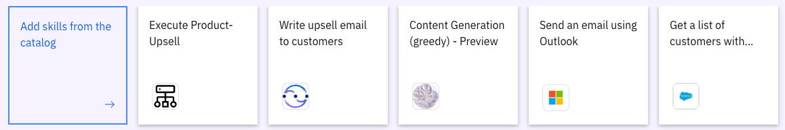
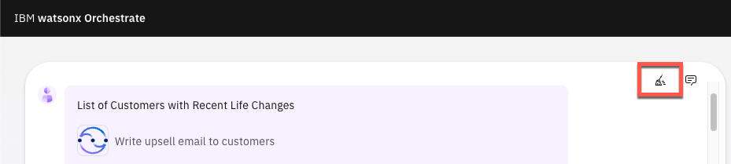

<inline-notification text="<strong>This 100-level demo does not require technical skills and is appropriate for both Sellers and Tech Sellers.</strong>  The demo covers the end user view only. A more in-depth 300-level demo designed for Tech Sellers that also covers the 'Builder' view will be available shortly.  This demo is used in the following L3 training plans:  • watsonx Orchestrate Level 3 for Sales  • watsonx Orchestrate Level 3 for Technical Sales   <strong>Attention: Safari and Chrome browser users.</strong> Please use Firefox to do this demo. "></inline-notification>

| **DEMO OVERVIEW** | | 
| :---         | :--- |
| **Scenario overview** | This demo shows how watsonx Orchestrate can be used by sales representatives to assist with the cross-sell/upsell opportunities. To illustrate this, you will take on the persona of an insurance seller using watsonx Orchestrate to retrieve a list of customers from Salesforce, make product recommendations, then generate a personalized offer that is sent using Microsoft Outlook.|
| **Products used  in this demo** | IBM watsonx Orchestrate |
| **watsonx Orchestrate Skills used in this demo** | IBM watsonx.ai generative AI; Salesforce; Microsoft Outlook; Embedded decision automation|
| **Demo script** | A complete demo script is provided [here](demo-script). (This link takes you to the second tab at the top of this page).   This demo script has multiple tasks that each have multiple steps. In each step, you have the details about what you need to do (**Actions**), what you can say while delivering this demo step (**Narration**), and what screenshots you will see.  This demo script provides a suggested narrative. You are welcome to customize it based on your sales opportunity. You can increase your ability to describe the value of watsonX Orchestrate by taking the watsonx Orchestrate Level 2 learning (<a href="https://yourlearning.ibm.com/activity/PLAN-7C5500E80F26" target="_blank" rel="noreferrer">IBM</a> <a href="https://learn.ibm.com/course/view.php?id=13175" target="_blank" rel="noreferrer">BP</a>).  Most importantly, practice this demo in advance. If the demo seems easy for you to do, the client will focus on your messaging and appreciate the simplicity the product. If the demo seems difficult to use, the client will come away with this impression. Remember, practice makes perfect. |
| **Applicable learning plans and badges** | This demo is used in the following learning plans:   • watsonx Orchestrate Level 3 for Sales <a href="https://yourlearning.ibm.com/activity/PLAN-07001C92F201" target="_blank" rel="noreferrer">IBM</a> <a href="https://learn.ibm.com/course/view.php?id=15985" target="_blank" rel="noreferrer">BP</a>    •  watsonx Orchestrate Level 3 for Technical Sales <a href="https://yourlearning.ibm.com/activity/PLAN-B4BFAE1FED99" target="_blank" rel="noreferrer">IBM</a> (BP learning plan coming Q1 2024)   Use this demo as credit towards the <a href="https://www.credly.com/org/ibm/badge/watsonx-orchestrate-sales-intermediate" target="_blank" rel="noreferrer">watsonx Orchestrate Sales Intermediate badge</a>. A Technical Sales Intermediate badge that also uses this demo will be available in Q1 2024.|
| **How to get support** | • IBMers can use the <a href="https://ibm-cloud.slack.com/archives/C0216F39ACU" target="_blank" rel="noreferrer">#platinumdemos-automation-support</a> Slack channel.  • If you are a BP and require assistance, please open a support case at <a href="https://techzone.ibm.com/help" target="_blank" rel="noreferrer">IBM Technology Zone Help</a>. |

Access the demo environment (IBMers)

This demo is available on several sales demonstration and enablement tenants (demo instances). For new watsonx Orchestrate users, please request access by submitting a <a href="https://ibm.biz/OrchestrateRequestEnv" target="_blank" rel="noreferrer">request here</a>. You will receive an email once you have been onboarded onto a suitable tenant, but please allow 48 hours for your request to be processed.  

Based on your role and requirements, you will be onboarded onto a sales demonstration tenant or an enablement tenant. Enablement tenants provide short-term access (two week maximum) for enablement purposes. 

Once you have received your onboarding email use your IBM email to log in <a href="https://dl.watson-orchestrate.ibm.com/home" target="_blank" rel="noreferrer">here</a>.  

**Cannot find the demo or skills?**

If you are an existing watsonx Orchestrate user but you cannot see the skills needed to run the demo(they are represented as cards at the bottom of the watsonx screen), please ensure you are in the **Team skills** view. When you log into watsonx Orchestrate, the default view is **Personal skills**. To run the demo, change the view to **Team skills**.   

If you are an existing watsonx Orchestrate user and still cannot see the skills used in the demo, please request access to a suitable tenant by submitting a <a href="https://ibm.biz/OrchestrateRequestEnv" target="_blank" rel="noreferrer">request here</a>. You will receive an email once you have been onboarded onto a suitable tenant, but please allow 48 hours for your request to be processed.  

Users with access to multiple tenants (demo environments) should ensure they select a tenant that has the demonstration installed. Please use the <a href="https://ibm-cloud.slack.com/archives/C0216F39ACU" target="_blank" rel="noreferrer">#platinumdemos-automation-support</a> Slack channel if you require assistance. 
  

Access the demo environment (Business Partners)

If you do not have access to a tenant, you can request access by submitting a <a href="https://ibm.biz/OrchestrateRequestEnv" target="_blank" rel="noreferrer">request here</a>. You will receive an email once you have been onboarded onto a suitable tenant, but please allow 48 hours for your request to be processed.  

Once you have received your onboarding email, use your IBM ID to log in <a href="https://dl.watson-orchestrate.ibm.com/home" target="_blank" rel="noreferrer">here</a>. 

Prepare to give the demo

When you log into watsonx Orchestrate, the default view is **Personal skills**. To run the demo, change the view to **Team skills**.  

The **skills** required to run the demo are shown at the bottom of the watsonx Orchestrate screen.   

To clear your chat history, click the **broom icon**. When prompted, place a tick in the check-box and click the **Clear history** button.  

Click [here](demo-script) to go to the **Demo script** on the next tab.