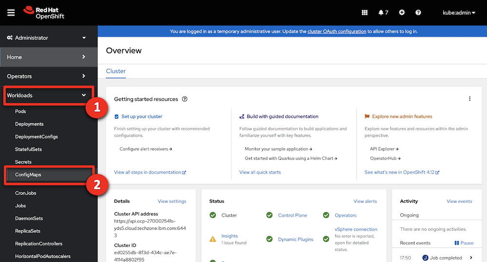

| DEMO OVERVIEW | |
| :---         | :--- |
| **Scenario overview** | This demo shows how IBM’s content management capabilities allow organizations to securely organize, manage and collaborate on documents and other types of content. To illustrate this, we’ll show how the capabilities are used to streamline a company’s hiring process. |
| **Demo products** | Cloud Pak for Business Automation |
| **Demo capabilities** | Content management |
| **Demo intro slides** | Download the Introduction and Overview slides <a href="./files/Managing and Securing Enterprise Content at Scale Platinum Demo - Intro deck.pptx" target="_blank" rel="noreferrer">here</a>. This is a short deck of customer-facing slides that sets the context for the demo. |
| **Demo script** | A complete demo script is on the second tab above. You can download a printer-ready PDF of the demo script <a href="./files/Managing and Securing Enterprise Content at Scale Platinum Demo - PDF script.pdf" target="_blank" rel="noreferrer">here</a>.   This demo script has multiple tasks, that each have multiple steps. In each step, you have the details about what you need to do (**Actions**), what you can say while delivering this demo step (**Narration**), and what diagrams and screenshots you will see.   This demo script is a suggestion, and you are welcome to customize based on your sales opportunity. Most importantly, practice this demo in advance. If the demo seems easy for you to execute, the customer will focus on the content. If it seems difficult for you to execute, the customer will focus on your delivery. |
| **Demo downloads** | • <a href="./files/Demo-Installer-23-0-2.zip" target="_blank" rel="noreferrer">Demo installer archive</a>  • <a href="./files/Resource files.zip" target="_blank" rel="noreferrer">Resource files.zip</a>  • <a href="./files/P8TeamspaceTemplates.templates" target="_blank" rel="noreferrer">P8TeamspaceTemplates</a>   |
| **Sales enablement video** | View the enablement video <a href="https://ibm.box.com/s/3y8p1y32ap5tpln6nb6iakncs44ip0xc" target="_blank" rel="noreferrer">here</a>. This video is for enablement purposes only (IBMers and Business Partners) and is not customer-ready. |
| **Required versions** | Cloud Pak for Business Automation V23.0.2   |
| **How to get support** | • Open a support case at <a href="https://techzone.ibm.com/help" target="_blank" rel="noreferrer">IBM Technology Zone Help</a> regarding issues with reserving and provisioning Tech Zone environments. • IBMers, contact <a href="https://ibm.enterprise.slack.com/archives/C06HT5PHLN9" target="_blank" rel="noreferrer">#ba-techlcd-support</a>  regarding issues with setting up and running this demo. |

## **DEMO INSTALLATION AND SETUP**

1 - Provision Cloud Pak for Business Automation environment
 

To run this demonstration, you will need an OpenShift environment with Cloud Pak
for Business Automation 23.0.2 installed. We will use IBM Operational Decision
Manager on prem version contained in this installation.   <inline-notification text="Note: If you want to use your ODM hosted on a SaaS tenant, just contact your SaaS administrator to get a user and password to connect your RES in Basic Authentication. Go directly to Step 3: Download the installation files."></inline-notification>

1. Visit the <a href="https://techzone.ibm.com/collection/tech-zone-certified-base-images/journey-pre-installed-software" target="_blank" rel="noreferrer">TechZone environment provisioning</a> page.   

2. Click the **CP4BA 23.0.x - Multi-Pattern Starter** tile.    

3. Select **Reserve now** tile.    

4. Select **Practice / Self-Education**    

5. Enter a **Purpose description**    

6. Select your **Preferred Geography**    

7. Select  **'5''** as **'Worker Node Couunt'**   

8. Select **’16 vCPU x 64GB – 100GB ephemeral storage’** as the **Starter service** (1) in the **Worker Node Flavor**    

9. Read and agree to **IBM Technology Zone's Terms and Conditions and End User Security Policies** (1). Click **Submit** (2).    

10. Check that the request was correctly submitted, and wait for the confirmation emails.    

**[Go to top](#top)**

2 - Validate your environment
 
After 4-5 hours, your Cloud Pak for Business Automation (CP4BA) should be ready. After requesting your CP4BA, you will receive a series of emails from IBM Technology Zone regarding the progress of your request.

1. Check for an email with the subject **Reservation Ready on IBM Technology Zone** (1). Click **View My Reservations** (2)    

2. Copy paste your **Kubeadmin / Passwords** in your notebook    

3. Click your reservation tile.     <inline-notification text="Your reservation status should be <strong>Ready</strong>"></inline-notification> 

4. Click the **Open your IBM Cloud environment**.    

1. Log in to your OpenShift console using the credentials provided during section 1 above.  

6. Expand the **Workloads** (1) and click **ConfigMaps** (2).  

7. Expand the **projects** menu (1) and click **cp4ba-starter** (2). 

8. Type '**access**' (1). Check that the **icp4adeploy-cp4ba-access-info** config map is present. <inline-notification text="If the file is not listed, wait five more minutes for the CP4BA deployment to be completed"></inline-notification>

9. Click **icp4adeploy-cp4ba-access-info**.  

10. Scroll down (1) and check that all the ADS access information is displayed. ADS is the last element to install, so your CP4BA setup is completed once this info displays.   

11. Copy the **CP4admin username** and **password** used to log in to the various CP4BA components into a note to access later.  

12. Copy the **URL** needed to access the various products required in this demonstration into a note to access later. 

**[Go to top](#top)**

3 - Bookmark URLs and logins
 

This demo shows how IBM Content Navigator manages content. A web-based console provides end-users the capability to securely access and work content assets, individually or with a team.

In this section, you will collect the links to access the required capabilities and use them to make a cheat sheet to use throughout the demo.

This is a sample completed cheat sheet:  

Let’s collect the URLs and passwords for the demo cheat sheet. 

1. Log in your Openshift console using the credentials provided in section 1 above. 

2. Expand your user menu (1) and click **Copy login command** (2).  

3. Click **Display Token**.  

4. Copy the Admin **token** (1) and the Admin URL (2) to your cheat sheet.  

5. Close the tab in your browser to return to the ROKS admin page. Let's get the URL, username, and password to access IBM Content Navigator. 

6. Click  **ConfigMaps**.  

7. Expand the **Project** menu (1) and select **cp4ba-starter** (2).  

8. Type **‘access’** in the search field (the results will automatically filter).  

9. Click the **icpdeploy-cp4ba-access-info** ConfigMap.  

10. Scroll to the **navigator-access-info** (1) section. Copy the **Business Automation Navigator for CP4BA** URL (2) to your cheat sheet as the IBM Content Navigator URL. Copy **username: cp4admin** and the **password** (3) to your cheat sheet as well.  <inline-notification text="This is the cp4admin user’s password for IBM Content Navigator and Business Automation Studio."></inline-notification>  

**[Go to top](#top)**

4 - Execute setup script 
 

A script will configure IBM FileNet Content Manager (FNCM), IBM Cloud Pak for Business Automation (CP4BA) and parts of the IBM Content Navigator for the demo. Steps 4-7 explain the remaining manual configurations. 

This automated configuration script uses the FNCM and CP4BA public APIs to: 
1. Create the three personas used in this scenario: Henry (the HR Manager), Debby (the hiring Manager), and Patrick (the payroll Manager).
2. Create the document data model in FNCM.
3. Configure the built-in workflows used to validate documents.
4. Create and dedicated desktop in IBM Content Navigator.
5. Configure role-based redactions.
6. Create a document entry template.

 <inline-notification text="The following instruction are documented for an Apple Mac OS environment. For MS Windows users, proceed with the same commands using a Microsoft shell and executing the .BAT files."></inline-notification> 

1. Ensure you have Java 8 or later installed on your computer. Find your Java version by opening a Terminal window, typing the command "**java -version**" (1), and hitting enter. The **version** displays (2).  If you do not have Java, download it from these locations: • IBMers with MacOS, use the <a href="https://w3.ibm.com/mac/" target="_blank" rel="noreferrer">Mac@IBM store</a>.  • IBMers with PCs, use the <a href="https://w3.ibm.com/download/standardsoftware/PC/lang_en/issiCatalogPC.html" target="_blank" rel="noreferrer">PC@IBM store</a>.  • Business Partners, use the <a href="https://www.oracle.com/java/technologies/downloads/" target="_blank" rel="noreferrer">Java downloads site</a> (or as directed by your internal IT department). 

2. Download and unzip the <a href="./files/Demo-Installer-23-0-2.zip" target="_blank" rel="noreferrer">demo installer archive</a>  on a local folder of your computer. 

3. Use a Terminal Shell window to navigate to the folder where the archive was unzipped:  

4. Type **'cd ContentPlatinumDemoDeployment'** and hit enter to access the folder folder.  

5. From your file browser, edit the **‘configurePlatinumDemoStarter.sh’** (.sh on Mac and .bat on Windows) file using the text editor of your choice.  

6. Replace the '<**ocpAdminURL**>' tag with the Admin URL from your cheat sheet (see step 2.3).  

7. Replace the '<**ocpAdminToken**>' tag with the Admin token from your cheat sheet (see step 2.3).  

8. Save and close the file (ctrl + s).

 

9. On Mac: Make the file executable by typing **‘chmod 755 configureContentPlatinumDemoStarter.sh’** in the terminal window.  

10. Type **‘./configureContentPlatinumDemoStarter.sh’** and hit enter to execute the script.  

11.	Wait for the execution to complete (1-3 minutes).  After the execution completes, your display should match:  

<inline-notification text=" Review the entire display to check that all actions are <strong>Successful</strong> (meaning none <strong>Failed</strong> or were <strong>Skipped</strong>). The user login credentials should also display at the end of the script execution."></inline-notification> 

**[Go to top](#top)**

5 - Prepare your document files
 

During the demo, documents related to the applicant John Doe will be added to the content management platform. These documents, called **Candidate files**, are documents sent by the applicant or pre-filled forms that reduce the demonstration duration. 

1. Download the <a href="./files/Resource files.zip" target="_blank" rel="noreferrer">Resource files.zip</a> archive containing the documents. 
2. Unzip the archive. 
3. Open the folder containing the John Doe document repository. 

**[Go to top](#top)**

6 - Create the Teamspace template
 

Let's create a Teamspace template for the hiring team to use when collaborating on new applicants. Download the <a href="./files/P8TeamspaceTemplates.templates" target="_blank" rel="noreferrer"><strong>P8TeamspaceTemplates</strong></a> file.

1. Open IBM Content Navigator using the URL from your cheat sheet. Select **Enterprise LDAP** in the **Log in with** drop down menu (1). Enter **‘cp4admin’** as the **Username** and the **Password** (2) from your cheat sheet. Click **Log in** (3).  

2. Click the **Teamspaces** tile.   

3. Click the **Templates** tab.  

4. Click **Import**.  

5. Click **Browse** or **Choose file** (based on your browser).   

6. Select the **P8TeamspaceTemplates** file (1) and click **Open** (2).  

7. Click **Import**.  

8. Double-click **FC Hiring Teamspace Template**.  

9. Click the **Select Classes or Entry Templates** tab.  

10.	Select **HR Application Document Entry Template** (1) and click **Add** (2).  

11.	Click the **Folders and Documents Tree** tab.  

12.	Click **HR Documents**.  

13.	Click **Add Document**.  

14.	Expand the **Search in** (1) drop down menu, select the **ECM Platinum Demo** (2) and click **OK** (3).  

15.	Scroll to the **Search Criteria** section. In the **Property options** box, select **Is Not Empty** (1) in the search criteria drop down menu next to **Document Title**. Click **Search** (2).   

16.	Select all the files (1) and click **OK** (2).  

17.	Right-click **FC Evaluation form.docx** (1) and click **Properties** (2).  

18.	Click the **Security** tab.  

19.	Click **Select...**  

20.	Search for **‘debby’**.  

21.	Select **debby** (1) and click the **right-facing arrow** (2) to add her to the **Selected** list.  

22.	Verify the **Permissions** role is **Owner** (1) and click **Add** (2).  

23.	Click **Save**.  

24.	Click **Validate**.  

25.	Select the **FC Hiring Teamspace Template** (1), click the **Actions** (2) drop down menu, and click **Properties** (3).  

26.	Click **Security**.  

27.	Click **Select...**  

28.	Type ‘**henry**’ (1) and click the **magnifier** icon (2).   

29.	Select **henry** (1) and click the **right-facing arrow** (2) to add him to the **Selected** list.  

30.	Repeat the previous step to add **debby** and **patrick**. 

31.	Select **Reader** in the **Permissions** drop box (1) and click **Add** (2).  

32.	Click **Save**.  

33. Select the **FC Hiring Teamspace Template** (1), click the **Actions** (2) drop down menu, and click **Set as Default** (3).  

34.	Click the **x** to close the Teamspaces view.  

35. Log out of IBM Content Navigator. 

**[Go to top](#top)**

7 - Create a finalized teamspace
 

1. Open IBM Content Navigator using the URL from your cheat sheet. Select **Enterprise LDAP** in the **Log in with** drop down menu (1). Enter the **Username: 'henry'** and **Password: 'henry'** (2). Click **Log in** (3).  

2. Click the **Teamspaces** tile.  

3. Click **New Teamspace**.  

4. Type ‘**John Doe**’ (1) in the **Teamspace name** field and click **Select Users** (2).   

5. Click **Add Users and Groups...**   

6. Type ‘**debby**’ (1) and click the **magnifier** icon (2).  

7. Select **debby** (1) and click the **right-facing arrow** (2).  

8. Repeat the previous step to add **patrick**.  

9. Select **Member** (1) in the **Roles** menu and click **Add** (2).  

10.	Click **Finish**.   

11.	Click the **Candidate files** folder.  

12.	Open your local files containing John Doe’s application files. <inline-notification text="John Doe’s application files are in the <a href='./files/Resource files.zip' target='_blank' rel='noreferrer'>Resource files.zip</a> archive."></inline-notification>  

13.	Drag the **John Doe Diploma.pdf** file to the **Candidate files** folder.  

14.	Type ‘**John Doe**’ for **Candidate Name** (1), set the **Document Type** to **Diploma** (2), set the **Document Source** to **External** (3), and set the **Department Name** to **R&D** (4). Click the **calendar** icon (5) and pick a day approximately three days in the future. Click **Add** (6).  

15.	Repeat the previous two steps to add the John Doe's **Resume**, **Video**, and **Drivers License** documents (individually) to the **Candidate Files** folder. Add the properties below to each document as you add them to the repository:   

16.	Click **John Doe Video.mp4**.  

17.	Click **Bookmarks**.  

18.	Click **New Bookmark**.  

19.	Type ‘**Overview**’ (1) in the **Name** field. Type ‘**Tell me about yourself?**’ (2) in the description field. Click **OK** (3).  

20.	Click the play icon and then pause the video at the next question slide.  

21.	Repeat actions 17 - 19 to add more bookmarks, one at each new question slide. Repeat this process until these bookmarks are added:

 

| Bookmark name | Time | Description |
| --- | --- | --- |
| Overview | 00:00:00 | Tell me about yourself? |
| Hiring reasons | 00:00:25 | Why should we hire you? |
| Last job | 00:00:34 | Why did you leave your last job? |
| Weaknesses | 00:00:46 | What is your greatest weakness? |
| Strengths | 00:00:53 | What are your greatest strengths? |
| Other interests | 00:01:03 | What do you like to do outside of work? |

 

22.	The finalized bookmarks for the video should match the following:  

23.	Log out and close the IBM Navigator Viewer window.

 

**[Go to top](#top)**

## **PREPARE TO GIVE THIS DEMO**

1 - Before each demo
 

Have these resources ready before starting the demonstration:
 

1. Open the cheat sheet you created during demo preparation.
 
2. Open the folder containing John Doe's candidate files (unzipped during step 5 - Prepare your document files).
 
3. Use the URL from your cheat sheet to open IBM Content Navigator in a browser tab.

 

<inline-notification text="Do not log in now, you will do this during the demonstration."></inline-notification>

2- Giving the demo again
 

To give this demo again, you must do the following steps to reset the demo to its original state: 

1.	Delete the John Doe Teamspace.
 
2.	Delete the John Doe Demo Teamspace.
 
3.	Repeat **Demo preparation** step **7 – Create a finalized teamspace**.

 

Follow these detailed instructions to delete the Teamspaces:

 

1. Open IBM Content Navigator using the URL from your cheat sheet. Enter the **Username** ‘henry’ and the **Password** ‘henry’ (1). Click **Log in** (2).  

2. Click the **Teamspaces** tile.  

3. Right-click the **John Doe** Teamspace (1) and click **Delete** (2).  

4. Click **Delete**.  

5. Repeat actions 3 and 4 in this step to delete the **John Doe Demo Teamspace**. 

6. Repeat **Demo preparation** step **7 – Create a finalized teamspace**.

 

**[Go to top](#top)**

***

Click [here](demo-script) to go to the **Demo script** on the next tab.