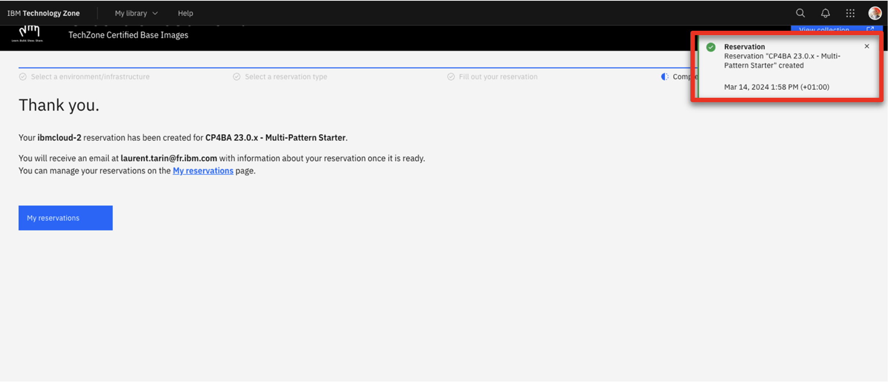
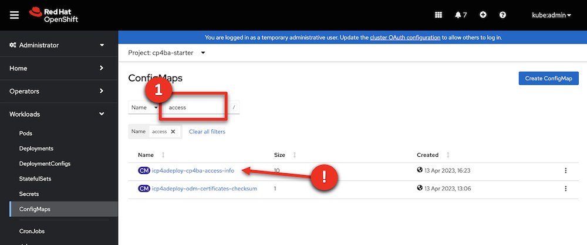
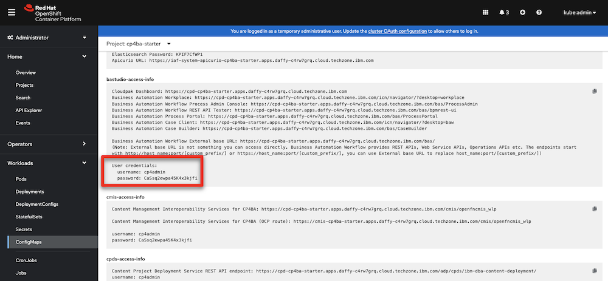
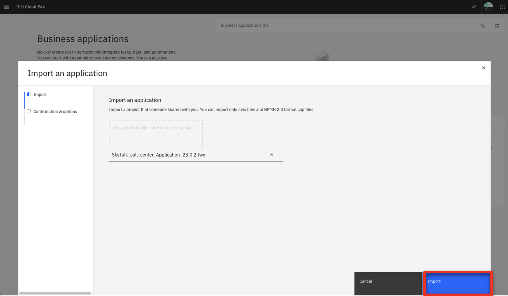

| DEMO OVERVIEW | |
| :---         | :--- |
| **Scenario overview** | This demo shows how the IBM Cloud Pak for Business Automation integrates machine learning to improve decisions. To illustrate this, a company’s customer retention offer process is automated. |
| **Demo products** | Cloud Pak for Business Automation, Cloud Pak for Data (Machine learning capabilities) |
| **Demo capabilities** | Decision management; Machine learning |
| **Sales guidance** | Download the sales guidance document <a href="./files/Predictive Decisioning Platinum Demo - Sales guidance.pdf" target="_blank" rel="noreferrer">here</a>. |
| **Demo intro slides** | Download the Introduction and Overview slides <a href="./files/Predictive Decisioning Platinum Demo - Intro deck.pptx" target="_blank" rel="noreferrer">here</a>. This is a short deck of customer-facing slides that sets the context for the demo. |
| **Demo script** | A complete demo script is on the second tab above. You can download a printer-ready PDF of the demo script <a href="./files/Predictive Decisioning Platinum Demo - PDF script.pdf" target="_blank" rel="noreferrer">here</a>.    This demo script has multiple tasks that each have multiple steps. In each step, you have the details about what you need to do (**Actions**), what you can say while delivering this demo step (**Narration**), and screenshots of what you will see.  This demo script is a suggestion, and you are welcome to customize based on your sales opportunity. Most importantly, practice this demo in advance. If the demo seems easy for you to execute, the customer will focus on the content. If it seems difficult for you to execute, the customer will focus on your delivery. |
| **Demo downloads** | • <a href="./files/Retention Policy.pdf" target="_blank" rel="noreferrer">SkyTalk’s Retention offer document.pdf</a>  • <a href="./files/SkyTalk customer loyalty data.csv" target="_blank" rel="noreferrer">SkyTalk customer loyalty data.csv</a>  • <a href="./files/SkyTalk customer value data.csv" target="_blank" rel="noreferrer">SkyTalk customer value data.csv</a>  • <a href="./files/SkyTalk_call_center_application_23.0.2.twx" target="_blank" rel="noreferrer">SkyTalk_call_center_application_23.0.2.twx</a>  • <a href="./files/SkyTalk-customer-retention_23.0.2.zip" target="_blank" rel="noreferrer">SkyTalk-customer-retention_23.0.2.zip</a> |
| **Sales enablement video** | View the enablement video  <a href="https://ibm.box.com/s/mzlmipw8gux5xnaeokjgvko10vxrsdkl" target="_blank" rel="noreferrer">here</a>. This video is for enablement purposes only (IBMers and Business Partners) and is not customer-ready. |
| **Required versions** | Cloud Pak for Business Automation V23.0.2, Cloud Pak for Data 4.0   |
| **How to get support** | • Open a support case at <a href="https://techzone.ibm.com/help" target="_blank" rel="noreferrer">IBM Technology Zone Help</a> regarding issues with reserving and provisioning Tech Zone environments. • IBMers, contact <a href="https://ibm.enterprise.slack.com/archives/C06HT5PHLN9" target="_blank" rel="noreferrer">#ba-techlcd-support</a>  regarding issues with setting up and running this demo. |

This platinum demo uses machine learning resources that are subject to a quota. It is critical to stop depleting your machine learning quota by following the ‘**After each demo**’ steps detailed in this preparation guide unless you are practicing or presenting this demo.

The ‘**Preparation required to give this demo again**’ section details how to re-deploy the required machine learning service prior to your next demo.

The five components of the demo:  

## **MANAGING YOUR WATSON STUDIO FREE SUBSCRIPTION**

This demonstration requires Watson Studio and a Watson Machine Learning subscription. If you don’t have a paid subscription, you can use a free Lite version (which has a limited quota). This preparation guide explains how to provision a Watson Studio account.

The Lite version entitles you to **10 free CUH** (capacity units) per calendar month. The quota resets on the first of each month.

The 10 CHU allows for **3 to 5 hours of usage**, which is measured as the total time Watson Machine Learning is deployed. To stop the clock, you must undeploy the 2 ML services (see the ‘After each demo’).

Assuming you undeploy after each time you give or practice the demo, we estimate that you can do the demo **three to five times per month** without exceeding the free Watson Machine Learning limit. If you leave the two machine learning services deployed overnight, it will consume all your monthly limit in just 3 to 5 hours of time.

## **DEMO INSTALLATION AND SETUP**

1 - Provision an OpenShift environment and deploy Cloud Pak for Business Automation

To run this demonstration, you will need an OpenShift environment with Cloud Pak
for Business Automation 23.0.2 installed. We will use IBM Operational Decision
Manager on prem version contained in this installation.   <inline-notification text="Note: If you want to use your ODM hosted on a SaaS tenant, just contact your SaaS administrator to get a user and password to connect your RES in Basic Authentication. Go directly to Step 3: Download the installation files."></inline-notification>

1. Visit the <a href="https://techzone.ibm.com/collection/tech-zone-certified-base-images/journey-pre-installed-software" target="_blank" rel="noreferrer">TechZone environment provisioning</a> page.   

2. Click the **CP4BA 23.0.x - Multi-Pattern Starter** tile.    

3. Select **Reserve now** tile.    

4. Select **Practice / Self-Education**    

5. Enter a **Purpose description**    

6. Select your **Preferred Geography**    

7. Select  **'5''** as **'Worker Node Couunt'**   

8. Select **’16 vCPU x 64GB – 100GB ephemeral storage’** as the **Starter service** (1) in the **Worker Node Flavor**    

9. Read and agree to **IBM Technology Zone's Terms and Conditions and End User Security Policies** (1). Click **Submit** (2).    

10. Check that the request was correctly submitted, and wait for the confirmation emails.    

**[Go to top](#top)**

2 - Validate your environment and bookmark your IDs and URLs

 
After 4-5 hours, your Cloud Pak for Business Automation (CP4BA) should be ready. After requesting your CP4BA, you will receive a series of emails from IBM Technology Zone regarding the progress of your request.

1. Check for an email with the subject **Reservation Ready on IBM Technology Zone** (1). Click **View My Reservations** (2)    

2. Copy paste your **Kubeadmin / Passwords** in your notebook    

3. Click your reservation tile.     <inline-notification text="Your reservation status should be <strong>Ready</strong>"></inline-notification> 

4. Click the **Open your IBM Cloud environment**.    

1. Log in to your OpenShift console using the credentials provided during section 1 above.  

6. Expand the **Workloads** (1) and click **ConfigMaps** (2).  

7. Expand the **projects** menu (1) and click **cp4ba-starter** (2). 

8. Type '**access**' (1). Check that the **icp4adeploy-cp4ba-access-info** config map is present. <inline-notification text="If the file is not listed, wait five more minutes for the CP4BA deployment to be completed"></inline-notification>

9. Click **icp4adeploy-cp4ba-access-info**.  

10. Scroll down (1) and check that all the ADS access information is displayed. ADS is the last element to install, so your CP4BA setup is completed once this info displays.   

11. Copy the **CP4admin username** and **password** used to log in to the various CP4BA components into a note to access later.  

12. Copy the **URL** needed to access the various products required in this demonstration into a note to access later. 

**[Go to top](#top)**

3 - Create and configure a GitHub repository 

 
A GitHub repository is required to manage decision projects in ADS. You must create a personal Git repository. You can use for example https://github.com and create your own account. IBMers can use the IBM enterprise git on https://github.ibm.com.
 
After logging into GitHub:
 
1. Click **New** in the repository section. 
2. Enter ‘**SkyTalk retention DS**’ (1) in the **Repository name** field. Click **Create repository** (2).  
3. Bookmark the repository URL (to configure ADS in a future step).  
4. Click your **profile** icon (1), then select **Settings** (2).  
5. Click **Developer settings**.  
6. Expand **Personal access tokens** and click **Tokens (classic)**.  
7. Click **Generate new token**.  
8. Enter **'ADS Platinum demo 23.0.2'** in the **Note** (1) and check **repo** (2).  
9. Scroll down and click **Generate token**.  
10. Copy the **Personal access token** ID (it will be used in ADS).  
11. Expand your profile (1) and copy your **username** (it will be used in ADS).  

**[Go to top](#top)**

4 - Create and set up a Watson Studio account 

1. Go to <a href="http://cloud.ibm.com" target="_blank" rel="noreferrer">IBM Cloud</a>. 
2. Enter your **IBM ID**. If you do not have one, create a new one. 
3. Ensure you are in your own Cloud Pak for Data account instance (1). Click **Create resource** (2).
  
4. If prompted, click **Go** in the **Internal Paid Account** column.  
5. Type **'watson'** (1) in the search field and then select **Watson Studio** (2).
  
6. Select the **Lite** plan (1) and a **location** (2). Read and accept **license agreements** (3). Click **Create** (4).
  
7. Return to **IBM Cloud**.
  
8. Click **Create resource**.  
9. Type **'machine'** (1) in the search field and then select **Watson Machine Learning** (2).
  
10. Select the **Lite** plan (1) and a **location** (2). Read and accept **license agreements** (3). Click **Create** (4).
  
11. Return to **IBM Cloud**.
  
12.	Click **Create resource**.
  
13. Type **'Object'** (1) in the search field and then select **Object Storage** (2).
  
14. Select **IBM Cloud** (1). Choose the **Lite** plan (2) and click **Create** (3).
  
15. Expand the **top menu** (1) and then select **Resource list** (2).
  
16. The new services should appear. Click **Watson Studio-2d**.
  
17. Click **Launch in IBM Cloud Pak for Data**.
  
18. Click **+** next to **Deployments**.
  
19. Name the production space **'SkyTalk production space'** (1). Select **Cloud Object Storage-xx** as the **storage service** (2). Select your **Machine Learning-xx** (3) as the machine learning service. Click **Create** (4).  
20.	Click **Close**.  
21. Click the **IBM Watson Studio** logo on the left side of the toolbar to return to the home page.  

**[Go to top](#top)**

5 - Set up two machine learning models 

The Watson Studio environment is completely set up. The three services (Watson Studio, ML, and Storage) are ready, and the deployment environment is set up. Now let’s create the two prediction services using AutoAI in Watson Studio.
 
Ensure you have downloaded these two data files prior to starting this step:
 
<a href="./files/SkyTalk customer loyalty data.csv" target="_blank" rel="noreferrer">SkyTalk customer loyalty data.csv</a> 
<a href="./files/SkyTalk customer value data.csv" target="_blank" rel="noreferrer">SkyTalk customer value data.csv</a>
  
1. Click **+** next to **Projects**.
  
2. Select **Create an empty project**.
  
3. Name the project **'SkyTalk customer retention'** (1) and click **Create** (2). 
  
4. Click the **Assets** tab. 
  
5. Click **New asset +**.
   
6. Select **AutoAI**.
   
7. Name the AutoAI experiment **'SkyTalk churn prediction'** (1) and click **Associate a Machine Learning service instance** (2).
  
8. Select the **Machine learning-xx** (1) service. Click **Associate** (2).
   
9. Click **Reload**.
   
10. Click **Create**.
   
11. Click **Browse**.
   
12. Select the **SkyTalk customer loyalty data.csv** file (1) and click **Open** (2).
   
13. When prompted **‘Create a time series forecast?'**, click **No**.
   
14. When prompted **'What do you want to predict?'**, select **CHURN**.
  
15. Click **Run experiment**.
   
16. The tool will create 8 pipelines, which will take approximately two minutes.
   
17.	Scroll down to the pipeline marked with a star in the **Pipeline leaderboard** list and click **Save as** in the corresponding row.
   
18. Select **Model** (1) and click **Create** (2).
   
19. A **Saved model successfully** confirmation message appears.
  
20. Return to the project view by clicking **SkyTalk customer retention** in the breadcrumb navigation.
  
21. Click **New asset +**.
  
22.	Repeat steps 6 – 21 to create another model to predict Skytalk’s customer lifetime value. 
• When repeating step 7, name the AutoAI experiment **‘SkyTalk lifetime value prediction’**.  
• When repeating step 12, select the **SkyTalk customer value data** (2) file. 
• When repeating step 14, select the **Lifetimevalue**.
 
23.	After saving the starred pipeline as the **Skytalk lifetime value prediction** model, return to the project view by clicking **SkyTalk customer retention** in the breadcrumb menu.  
The two models display and are ready to be published in the deployment space.
  
24.	Hover the mouse over the first model and click **Promote to space**.
  
25.	Choose the **SkyTalk production space** (1) as the **Target space** and click **Promote** (2).
  
26.	Repeat steps 4.24 and 4.25 to promote the second model.
 
27.	Return to the IBM Watson Studio home page then click **SkyTalk production space** in the deployment space section.
  
28.	Select the **Assets** tab.
  
29.	The **Assets** tab displays. The two Machine learning services are ready to be deployed.
  

**[Go to top](#top)**

6 - Deploy the ML models

<inline-notification text="Any time your ML services are deployed, your Machine Learning Lite subscription quota is consumed. To avoid running out of Watson ML quota, undeploy your ML services whenever you are not practicing or giving this demo."></inline-notification>
 
The **Reset the demo to its beginning state** step on this page below contains the process to undeploy the services and stop the billing process.
 
Redeploy your ML services approximately 15 minutes prior to practicing or giving this demo.
 
1. From the Watson Studio environment, select the **SkyTalk production space** deployment space.
  
2. Select the **Assets** tab.
  
3. Deploy the **Skytalk churn prediction** by hovering your mouse over the right side of the corresponding row, clicking the rocket icon that appears, and clicking **Deploy**.
  
4. Select **Online** (1), name the deployment **'churn'** (2), and click **Create** (3).
  
5. Return to the **SkyTalk production space** using the breadcrumb menu and deploy the **Skytalk lifetime value prediction** by hovering your mouse over the right side of the corresponding row, clicking the rocket icon that appears, and clicking **Deploy**.
  
6. Select **Online** (1), name the deployment **'Lifetime value'** (2), and click **Create** (3).
  
7. Return to the **SkyTalk production space** using the breadcrumb menu and click the **Deployments** tab. Ensure the two services are deployed.
  

**[Go to top](#top)**

7 - Get the credentials to set up the ML provider

This section explains how to get the credentials to set up the machine learning provider in ADS.
 
1. In the **Deployments - SkyTalk production space**, select the **Deployments** tab (1) and click **churn** (2).
   
2. Copy the first portion of the **Endpoint** URL path (the blue hightlighted section in the screenshot) and save it for the upcoming ML provider configuration.
   
3. Click **SkyTalk production space** in the breadcrumb menu.
  
4. Select the **Manage** tab.
  
5. Copy the deployment **Space GUID** and save it for the upcoming ML provider configuration step.
   
6. Log out and return to the IBM Cloud environment at  <a href="http://cloud.ibm.com" target="_blank" rel="noreferrer">cloud.ibm.com </a>. Make sure you are in your personal Cloud Pak for Data instance.
   
7. Click the **Manage** tab and select **Access (IAM)**.
   
8. Click **API keys** (1) and then click **Create +** (2).
   
9. Name the key **'MY_API_Key'** (1) and click **Create** (2).
  
10.	Click **Download** to save the **API key file** for the upcoming ML provider configuration.
  

**[Go to top](#top)**

8 - Open Automation Decision Services (ADS) and import the ADS demo project 

Prior to performing this step, make sure you have downloaded the <a href="./files/SkyTalk-customer-retention_23.0.2.zip" target="_blank" rel="noreferrer">SkyTalk-customer-retention_23.0.2.zip</a> file. This file is required to set up the ADS decision service.
 
1. Access the Cloud Pak for Business Automation using the bookmark saved in step 2. Select **Enterprise LDAP** in the **Log in with** drop down menu (1). Enter **‘cp4admin’** as the **Username** and the **Password** (2) from your note. Click **Log in** (3).  
2. Expand the **top menu** (1) and click **Business automations** (2) under **Design**.
  
3. Pass through the privacy warning messages by clicking **advanced** and then the **'proceed...'** link.  
4. Under **Business automations**, click **Create** (1) and select **Decision automations** (2).
  
5. Name the automation **'Customer retention'** (1) and then click **Create** (2).
  
6. Accept any privacy checks that may appear.
  
7. Close any guided tour views.  
8. Click **New decision**.
  
9. Click **Import decision service**.
  
10. Click **Browse**.
  
11. Select the <a href="./files/SkyTalk-customer-retention_23.0.2.zip" target="_blank" rel="noreferrer">SkyTalk-customer-retention_23.0.2.zip</a> file (1) and click **Open** (2).
  
12. Click **Import**.
  
13. Configure the ADS environment by clicking the **Settings** icon.
  
14. In the **Remote Git repositories** tab, paste the git **Repository URL** (1) from step 2.3. Select **Create or update credentials for the decision automation** (2).
  
15. Click **Username & password** (1), enter your Git username in the **Username** field, and enter the Git **Personal access token (API key)** from step 2.10 in the **Password** field (3). Click **Connect** (4).
  
16. Ensure that the **Remote Git repository** status is successfully connected.  To perform the following steps, your two machine learning services must be deployed in the Watson Studio deployment environment.
17.	Click the **Machine learning providers** tab to configure the machine learning provider.
  
18. Click **New +**.
  
19. Select the **Watson ML** (1) machine provider type and name the ML provider **'SkyTalk ML provider'** (2). Enter the **URL** (3) and **Space ID** (4) from step 7.5 and scroll down.  NOTE: The **Space ID** is the **Space GUID**.
  
20. Enter the **API key** (1) from step 7.5, and click **Test connection** (2).  NOTE: The **Space ID** is the **Space GUID**.
  
21. If the connection is successful, click **Save**.
  
22. Click **Customer retention** in the breadcrumb menu.
  

**[Go to top](#top)**

9 - Update the decision model with the deployed ML models

1. Click the **Retention ML** tile.
  
2. Click the **Customer Churn** model on the **Models** tab.
  
3. Click **Configure**.
  
4. Select **Remote machine learning model** (1) and click **Next** (2).
  
5. Select **SkyTalk ML provider** as the **Machine learning provider**.
  
6. Expand the **SkyTalk churn prediction model** (1), select the **churn** deployment (2), and click **Next** (3).
  
7. Click **Next**.
 
8. Click **Run** to test the invocation.
  
9. If the test succeeds, click **Next**.
  
10. Click **Generate from test output**.
  
11. Click **OK**.
  
12. Click **Apply**.
  
13. Click **Retention ML** in the breadcrumb menu.
  
14. Click **Customer Lifetime Value** and repeat steps 3 - 13 to configure the model. When repeating step 6, expand the **Skytalk lifetime value prediction** ML model and select **Customer lifetime value**.
  
15. Click the **Retention offer** model.
  
16. Select the **Run** tab.
  
17. Select the **High value profile** test file (1) and click **Run** (2).   The retention offer **Result** should display.  Click **Run** again if you get a timeout error the first time.
  
Your result should match the screenshot below.  

**[Go to top](#top)**

10 - Deploy the decision service

1. Click **Customer retention** in the breadcrumb menu.
  
2. Select the **Share changes** tab.
  
3. Click the **share all changes** box (1) and click **Share** (2).
  
4. Click **Share** to push the updates to the Git repository.
  
5. Select the **View history** tab.
  
6. Refresh the page and then click **Version +** in the latest shared history.
  
7. Enter version **'1.0.0'** (1) in the **Name** field and click **Create** (2).
  
8. Click the **Deploy** tab.
  
9. Expand the most recently created version **(1.0.0)** (1) and click **Deploy** (2) in the **Retention ML** row.
  
10. Click **Deploy** to confirm.
  
11. Wait for the deployment to finish (1). Click **Business Automations** (2) in the breadcrumb menu.
  
12.	Select **Decision** (1) and then click the **Customer retention** tile (2).  <inline-notification text=" Do not select <strong>Open</strong> on the tile."></inline-notification>  
13.	The most recently deployed service displays. Click the **three dots** icon (1) and then select **Publish** (2).
  
14. Click **Publish**.
  <inline-notification text="If the publish fails, wait for 5 minutes and try again. Some deployment operations may still be occurring in background."></inline-notification> 
15. Ensure the service appears as **Published**.
  

**[Go to top](#top)**

11 - Configure Application Designer and import the client application

Prior to performing this step, make sure you have downloaded the <a href="./files/SkyTalk_call_center_application_23.0.2.twx" target="_blank" rel="noreferrer"> SkyTalk_call_center_application_23.0.2.twx</a> archive file. This file is required to set up the ADS decision service.
 

1. Expand the **top menu** (1), click **Design** (2), and then click **Business applications** (3).  

2. Click **Import**.   

3. Click the **upload link**.   

4. Select the **SkyTalk_call_center_application_23.0.2.twx** file (1) and then click **Open** (2).   

5. Click **Import**.   

6. Click **Done**.  

7. After the import, hover the mouse over the **SkyTalk call center Application** tile and click **Open**.  

8. Click the **gear** icon.   

9. Set the **View mode** (1) to **Advanced**. Click **Save** (2).   

10. Refresh the page and ensure the **Overview**, **Diagram**, and **Variables** tabs are visible.   

11. Click the **gear** icon on the left-hand side ribbon.   

12. Click **Action and services** (1), right-click **rentention_ml** (2) and then click **Delete** (3).   

13. Click **Yes** to confirm.    

14. Click the **Diagram** tab.  

15. Select the **Call skytalk_retention_ds** node (1) and then click the **Implementation** tab (2) below the diagram.   

16. Click **New…**   

17. Click **retention_ml Decision** (1), select the most recent version (2) as the **default version to use at runtime**, and click **Add** (3).   

18.	Click **x** to close the **retention_ml** service display.   

19.	Click the **Variables** tab at the top of the diagram.   

20. Select **customer (unavailable)** in the **Data** variables list.   

21.	Click **Select…** in the **Details** pane.   

22.	Select **decision_mlsamples_telco_retention_data_CustomerRecord** as the **Business Object**.   

23.	Select **subscription (unavailable)** in the **Data** variables list.   

24.	Click **Select…** in the **Details** pane.   

25. Select **decision_mlsamples_telcor_etention_data_Subscription** as the **Business Object**.   

26.	Select **retentionOffer (unavailable)** in the **Data** variables list.   

27.	Click **Select…** in the **Details** pane.   

28.	Select **decision_mlsamples_telco_retention_data_Offer** as the **Business Object**.   

29.	Click the **Diagram** tab.   

30.	Select **retentionOffer** on the **Operation** selector in the **Implementation** tab below the diagram.  

31.	Click **Open** in the Input and Output mapping.   

32.	Click **Insert suggestions**.   

33.	Click the **Output mapping** tab.   

34.	Click **Insert suggestions**.   

35.	Click **OK**    

36. Click **Preview**     <inline-notification text="If the preview window displays an error, just logout and login again from your Cloud pak instance or wait a little bit and try again until the background operations are completed. "></inline-notification> 

37.	Enter **'Sarah Miller'** (1) in the **Search customer** field and click **Search** (2).   

38.	Click **Get offer**.   

39.	If you get a response without an error message, you are ready to demo.
  
**[Go to top](#top)**

## **PREPARE TO GIVE THE DEMO**

Open these resources before starting the demonstration

**1 - SkyTalk call center application** 
1. Log in to Cloud Pak for Business Automation. Use the bookmark and credentials saved in step 2. 
2. Expand the **top menu** (1), select the **arrow** icon (2) in the **Design** row, and click **Business applications** (3).  
3. Hover the mouse over the **SkyTalk call center Application** tile and click **Preview**.  
4. The **SkyTalk - Call Center** application opens.    

**2 - IBM Cloud Pak for Business Automation** 
1. Click **IBM Cloud Pak / Automation**.  
2. The **Cloud Pak for Business Automation** home page opens.  

**3 - Watson Studio** 
1. Go to the <a href="http://cloud.ibm.com" target="_blank" rel="noreferrer">IBM Cloud environment</a> and log in using your personal credentials. Ensure you are in your Cloud Pak for Data instance.  
2. Click the **Resource list** menu icon (1) and then select **Watson Studio-xx** (2).  
3. Click **Launch in IBM Cloud Pak for Data**.  
4. **Watson Studio** opens.  

**4 - SkyTalk customer retention policy.pdf** 
1. Click this link to open <a href="./files/Retention Policy v2 RH.pdf" target="_blank" rel="noreferrer">SkyTalk customer retention policy.pdf.</a>
 

**[Go to top](#top)**

## **AFTER EACH DEMO**

1 - Undeploy the two Watson Machine Learning services

1. Click the **SkyTalk production space** deployment.
  
2. Click the **Deployments** tab (1). Click the **three dots** icon in the **Lifetime value** row and select **Delete** (2).   Click **Delete** again to confirm the deletion.   <inline-notification text="As soon as the two services are deleted, your Watson Machine Learning Lite subscription quota is not consumed anymore."></inline-notification>  
3. Repeat step 2 and delete the deployment for the **churn prediction** row.
4. Click **Watson Studio** to return to the Watson Studio home page.
  
5. Click the **SkyTalk customer retention** project.
  
6. Click the **Assets** tab.
  
7. Click the **three dots** icon in the **Churn prediction 2** AutoAI experiment row.
  
8. Click **Delete**.
  
9. Click **Delete** again to confirm the removal.
  
 

**[Go to top](#top)**

2 - Reset the demo to its beginning state

1. Go to the previously opened **Cloud Pak for Automation** browser tab. Click **Customer retention**.
  
2. Click **Open**.
  
3. Select the **Initial retention** tile.
  
4. Click **Retention offer**.
  
5. Hover the mouse over the purple **Customer Churn** rounded box.
  
6. Click the **trash** icon to delete the node.
  
7. Click **Initial retention** in the breadcrumb menu.
  
8. Click the **three dots** icon that appears when you move your cursor over the **Customer Churn** predictive model row.
  
9. Click **Delete**.
  
10. Click **Delete** to confirm.
  
11. Only the **Retention offer** predictive model should remain.
  

**[Go to top](#top)**

## **PREPARATION REQUIRED TO GIVE THIS DEMO AGAIN**

1 - Redeploy both ML models in Watson Studio 

Before starting a new demo, you must redeploy the two ML models you previously created.
 
<inline-notification text="Anytime your ML services are deployed, your Machine Learning Lite subscription quota is consumed. To avoid running out of Watson ML quota, undeploy your ML services whenever you are not practicing or giving this demo. "></inline-notification>
 
The **Reset the demo to its beginning state** step on this page below contains the process to undeploy the services and stop the billing process.
 
Redeploy your ML services approximately 15 minutes prior to practicing or giving this demo.
 
1. Go to <a href="http://cloud.ibm.com" target="_blank" rel="noreferrer">**IBM Cloud **</a>. 
2. Enter your **IBM ID**. If you do not have one, create a new one. 
3. Expand the **top menu** (1) and then select **Resource list** (2). 
4. Click **Watson Studio-2D** in the **Services and software** section.  
5. Click **Launch in IBM Cloud Pak for Data**.  
6. From the Watson Studio environment, select the **SkyTalk production space** deployment.
  
7. Click the **Assets** tab.  
8. Deploy the **Skytalk churn prediction** by clicking the corresponding rocket icon that appears when you hover over the right side of the row.  
9. Select **Online** (1), name the deployment **churn** (2), and click **Create** (3).  
10. Deploy the **SkyTalk lifetime value prediction** by clicking the corresponding rocket icon that appears when you hover over the right side of the row.  
11. Select **Online** (1), name the deployment **'Lifetime value'** (2), and click **Create** (3).  
12. Click the **Deployments** tab. Ensure the two services are deployed.  

**[Go to top](#top)**

2 - Reconnect both ML models to Automation Decision Services

1. Log in to Cloud Pak for Business Automation. Use the bookmark and credentials saved in step 2. 
2. Click the recent automation **Customer retention**.  <inline-notification text="You should have no deployed automation services, since they have been removed after the previous demo. Otherwise, remove them as explained in the <strong>After each demo</strong> section."></inline-notification> 
3. Click **Open**.  
4. Click **Retention ML**.  
5. Click the **Customer Churn** model on the **Models** tab.  
6. Click **Edit Configuration**.
  
7. Click **Next**.  
8. Expand the **SkyTalk churn prediction model** (1), select the **CHURN** deployment (2), and click **Next** (3).
  
9. Click **Next**.  
10.	Click **Run** to test the invocation.  
11.	If the test succeeds, click **Next**.  
12.	Click **Generate from test output**.  
13.	Click **OK**.  
14.	Click **Apply**.  
15.	Return to the **Retention ML** using the breadcrumb menu.  
16.	Click **Customer lifetime value** and then repeat previous steps 2 - 12, expanding and selecting the **Customer lifetime value ML** model.  
17.	Click the **Retention offer** model.  
18. Select the **Run** tab.  
19. Select the **High value profile** test file (1) and click **Run** (2).  <inline-notification text="The <strong>retention offer</strong> should display. Click <strong>Run</strong> again if you get a timeout error the first time."></inline-notification>  Your result should match the screen below:  

**[Go to top](#top)**

3 - Redeploy the decision service

1. Click **Customer retention** in the breadcrumb menu.  
2. Select the **Share changes** tab.  
3. Click the **share all changes** box (1) and click **Share** (2).  
4. Click **Share** to push the updates to the Git repository.  
5. Select the **View history** tab.  
6. Click **Version +** in the row with the deployment you just created.  
7. Name the version number **'2.0.0'** (1). Click **Create** (2).  
8. Click the **Deploy** tab.  
9. Expand the latest version.  
10. Click **Deploy** in the **Retention ML** row. <inline-notification text="Make sure you do not click the <strong>Initial retention</strong> decision service."></inline-notification>  
11. Click **Deploy** when prompted.  
12. Wait for the deployment to finish (1). Click **Business Automations** (2) in the breadcrumb menu.  
13. The most recently deployed service displays. Click the **three dots** icon (1) and then select **Publish** (2).  
14. Click **Publish**.  <inline-notification text="If the service fails to publish, wait for 5 minutes and try again."></inline-notification> 
15. Ensure the service appears as **Published**.  

**[Go to top](#top)**

4 - Reconnect the decision services to the call center application

This step must be performed anytime a new version of the **SkyTalk_rentention_DS** is deployed. Make sure only the latest deployed DS is published to prevent **Data renaming issues** when reimporting the new service
 

Once your decision service is deployed, repeat the Application configuration strating from **step 11.12**
 

**[Go to top](#top)**

***

Click [here](demo-script) to go to the **Demo script** on the next tab.