

Introduction

Thank you for attending this predictive decisioning demonstration.

Today I’ll show how IBM Cloud Pak for Business Automation can integrate with machine learning (ML) to enhance customer retention offers. You’ll learn how to use Watson Studio Machine Learning with the Cloud Pak to predict business outcomes, without needing data science skills. These predictions are used by automated decision services to customize retention offers, lower customer retention costs, and eliminate many paper-based processes.

This demo uses customer retention example, but the same pattern can be applied to numerous business scenarios that combine business rules and predictions such as loan approval, insurance claim validation and invoice processing. 
We’ll see how business experts develop and validate decision models using Decision Designer, a graphical user interface that provides decision diagramming capabilities.  Next, I’ll show how a business analyst can create and deploy a machine learning model to use for predictions. Once the machine learning model is available, we’ll see how to incorporate it into the decision model using a step-by-step wizard.
 

Let’s get started!
 

(Demo intro slides <a href="./files/Predictive Decisioning Platinum Demo - Intro deck.pptx" target="_blank" rel="noreferrer">here</a>)
 
(Printer-ready PDF of demo script <a href="./files/Predictive Decisioning Platinum Demo - PDF script.pdf" target="_blank" rel="noreferrer">here</a>)
 

**[Go to top](#top)**

1 - Reviewing the manual call center process 

 

| **1.1** | **Show SkyTalk’s current manual process** |
| :--- | :--- |
| **Narration** | SkyTalk, a telecommunications provider, is losing many of its best customers to competitors. SkyTalk needs to reduce customer churn. Let’s review the written customer retention policies call center management implemented. |
| **Action** &nbsp; 1.1.1 | Show SkyTalk’s <a href="./files/Retention Policy v2 RH.pdf" target="_blank" rel="noreferrer">**Retention offer document**</a>, which was opened during demo preparation.  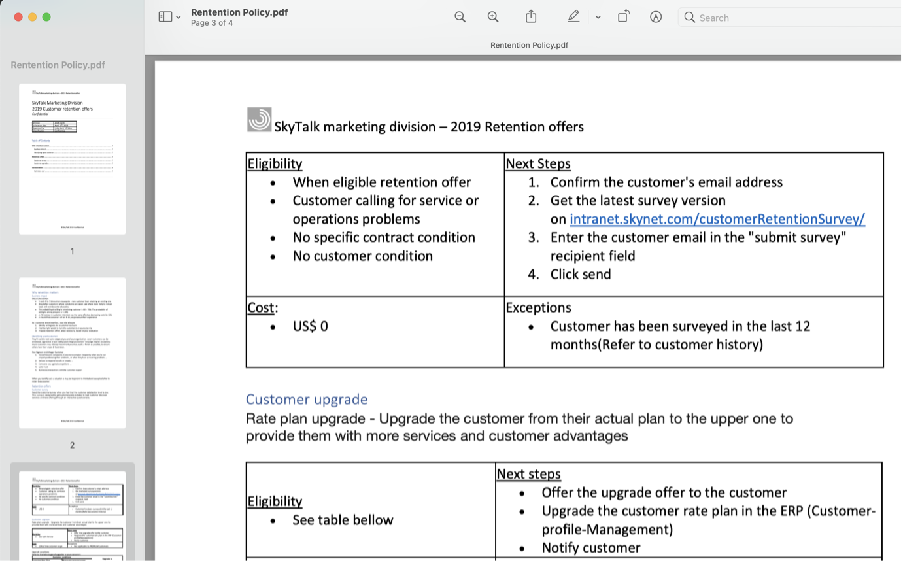 |
| **Narration** | Call center agents were asked to understand various retention offers and manually pick the ‘best’ option to retain the client.  Agents could not make insightful real-time decisions based on SkyTalk’s existing customer information. The guidelines were also implemented inconsistently.  SkyTalk’s customer retention costs skyrocketed, while attrition remained steady. Management decided to create a new call center application leveraging decision automation and machine learning to provide customer retention offers. |

 

**[Go to top](#top)**

2 - Modeling the business rules 

 

| **2.1** | **Review the components of SkyTalk’s retention decisions** |
| :--- | :--- |
| **Narration** | A business analyst in the customer care division uses machine learning and decision automation technologies to configure the call center's new retention offer application. The business analyst writes the business rules to generate retention offer recommendations. |
| **Action** &nbsp; 2.1.1 | Access the Business Automation Studio on the IBM Automation home page window, opened during demo preparation. Then click **Customer retention**.  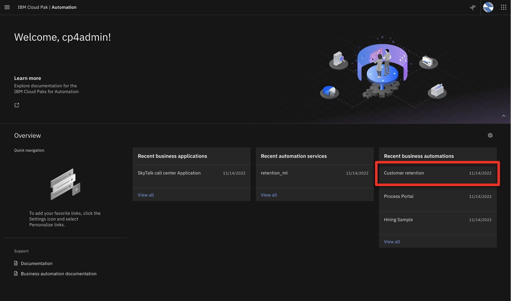 |
| **Action** &nbsp; 2.1.2 | Click **Open**.  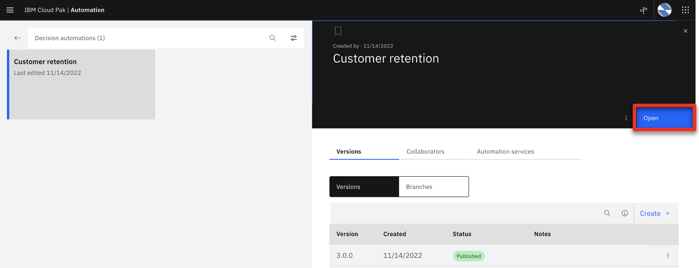 |
| **Action** &nbsp; 2.1.3 | Click **Initial retention**.  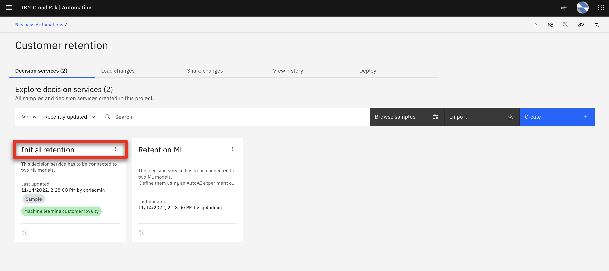  |
| **Action** &nbsp; 2.1.4 | Click **Retention offer**.  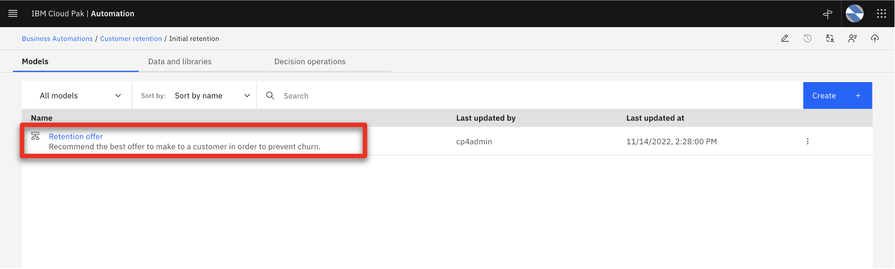 |
| **Narration** | The business analyst creates an automated decision, called a decision service, using a hierarchical model of business rules. Each blue box represents a sub-decision. The green rounded boxes represent the input data.  The ‘Determine retention offer’ decision service requires two sub-decisions: ‘Ranked retention offers’ and ‘Retention budget.’ The retention budget decision will be enhanced with predictions to customize retention offers.  Let’s take a closer look at one sub-decision to see how the decision logic defines how decisions are made. |
| **Action** &nbsp; 2.1.5 | Review the **Decision model** of the **Retention offer**.  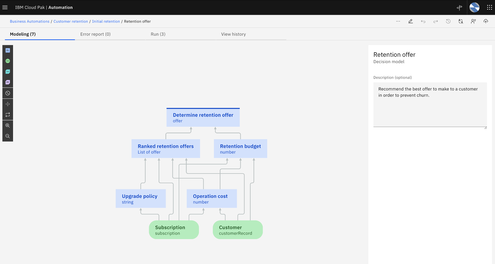 |
| **Action** &nbsp; 2.1.6 | Click the **Upgrade policy** box.  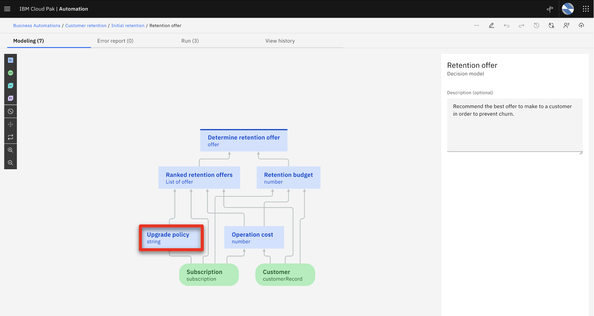 |
| **Action** &nbsp; 2.1.7 | Click the **Logic** tab.   |
| **Action** &nbsp; 2.1.8 | Click **Upgrade eligibility table**.  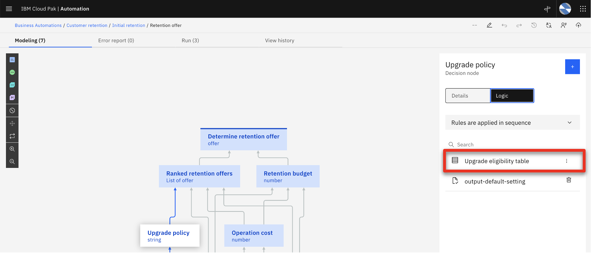 |
| **Narration** | The upgrade eligibility criteria are expressed in a decision table. Each row corresponds to a specific eligibility business rule.  By hovering the cursor on a row, the analyst can review the business rule in natural language. In this example, a SkyTalk Gold customer must have a subscription amount of at least $160 USD to be eligible for a Premium upgrade. |
| **Action** &nbsp; 2.1.9 | Show the **Upgrade eligibility table**. Move the cursor over row **3** to show the equivalent rule in natural language. 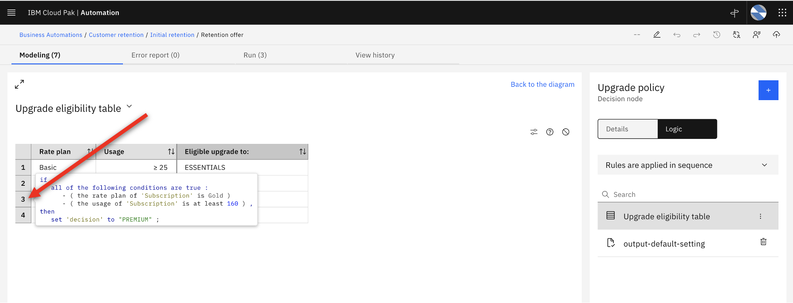 |
| **Action** &nbsp; 2.1.10 | Click **Back to the diagram**. 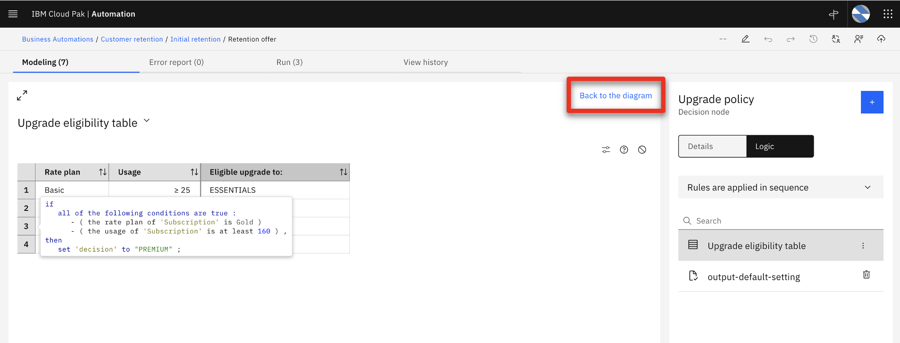 |
| **Narration** | The ‘Ranked retention offers' top-level decision cycles through the list of eligible offers and selects the least expensive one that does not exceed the calculated retention budget for the given customer. The ‘Retention budget’ sub-decision estimates the maximum amount SkyTalk should spend to keep the customer. The retention budget is calculated using two predictions: (1) the customer’s lifetime value, (2) and the customer’s propensity to churn.  In the next section, the business analyst uses IBM Watson Studio to create these two predictions. |

 

**[Go to top](#top)**

3 - Creating the predictive models 

 

| **3.1** | **Show the data sources used for prediction** |
| :--- | :--- |
| **Narration** | The business analyst creates and deploys the machine learning models used for the predictions.  Five years of data from SkyTalk’s customer database has been loaded into IBM Watson Studio. The analyst will use this data to develop predictions for customer lifetime value and churn. |
| **Action** &nbsp; 3.1.1 | Click the **SkyTalk customer retention** project, which was opened during the demo preparation. 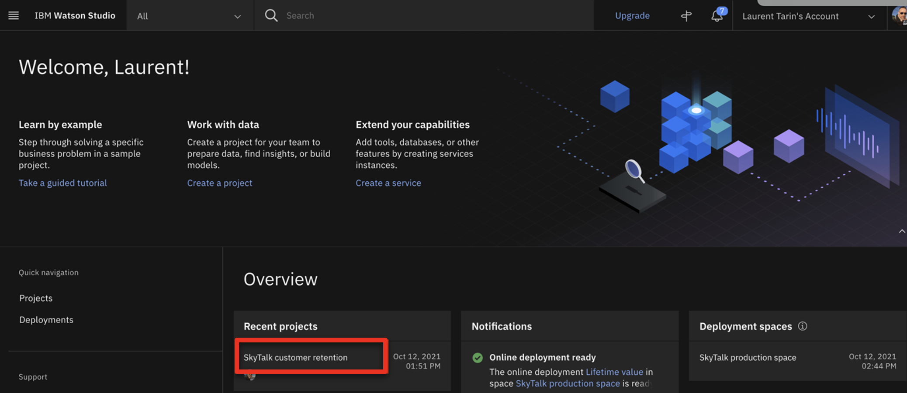 |
| **Action** &nbsp; 3.1.2 | Click **SkyTalk customer retention** (1). Then, click the **Assets** tab (2).  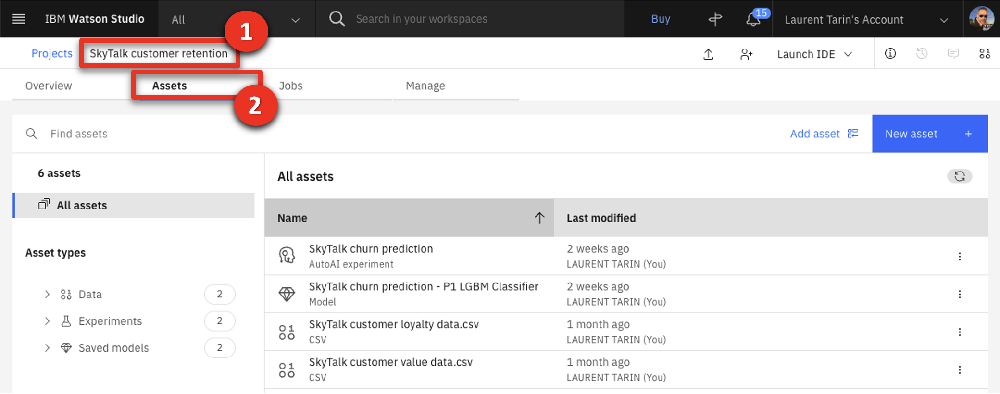 |
| **Action** &nbsp; 3.1.3 | Open the **SkyTalk customer loyalty data.csv** file.  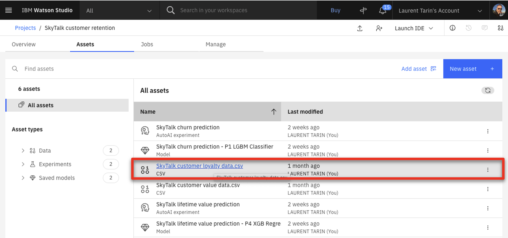 |
| **Narration** | Watson Studio generates models that predict customer churn. Model generation is referred to as an 'AutoAI experiment.' The business analyst reviews the uploaded historical data file to make sure it contains the data required to predict customer churn. T (true) in the Churn column indicates the customer closed their SkyTalk account. F (false) indicates the customer remained with SkyTalk. |
| **Action** &nbsp; 3.1.4 | Review the displayed **SkyTalk customer loyalty data.csv** file. 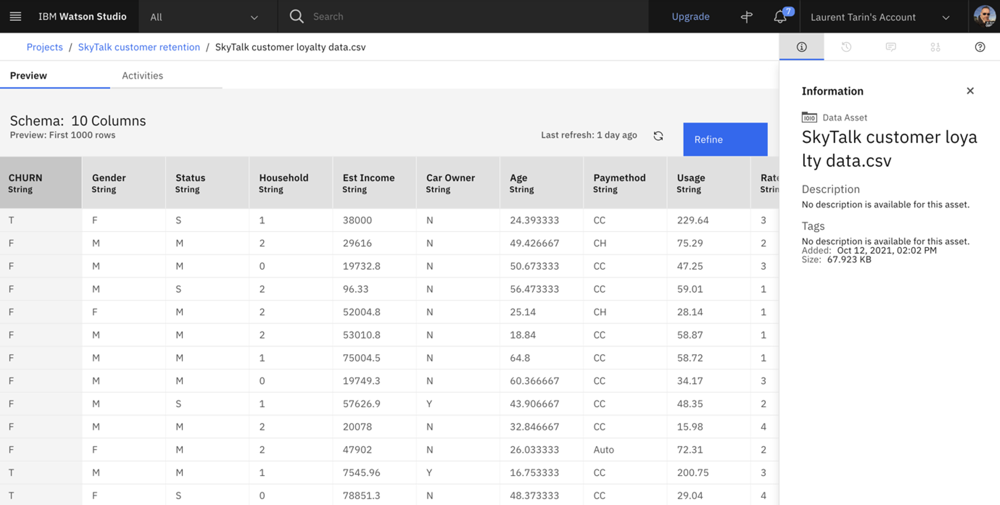 |
| **Action** &nbsp; 3.1.5 | Click **SkyTalk customer retention** in the breadcrumb navigation bar. 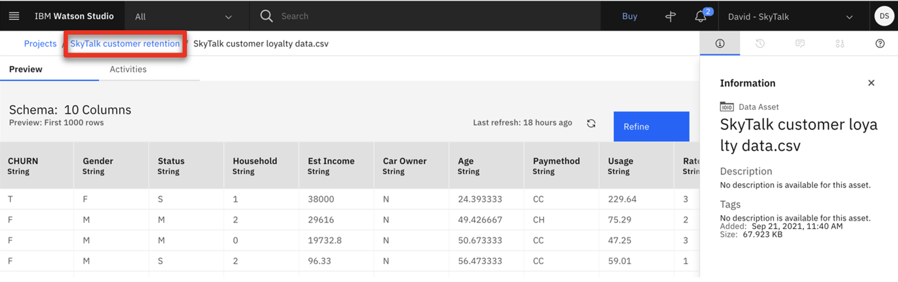 |
| **Narration** | The business analyst starts an AutoAI experiment to create models that predict customer churn. Models are referred to as 'pipelines.'  The AutoAI tool analyzes historical data to generate multiple pipelines. |
| **Action** &nbsp; 3.1.6 | Click **New asset**.  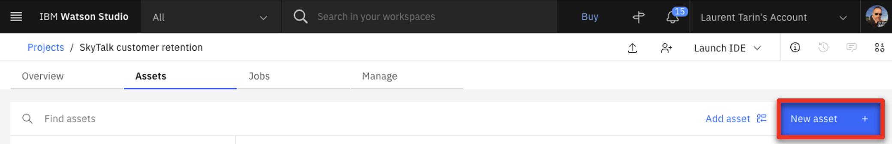 |
| **Action** &nbsp; 3.1.7 | Click **AutoAI**.  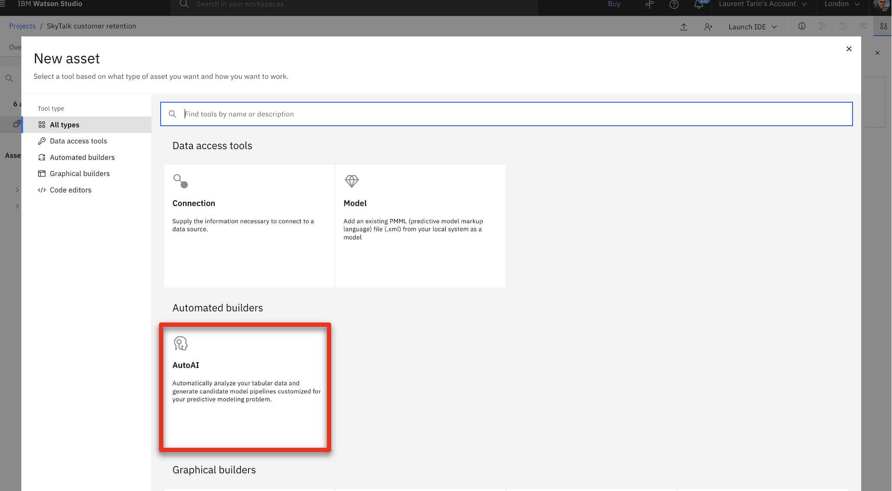 |
| **Action** &nbsp; 3.1.8 | Name the experiment **'Churn prediction 2'** (1) and click **Create** (2).  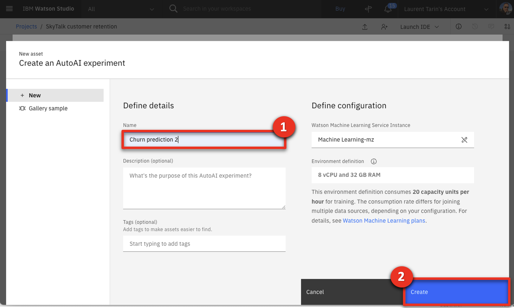 |
| **Action** &nbsp; 3.1.9 | Click **Select data from project**.   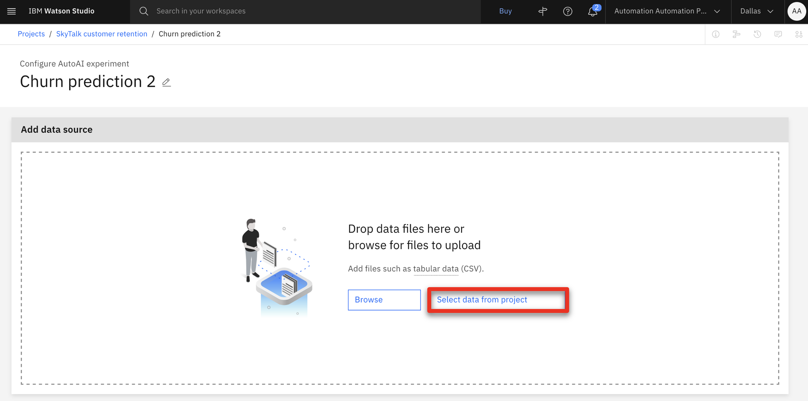 |
| **Action** &nbsp; 3.1.10 | Click **Data asset** (1) and select the **SkyTalk customer loyalty data.csv** file (2). Click **Select asset** (3).  |
| **Action** &nbsp; 3.1.11 | Select **No** for the **Create a time series forecast?** question. 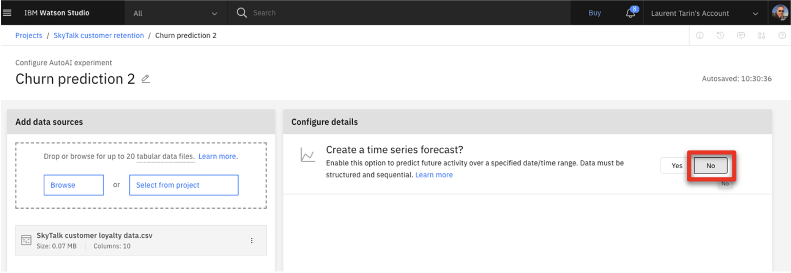 |
| **Narration** | The analyst chooses the customer loyalty data file and selects Churn in the ‘What do you want to predict’ dropdown menu.  The AutoAI tool analyzes historical data and automatically generates various pipeline choices. It also tests the pipelines’ predictions so the business analyst can easily compare them across several accuracy measures. |
| **Action** &nbsp; 3.1.12 | Click **Select prediction columns** (1) and select **CHURN** (2) as the measure to predict.  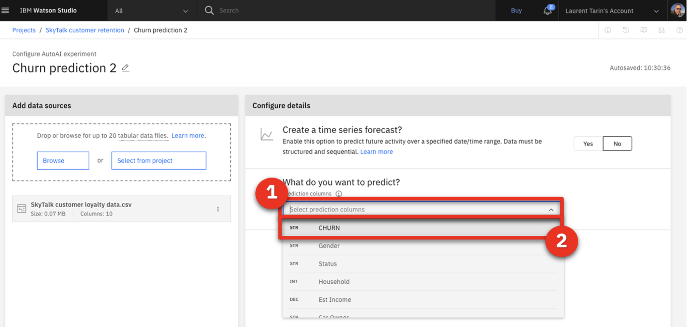 |
| **Action** &nbsp; 3.1.13 | Click **Run experiment.**  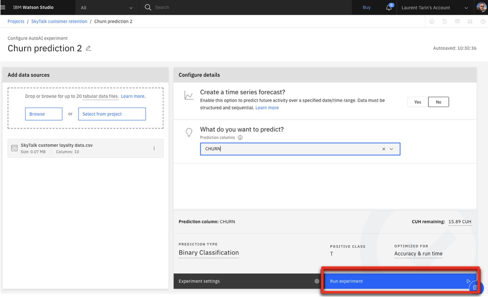 |
| **Narration** | The results automatically suggest eight different pipelines. The pipelines use different ML optimization approaches to make predictions. The business analyst evaluates the pipelines’ various prediction accuracy measures. |
| **Action** &nbsp; 3.1.14 | Click **SkyTalk customer retention** in the breadcrumb menu.  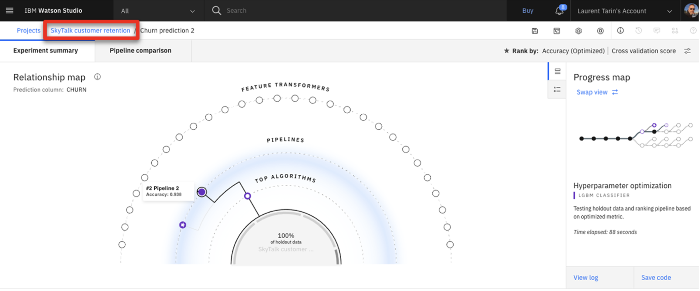 |
| **Narration** | Let’s jump to a finalized experiment corresponding to the same data set. |
| **Action** &nbsp; 3.1.15 | Click the **SkyTalk churn prediction** AutoAI experiment. 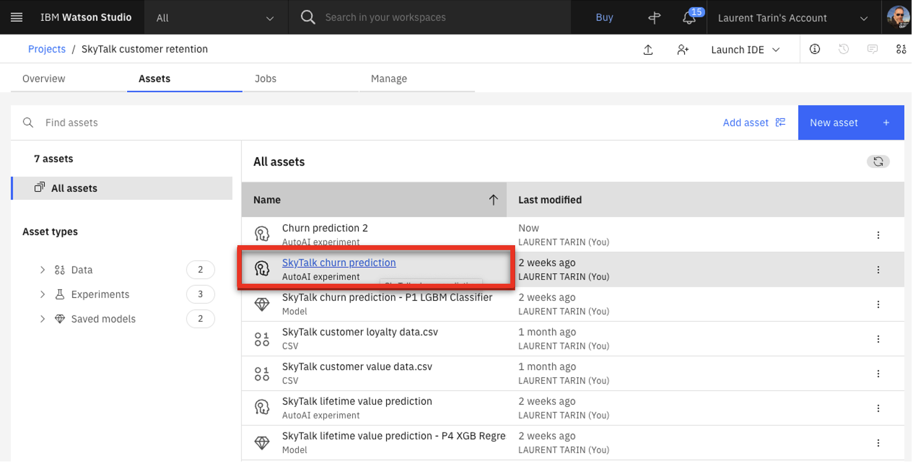 |

| **3.2** | **Choose the best predictive model** |
| :--- | :--- |
| **Narration** | On the ‘Pipeline Comparison’ chart, the business analyst examines how each pipeline ranks by various measures of accuracy. For example, Pipeline 7 has the highest accuracy in differentiating useful data from noise. This is determined by the area under the ROC (receiver operating characteristic) curve and displayed on this chart in the ROC AUC column. |
| **Action** &nbsp; 3.2.1 | Click **Pipeline comparison** (1) and move the cursor over the **P7** (**pipeline 7**) line (2) on the graph to highlight the different values for this pipeline.  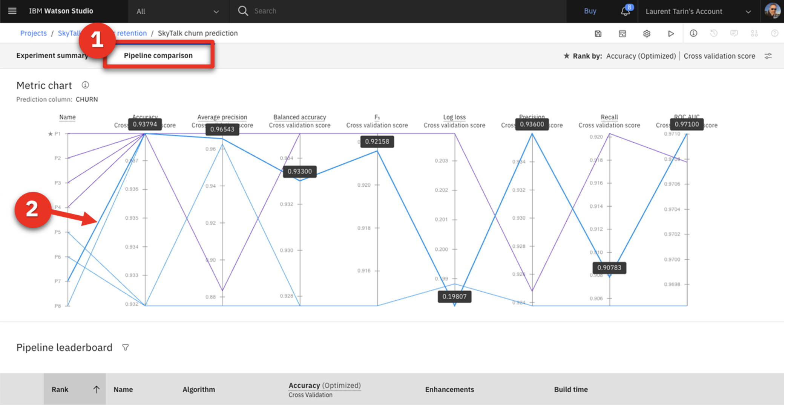
| **Narration** | Scrolling down and clicking on a Pipeline provides additional details. |
| **Action** &nbsp; 3.2.2 | Note which pipeline has a **star** icon (1) in its row, which indicates it has the highest overall accuracy. Scroll down and click **Pipeline 7** (2) in the **Pipeline leaderboard.** 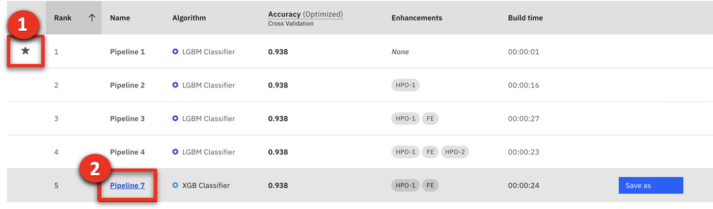
| **Narration** | The ‘Model evaluation’ view shows Pipeline 7’s actual ROC curve. Pipeline 7’s ROC curve arcs upward, indicating that as more predictions are made during the test, the model becomes increasingly accurate. |
| **Action** &nbsp; 3.2.3 | Click the **Model evaluation** tab. 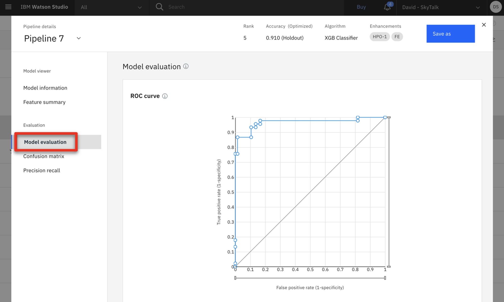 |
| **Narration** | The confusion matrix shows a different accuracy measure. It compares the actual attrition data with the pipelines’ predictions. Earlier in the demo, we looked at how customer churn is indicated in SkyTalk’s data as T (true) for customers that closed their account and F (false) for customers that remained with SkyTalk. Correct predictions in the confusion matrix below are indicated in the green T/T and F/F boxes. There were 39 T/T results and 62 F/F results. Summarizing those results shows us that Pipeline 7 made 101 correct predictions. The six T/F and four F/T represent ten incorrect predictions. Therefore, Pipeline 7 made 101 correct predictions out of 111 chances. This translates to 91% accuracy, which is displayed in the bottom right box of the matrix. |
| **Action** &nbsp; 3.2.4 | Click the **Confusion matrix** tab. 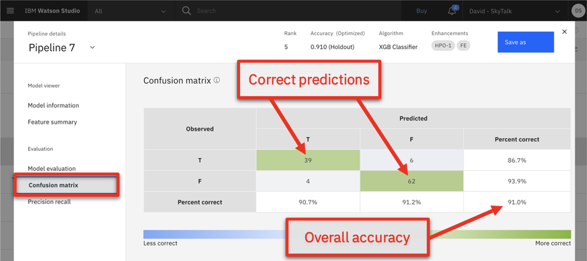 |
| **Narration** | The analyst compares the starred pipeline to Pipeline 7 to understand why it is rated the best overall. |
| **Action** &nbsp; 3.2.5 | Click the **Pipeline details** drop-down list (1) and select the starred pipeline you previously noted had the highest overall accuracy (2).  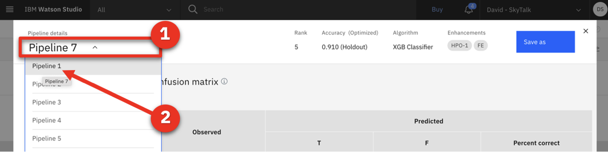 |
| **Action** &nbsp; 3.2.6 | Click **Confusion matrix** menu option on the left. 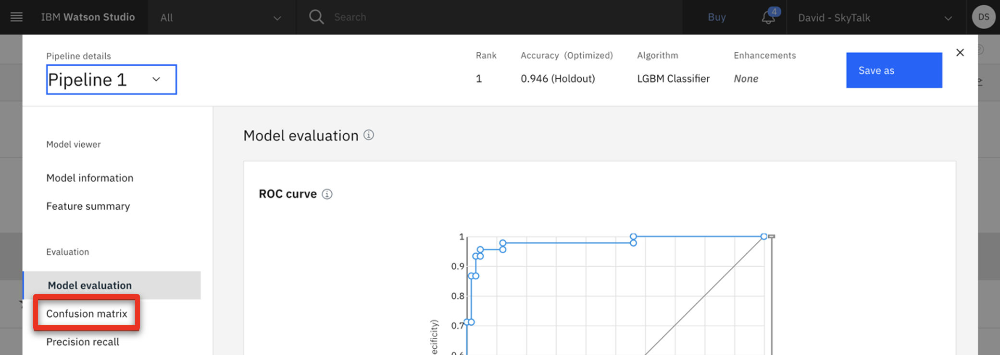 |
| **Action** &nbsp; 3.2.7 | Review the **Confusion matrix**. Highlight the fact that the overall correct percentage is higher using Pipeline 1.  |
| **Narration** | Pipeline 1 has a 94.6% accuracy, which is higher than Pipeline 7’s 91.0%. The analyst chooses Pipeline 1 as the model to deploy in production. |
| **Action** &nbsp; 3.2.8 | Click the **X** on the upper right corner to close the **Pipeline details** view. 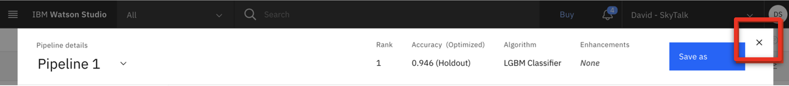 |
| **Action** &nbsp; 3.2.9 | Click **Save as** on the right side of the Pipeline 1 row. 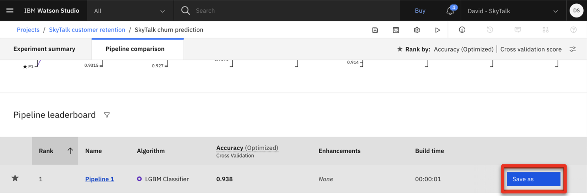 |
| **Narration** | The analyst can now generate a machine learning model using the pipeline from the AutoAI experiment. We will click cancel and review the model that was previously created. |
| **Action** &nbsp; 3.2.10 | Select **Model** (1) and click **Cancel** (2). 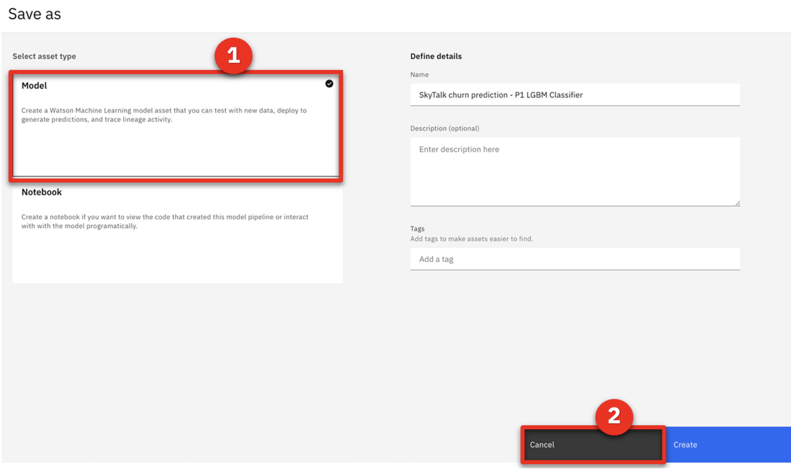 |
| **Action** &nbsp; 3.2.11 | Click the **SkyTalk customer retention** project in the breadcrumb navigation bar. 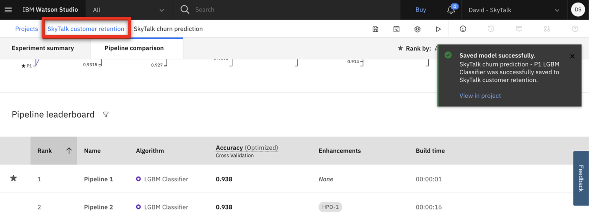 |

| **3.3** | **Prepare the churn prediction model for production use** |
| :--- | :--- |
| **Narration** | The analyst has created a churn prediction service for the model. Then, an AutoAI experiment was invoked to automatically generate pipeline options for the churn prediction service. The analyst chose a pipeline for production use and saved it as a churn prediction model in the SkyTalk’s customer retention project. In Watson AI, promoting a prediction model to a production space makes it available for use in production. Let’s complete this final step to make SkyTalk’s new churn prediction model available in the SkyTalk production space. |
| **Action** &nbsp; 3.3.1 | Click **Saved models**. 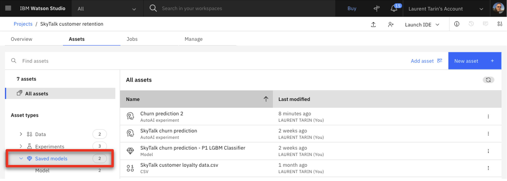 |
| **Action** &nbsp; 3.3.2 | Display the menu on the right side of one of the models and click **Promote to space**.  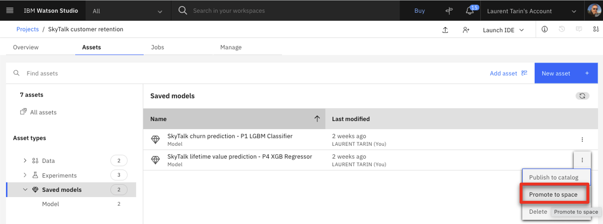 |
| **Narration** | In practice, the analyst would promote the churn model to the deployment environment here. For our demo, it has already been promoted. |
| **Action** &nbsp; 3.3.3 | Show the **SkyTalk production space** (1) option. Click **Cancel** (2) to avoid promoting the model. <inline-notification text="Do not click <strong>Prompt</strong>."></inline-notification> 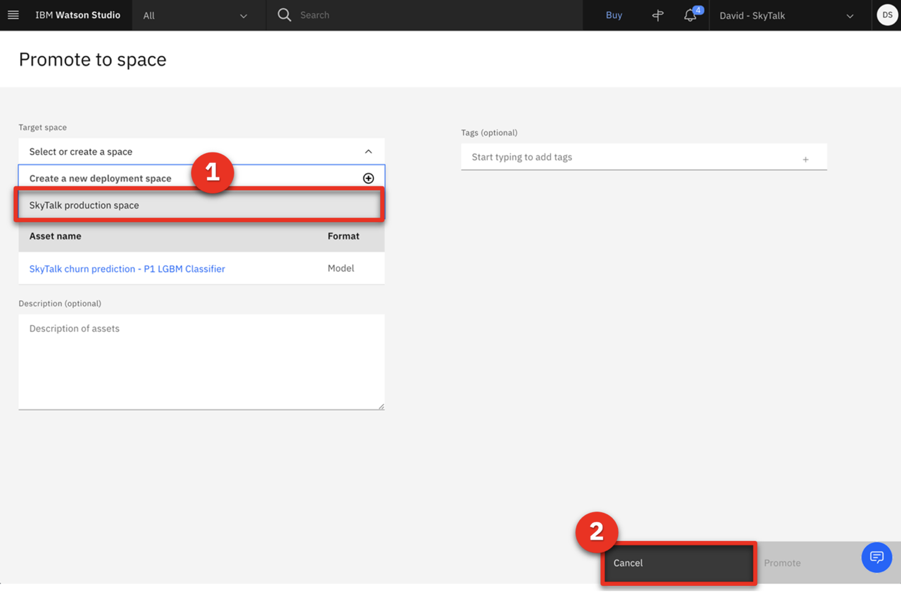 |
| **Narration** | The two prediction services are now ready for deployment. |
| **Action** &nbsp; 3.3.4 | Click the **IBM Watson Studio** menu (1), click **Deployments** (2), and then click the **SkyTalk production space** (3).  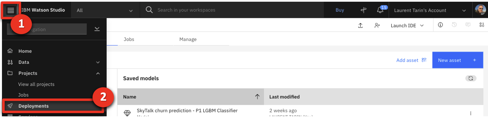  |
| **Action** &nbsp; 3.3.5 | Click the **Deployments** tab.  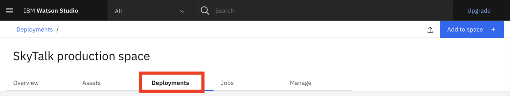 |
| **Narration** | The two services have been deployed. Copy and save the service endpoint URL. It will be required to configure a machine learning provider that will establish the link between Watson Studio and the Cloud Pak later in the demo. |
| **Action** &nbsp; 3.3.6 | Click the **churn** service.  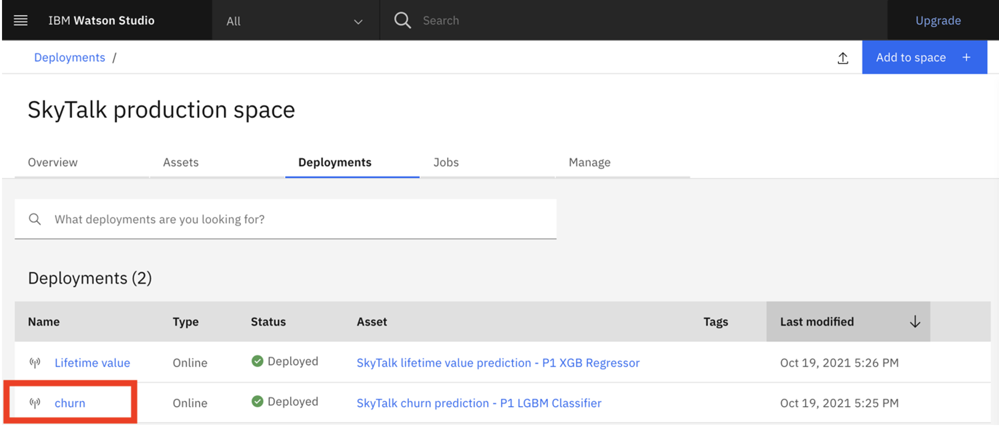 |
| **Action** &nbsp; 3.3.7 | Keep the first portion of the **Endpoint URL** to use later in the demo. Only highlight from the beginning through 'v4,' as shown in the image. 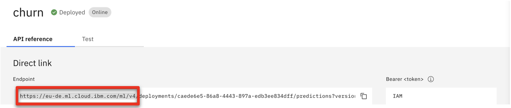 |
| **Narration** | The deployment space identifier will also be required to configure the machine learning provider. |
| **Action** &nbsp; 3.3.8 | Click the **SkyTalk production space** in the breadcrumb navigation bar. 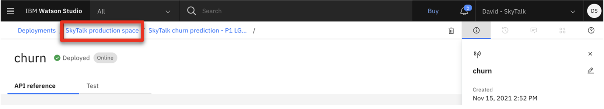 |
| **Action** &nbsp; 3.3.9 | Click the **Manage** tab (1) and keep the **Space GUID** (2) to use later in the demo.  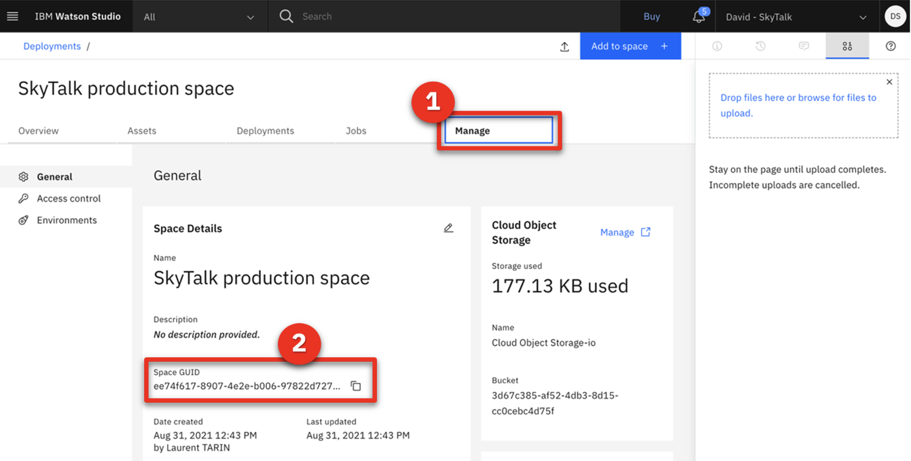 |

**[Go to top](#top)**

4 - Calling the prediction services from the business rules 

 

| **4.1** | **Configure the customer retention decision service to use the new predictive services** |
| :--- | :--- |
| **Narration** | The ‘Retention budget’ sub-decision uses the ‘churn’ and ‘lifetime value’ predictive services. A machine learning provider establishes the link between the sub-decision and the predictive services. The business analyst now has set up a machine learning provider for the SkyTalk ‘customer retention decision service.' |
| **Action** &nbsp; 4.1.1 | Return to the **SkyTalk customer retention DS** using the breadcrumb navigation menu. 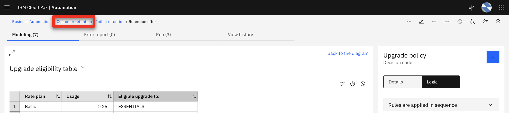 |
| **Action** &nbsp; 4.1.2 | Open the **Settings** menu.  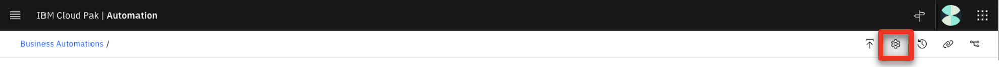 |
| **Action** &nbsp; 4.1.3 | Click the **Machine learning providers** tab.  |
| **Action** &nbsp; 4.1.4 | Click **Edit** on the right side of the **SkyTalk ML Provider** box. 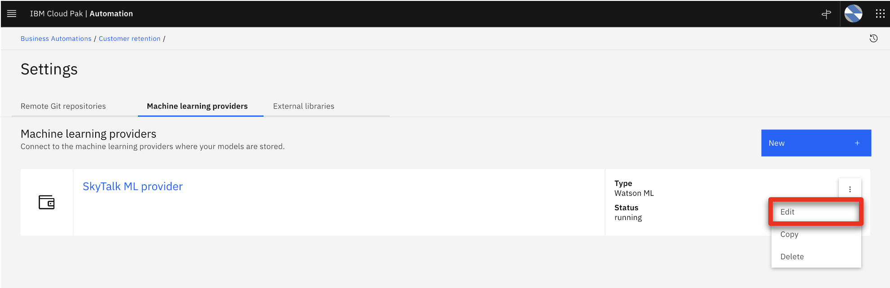 |
| **Action** &nbsp; 4.1.5 | Show the **API key** (1), the **Space ID** (2), and the Endpoint **URL** (3) obtained during the demo preparation instruction (step 5.8).  <inline-notification text="The Space GUID saved earlier in the demo is called the <strong>Space ID</strong> on this interface. "></inline-notification> 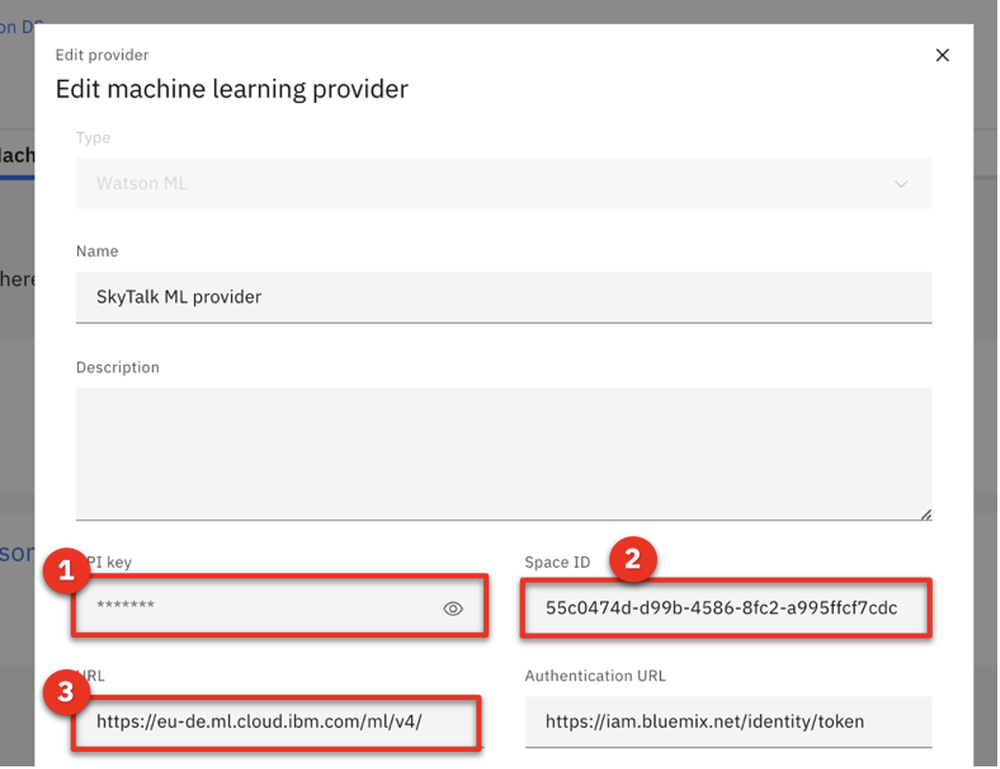 |
| **Narration** | Now that the interface between the Cloud Pak and Watson Studio is set up, the analyst can create two predictive models and make the predictions available for use within business rules. |
| **Action** &nbsp; 4.1.6 | Click **Cancel** and explain that the provider has been pre-configured during demo preparation.   |
| **Action** 4.1.7 | Return to the **Customer retention** tab using the breadcrumb navigation menu.  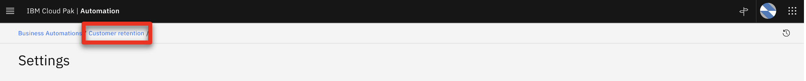 |
| **Action** &nbsp; 4.1.8 | Click the **Initial retention** tile. 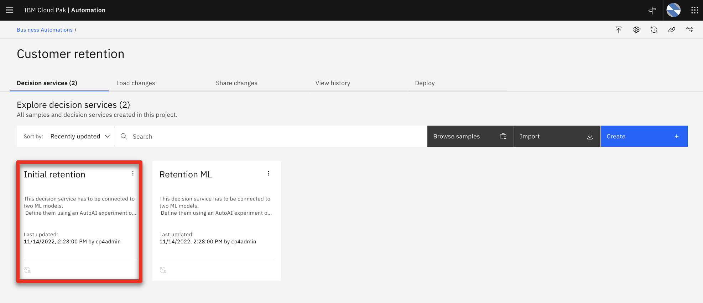 |
| **Action** &nbsp; 4.1.9 | Click **Create**. 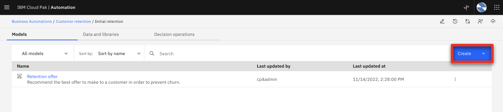 |
| **Narration** | The business analyst creates a predictive model to map the customer churn prediction parameters. |
| **Action** &nbsp; 4.1.10 | Select **Predictive model** (1) and name it **'Customer Churn'** (2). Click **Create** (3). 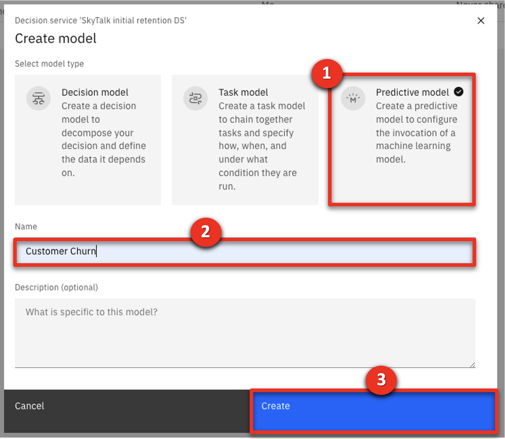 |

| **4.2** | **Map the predictive service to the predictive model** |
| :--- | :--- |
| **Narration** | A new predictive model is automatically created. This model needs to be configured to map the churn prediction parameters. |
| **Action** &nbsp; 4.2.1 | Click **Connect**. 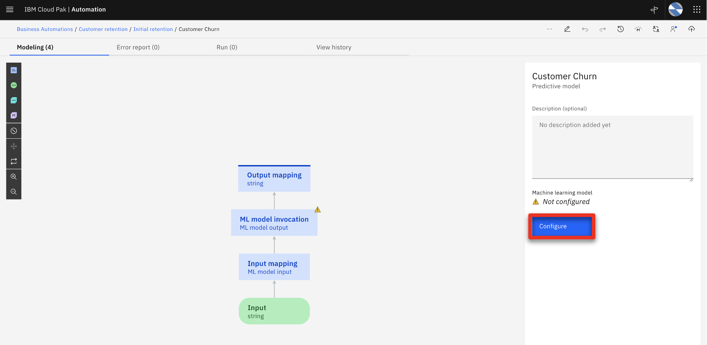 |
| **Narration** | The analyst selects the SkyTalk machine learning provider to establish the link to the deployed prediction service. |
| **Action** &nbsp; 4.2.2 | Click **Next**. 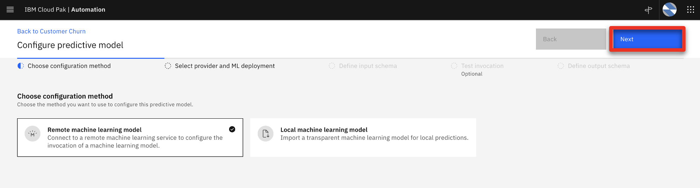 |
| **Action** &nbsp; 4.2.3 | Select the **SkyTalk ML Provider**. 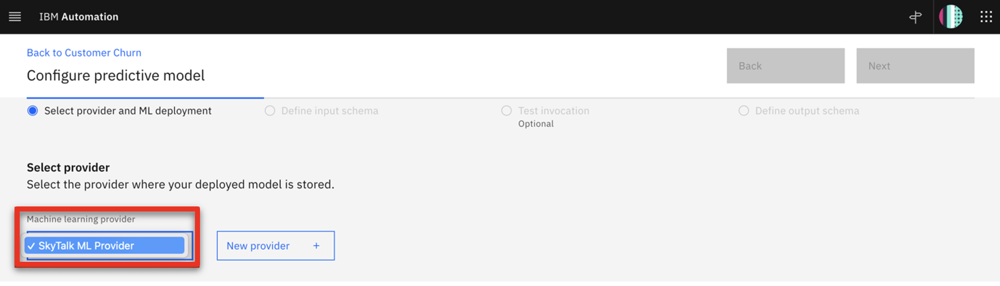 |
| **Action** &nbsp; 4.2.4 | Expand the **SkyTalk churn prediction – P1 LGBM Classifier** machine learning model (1). Select the **churn** deployment name (2).   The prediction is now connected to the customer lifetime value. 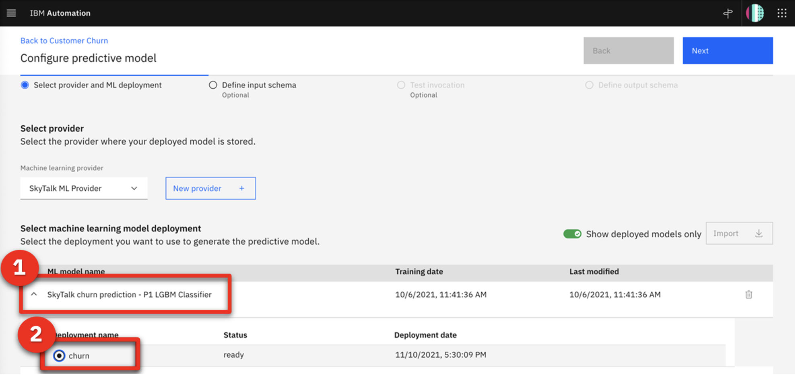 |
| **Narration** | Now we will complete the predictive model. A wizard is used to complete the mapping. |
| **Action** &nbsp; 4.2.5 | Click **Next**.  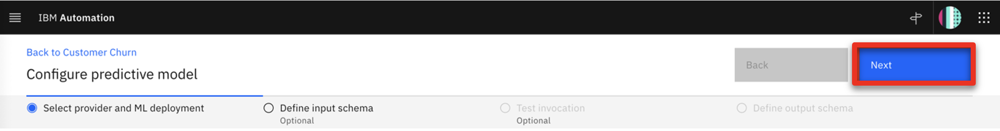 |
| **Action** &nbsp; 4.2.6 | Click **Next** again. 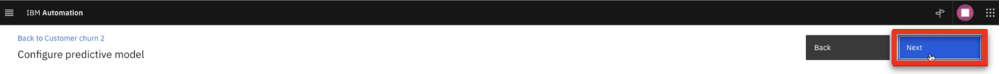 |
| **Narration** | The input data structure is automatically created. |
| **Action** &nbsp; 4.2.7 | Click **Run**. 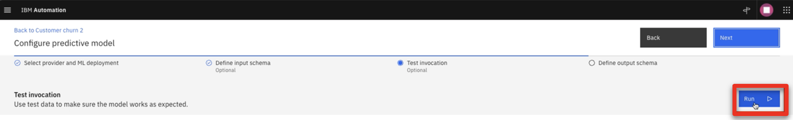 |
| **Narration** | The connection is tested to ensure the predictive service is working. |
| **Action** &nbsp; 4.2.8 | Click **Next**. 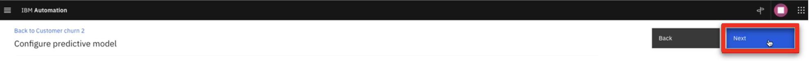 |
| **Action** &nbsp; 4.2.9 | Click **Generate from test output**. 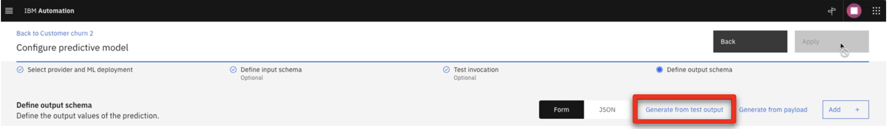 |
| **Narration** | The churn predictive service returns true or false and the prediction accuracy. In this example, the prediction result is F (false), meaning the customer will not leave SkyTalk. The prediction accuracy results are expressed as a probability out of 1. It is shown below the prediction. In this case the accuracy is 58.4% for this model.  This is working as expected. The predictive model is now mapping the input and output parameters of the ‘Retention budget’ sub-decision. |
| **Action** &nbsp; 4.2.10 | Indicate the **F** (false) prediction (1) and the **probability that the prediction is correct** (2) in the prediction output. Click **OK** (3).  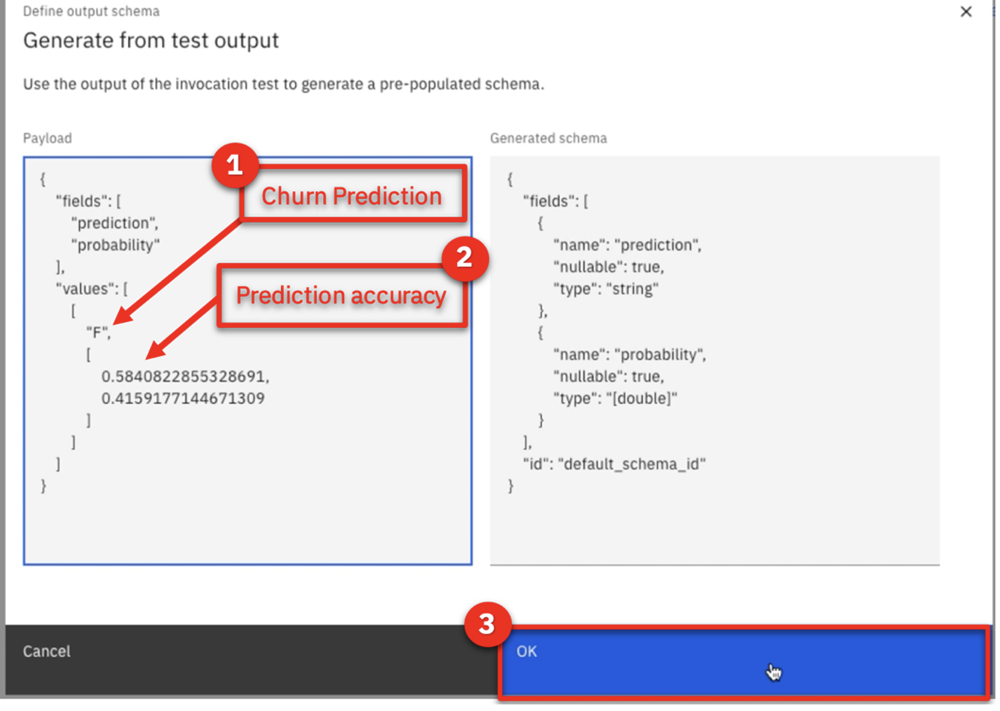 |
| **Action** &nbsp; 4.2.11 | Click **Apply**. 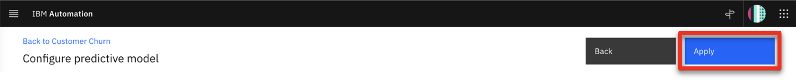 |
| **Narration** | Now let’s return to the Initial retention using the breadcrumb navigation. |
| **Action** &nbsp; 4.2.12 | Click **SkyTalk initial retention DS** using the breadcrumb navigation menu. 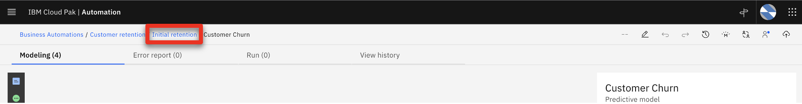 |

| **4.3** | **Assign the predictive model to the ‘Retention budget’ sub-decision** |
| :--- | :--- |
| **Narration** | Let’s improve the ‘Retention budget’ sub-decision by incorporating the churn predictive model. |
| **Action** &nbsp; 4.3.1 | Click **Retention offer**. 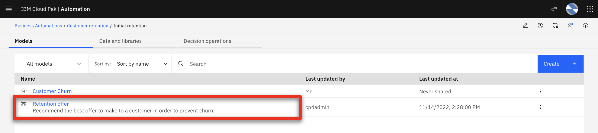 |
| **Action** &nbsp; 4.3.2 | Hover the mouse over the **Retention budget** decision box on the screen. 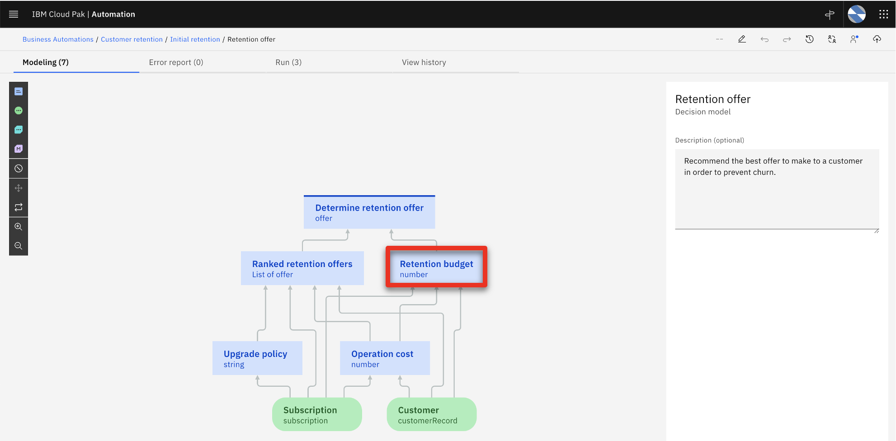 |
| **Action** &nbsp; 4.3.3 | A black choice box appears over the **Retention budget** decision box. Click the **purple box** to **Add prediction** (1). **Prediction 8** (2) will be added to your model.   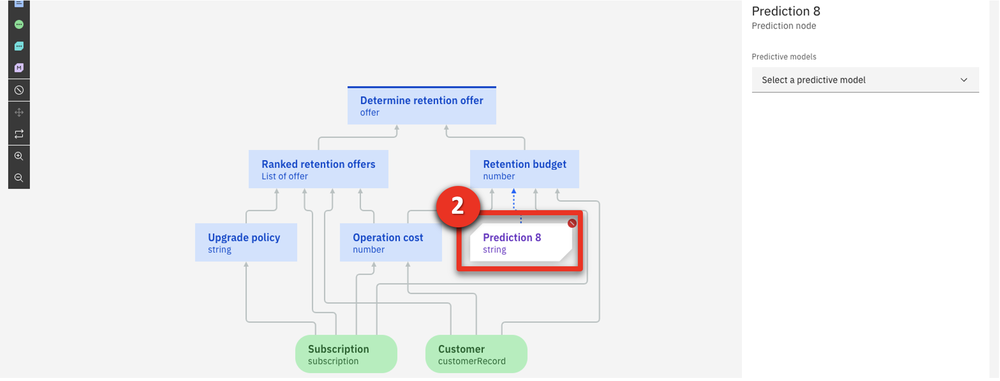 |
| **Narration** | The analyst assigns the churn predictive model to the newly-created predictive node. |
| **Action** &nbsp; 4.3.4 | Click the **Prediction 8** node (1) and then select the **Customer Churn** predictive model (2).  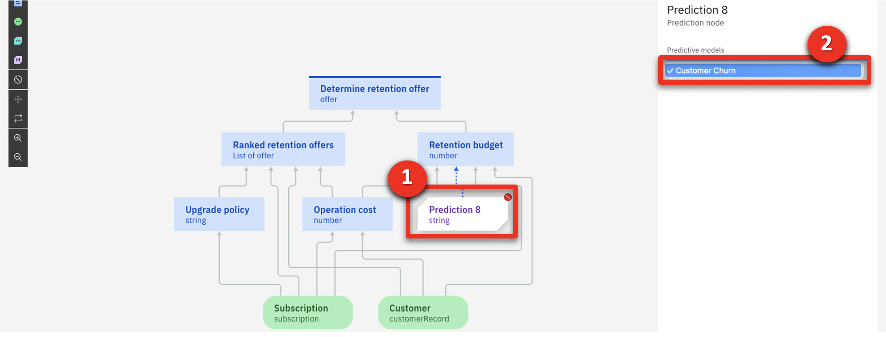 |
| **Action** &nbsp; 4.3.5 | Highlight the predictive model invocation rule.  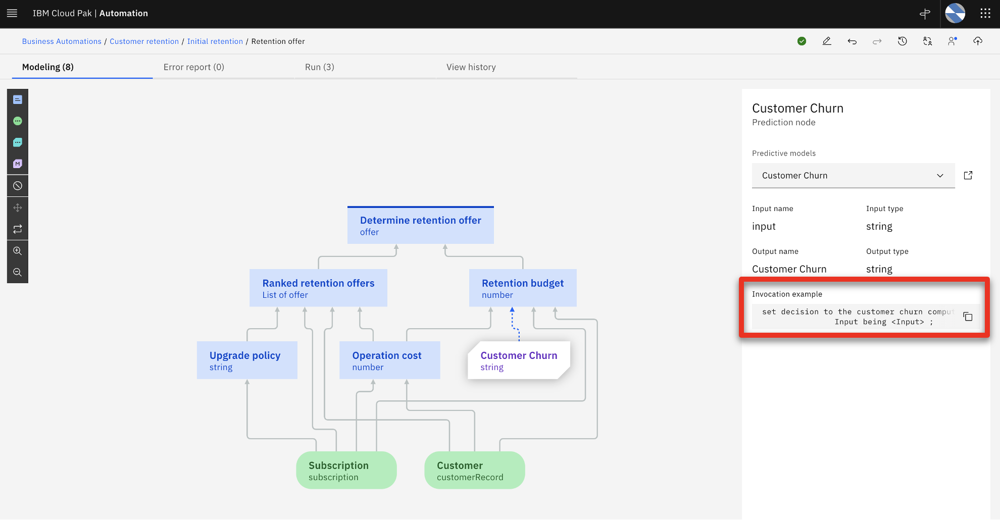 |
| **Narration** | Now the machine learning prediction can be invoked from the retention budget sub-decision using a simple business rule.  In practice, the same steps would be repeated to create another prediction service for the customer lifetime value predictive model. For our demo, this has already been created. Let’s look at the final decision model. |
| **Action** &nbsp; 4.3.6 | Return to **Customer retention** using the breadcrumb navigation menu.   |
| **Action** &nbsp; 4.3.7 | Click the **Retention ML** tile. <inline-notification text="The <strong>Initial retention</strong> tile will not be used any more during the demo."></inline-notification> 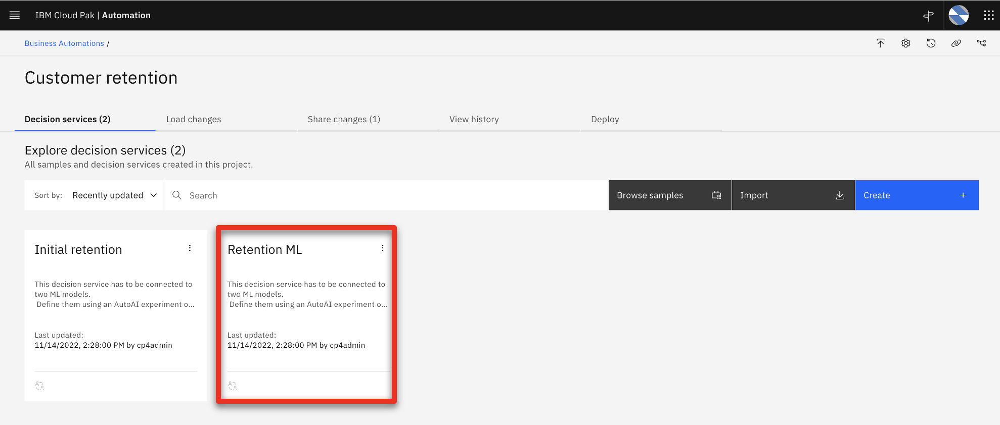 |
| **Action** &nbsp; 4.3.8 | Click **Retention offer**. 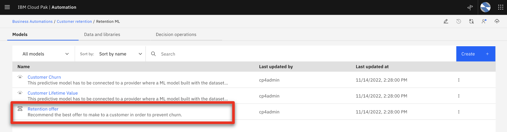 |
| **Narration** | The analyst can now review the 'Retention offer' business logic. |
| **Action** &nbsp; 4.3.9 | Click the **Retention budget** box.  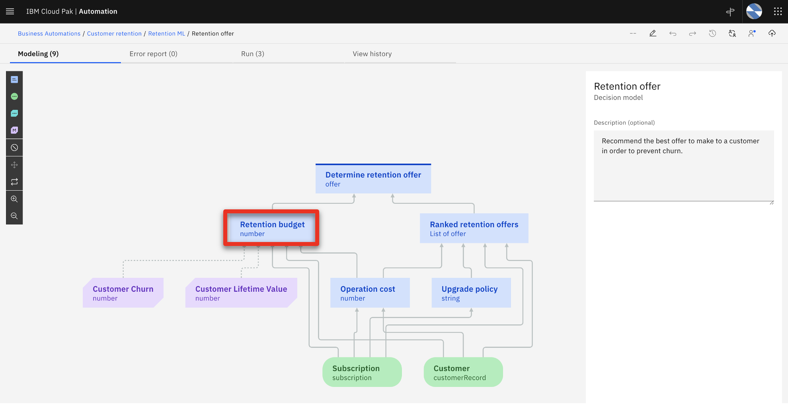 |
| **Narration** | The retention budget is calculated using the three sequential rules that will be applied in the order shown in the dropdown menu. 
| **Action** &nbsp; 4.3.10 | Select the **Logic** tab. 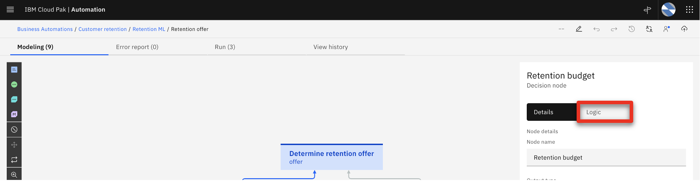 |
| **Narration** | The ‘Estimated retention cost’ rule calculates how much we are willing to spend to keep this customer. |
| **Action** &nbsp; 4.3.11 | Click **Estimate retention cost** to review the retention budget rule. 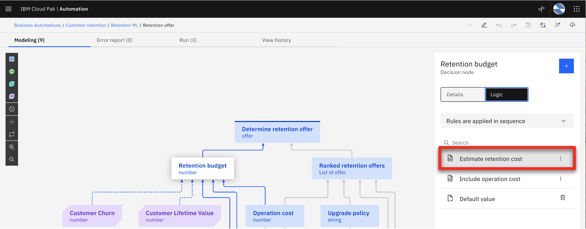  |
| **Narration** | These are the business rules used to calculate the retention cost.  At the start of the rules the definition of the 'LifeTimeValue' variable, which is used in many calculation rules below, includes invoking the customer lifetime value predictive service. Similarly, the Churn variable definition includes invoking the churn predictive service. |
| **Action** &nbsp; 4.3.12 | Review the **Estimate retention cost** business rule. 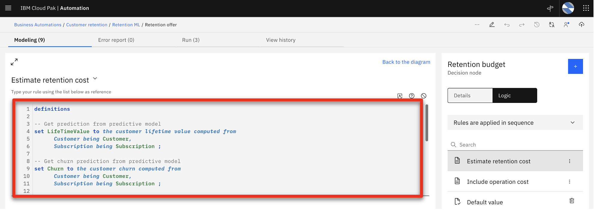 |
| **Narration** | Scrolling further down in the definition, the analyst can review how the results are calculated using the predictions. |
| **Action** &nbsp; 4.3.13 | Scroll down in the business rule pane to show more detail. 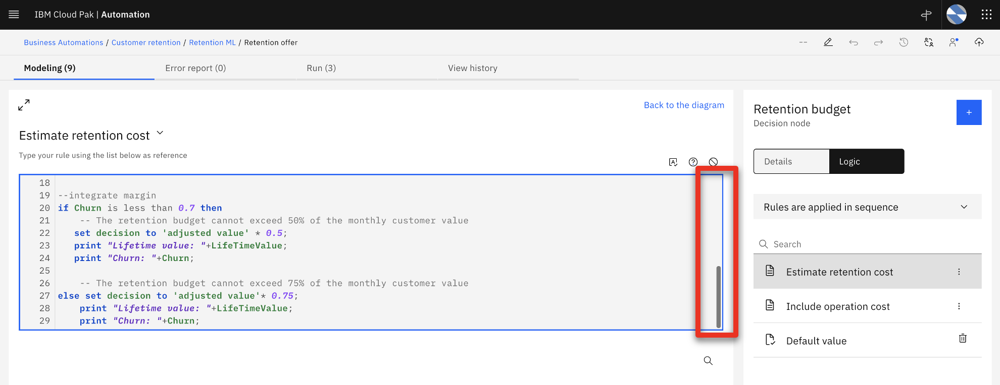 |
| **Narration** | Before deployment, the decision logic can be tested to ensure the results are as expected. |

| **4.4** | **Test the decision services** |
| :--- | :--- |
| **Narration** | The retention budget is based on the customer probability to churn and the customer estimated lifetime value.  To validate the retention budget decision, three pre-defined customer profiles are used. The first one is a low value profile. It corresponds to the customers on which SkyTalk is not willing to spend a big retention budget. |
| **Action** &nbsp; 4.4.1 | Click the **Run (3)** tab. 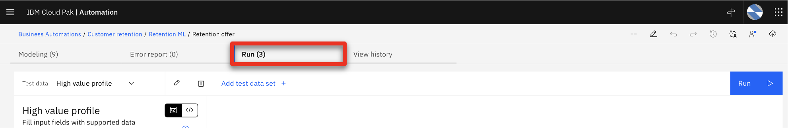 |
| **Action** &nbsp; 4.4.2 | Select **Low value profile** (1) and click **Run** (2).  Click **Show more** (3) when the result is displayed.  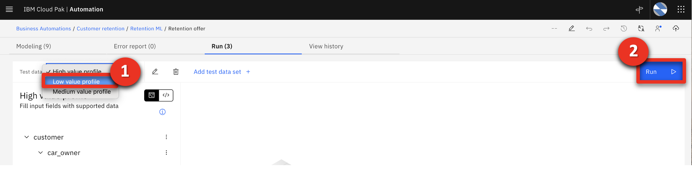  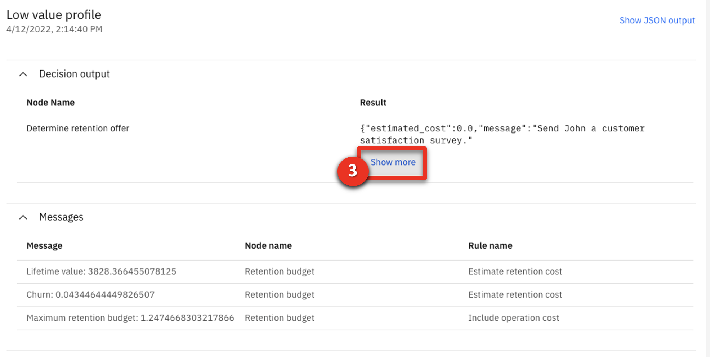 |
| **Narration** | The decision works as expected. SkyTalk will spend no retention budget for this customer and will just send a satisfaction survey. This is due to a limited estimated lifetime value of $3,828 and a low churn probability of 4.3%.  The same decision is now tested against Medium Value profiles. SkyTalk is willing to spend a limited budget to retain these customers. |
| **Action** &nbsp; 4.4.3 | Select **Medium value profile** (1) and click **Run** (2).  Click **Show more** (3) when the result is displayed.  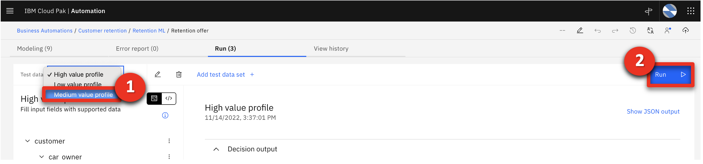  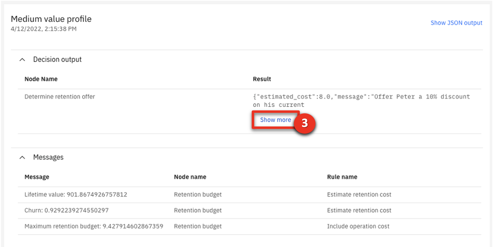 |
| **Narration** | Here again, the decision works as expected.   Only $8 are spent to offer a 10% discount to this customer having an 92% propensity to churn. Finally, the decision is tested on the high value profiles on which SkyTalk is willing to invest retention money. |
| **Action** &nbsp; 4.4.4 | Select **High value profile** (1) and click **Run** (2).  Click **Show more** (3) when the result is displayed.  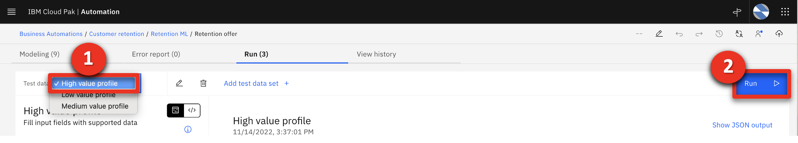  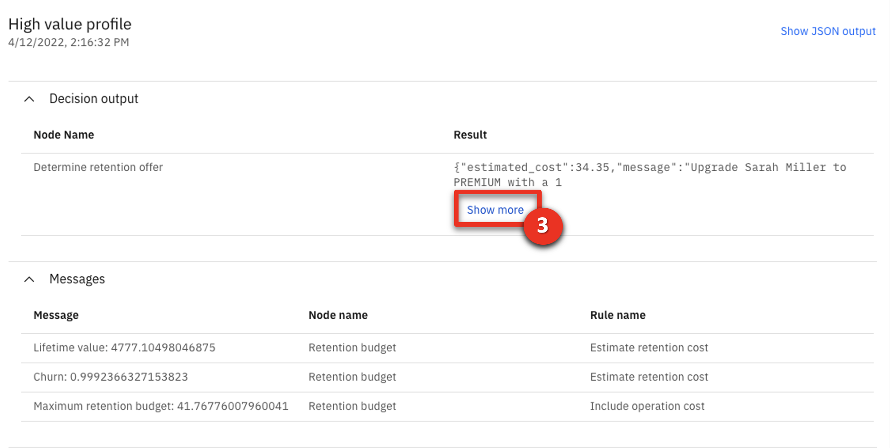 |
| **Narration** | The retention budget is higher to retain this customer having a high lifetime value and a very high propensity to churn.  The decision works as expected in the three situations. It can now be deployed and used in the customer call center application.   Let’s see it in action. |

 

**[Go to top](#top)**

5 - Using the automated call center application

 

| **5.1** | **Generate a real-time retention offer that best allocates SkyTalk’s retention budget** |
| :--- | :--- |
| **Narration** | SkyTalk developed an automated call center application. The application provides agents with customer-specific retention offers in real time. Let’s look at how an agent now handles a customer call using this application. |
| **Action** &nbsp; 5.1.1 | Show the **SkyTalk call center Application** preview window, which was opened during the demo preparation (see step 10 in the demo preparation instructions). &nbsp; &nbsp; &nbsp; &nbsp; &nbsp; &nbsp; &nbsp; &nbsp; &nbsp; &nbsp; &nbsp; &nbsp; &nbsp; &nbsp; &nbsp; &nbsp; &nbsp; &nbsp; &nbsp; &nbsp; &nbsp; &nbsp; &nbsp; &nbsp; &nbsp; &nbsp; &nbsp; &nbsp; &nbsp; &nbsp; &nbsp; &nbsp; &nbsp; &nbsp; &nbsp; &nbsp; &nbsp; &nbsp; &nbsp; &nbsp; &nbsp; &nbsp; &nbsp; &nbsp; &nbsp; &nbsp; &nbsp; |
| **Action** &nbsp; 5.1.2 | Enter “Peter Carter” in the **Search customer** field (1) and click **Search** (2). &nbsp; &nbsp; &nbsp; &nbsp; &nbsp; &nbsp; &nbsp; &nbsp; &nbsp; &nbsp; &nbsp; &nbsp; &nbsp; &nbsp; &nbsp; &nbsp; &nbsp; &nbsp; &nbsp; &nbsp; &nbsp; &nbsp; &nbsp; &nbsp; &nbsp; &nbsp; &nbsp; &nbsp; &nbsp; &nbsp; &nbsp; &nbsp; &nbsp; &nbsp; &nbsp; &nbsp; &nbsp; &nbsp; &nbsp; &nbsp; &nbsp; &nbsp; &nbsp; &nbsp; &nbsp; &nbsp; &nbsp; &nbsp; &nbsp; &nbsp; &nbsp; &nbsp; &nbsp; &nbsp; &nbsp; &nbsp; &nbsp; &nbsp; &nbsp; &nbsp; &nbsp; &nbsp; &nbsp; &nbsp; &nbsp; &nbsp; &nbsp; &nbsp; &nbsp; &nbsp; &nbsp; &nbsp; &nbsp; &nbsp; &nbsp; &nbsp; &nbsp; &nbsp; &nbsp; &nbsp; &nbsp; &nbsp; &nbsp; &nbsp; 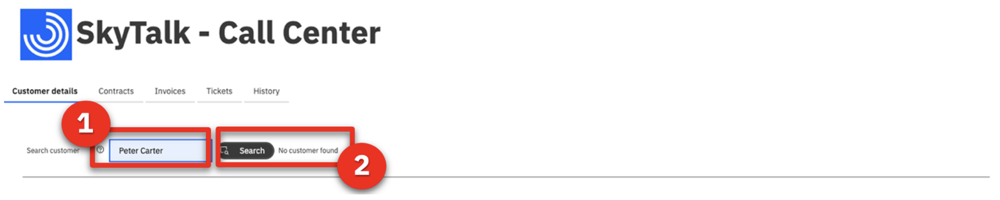 |
| **Narration** | A customer-specific retention offer displays. The agent suggests this offer to the customer in real time. &nbsp; &nbsp; &nbsp; &nbsp; &nbsp; &nbsp; &nbsp; &nbsp; &nbsp; &nbsp; &nbsp; &nbsp; &nbsp; &nbsp; |
| **Action** &nbsp; 5.1.3 | Click **Get offer**. &nbsp; &nbsp; &nbsp; &nbsp; &nbsp; &nbsp; &nbsp; &nbsp; &nbsp; &nbsp; &nbsp; &nbsp; &nbsp; &nbsp; &nbsp; &nbsp; &nbsp; &nbsp; &nbsp; &nbsp; &nbsp; &nbsp; &nbsp; &nbsp; &nbsp; &nbsp; &nbsp; &nbsp; &nbsp; &nbsp; &nbsp; &nbsp; &nbsp; &nbsp; &nbsp; &nbsp; &nbsp; &nbsp; &nbsp; &nbsp; &nbsp; &nbsp; 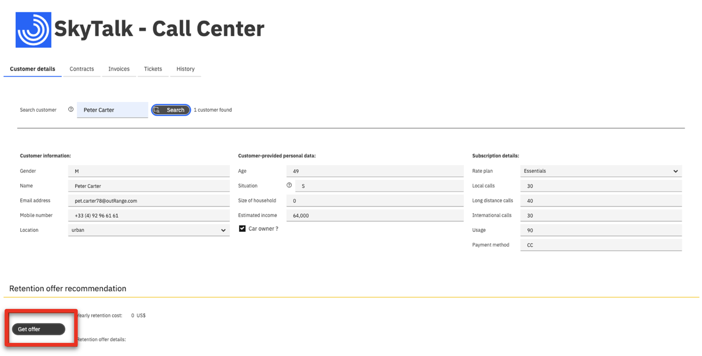 The offer displays: &nbsp; &nbsp; &nbsp; &nbsp; &nbsp; &nbsp; &nbsp; &nbsp; &nbsp; &nbsp; &nbsp; &nbsp; &nbsp; &nbsp; &nbsp; &nbsp; &nbsp; &nbsp; &nbsp; &nbsp; &nbsp; &nbsp; &nbsp; &nbsp; &nbsp; &nbsp; &nbsp; &nbsp; &nbsp; &nbsp; &nbsp; &nbsp; &nbsp; &nbsp; &nbsp; &nbsp; &nbsp; &nbsp; &nbsp; &nbsp; &nbsp; &nbsp; 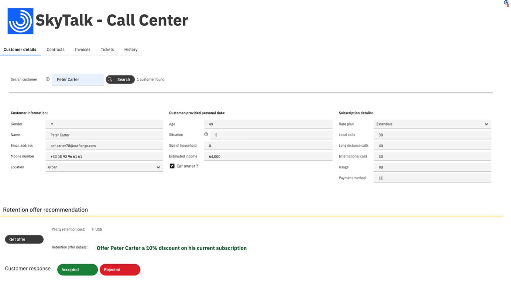  |

**[Go to top](#top)**

Summary

 
In this demo, I showed how business users can easily build business rules that incorporate predictive decisions. The predictions help retain SkyTalk’s profitable customers by providing customized offers at the lowest cost to SkyTalk.
 
The new retention process also improved productivity by eliminating manual procedures. Customer satisfaction will increase with speedier and more relevant service.
 
Thank you for attending today’s presentation.
 

**[Go to top](#top)**

Note - After the demonstration

 
When you are done with your demonstration, don’t forget to proceed with the instructions in the **After each demo** section of the **Demo preparation**. 
 
These instructions will explain you how to un-deploy the two ML services to suspend the billing process and save your free Watson ML Lite quota. 
 

**[Go to top](#top)**

