

Introduction

Today we’ll see how watsonx Orchestrate uses conversational AI to help sales professionals be more productive.

Insurance sales agents spend their day doing many tasks while constantly switching between multiple applications. Much of their time is spent servicing existing clients, but an important part of being a sales agent is finding new business.

Prior to watsonx Orchestrate, agents dedicated a few hours per week to sending prospecting emails for upsell and cross-sell. The steps of this process are: 
1.	Search Salesforce for customers that meet certain cross-sell criteria
2.	Determine the best cross-sell products to offer each customer
3.	Send a customized email to each customer

In this demo, we will see how IBM watsonx Orchestrate skills can assist agents in performing this sequence of tasks within a single chat interface. Skills are the fundamental components of watsonx Orchestrate and allow agents to interact with systems through natural language. Also, we’ll see how developers, called 'builders' in watsonx Orchestrate, create the customized skills used by the agents.

Let's get started.

 

1 - Retrieving a customer list from Salesforce using conversational AI

 

| **1.1** | **Invoke a Salesforce skill using natural language** |
| :--- | :--- |
| **Narration** | A common task for an insurance agent is to periodically search the Salesforce CRM for customers with recent life changes to whom they can make upsell / cross-sell offers. Traditionally, this task involves creating custom Salesforce reports and downloading them for manual review by the agent.   In Orchestrate, the agent invokes the Salesforce task using the simple natural language phrase: 'Write upsell email to customers.' Orchestrate uses AI to understand the sales agent's intent and peform the correct action, even when the request phrase is ambiguous.|
| **Action** &nbsp; 1.1.1 | Click on the menu slider on the top left and select <strong>Chat</strong> 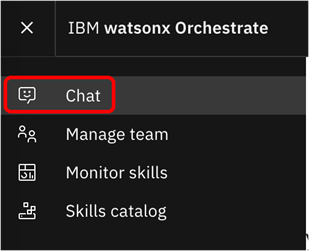|
| **Action** &nbsp; 1.1.2 | Switch the view to <strong>Team skills</strong> 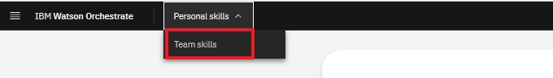|
| **Action** &nbsp; 1.1.3 | Type the natural language command **'Write upsell email to customers'** (1) and click the **Send** arrow (2) in the chat window. 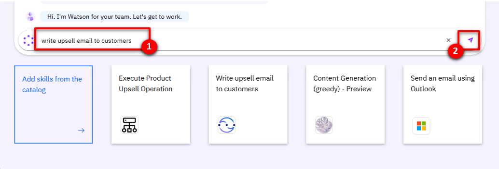 |
| **Narration** | Orchestrate runs the Salesforce task by connecting to a backend API that retrieves a list of customers with recent life changes. The returned customer data is neatly displayed in a table within Orchestrate's chat interface.  The agent reviews the list of customers and pursues a cross-sell opportunity with John Collins, who has a child that is about to turn twenty-six. In the US, twenty-six is a milestone requiring children to acquire independent health insurance coverage. (Other countries set different age limits for various family milestones.)|
| **Action** &nbsp; 1.1.4 | Select **John Collins** (1) from the table and click **Apply** (2) in the chat window.    |

 

| **1.2** | **Identify products for cross-sell / upsell** |
| :--- | :--- |
| **Narration** | The next task is to determine which products to recommend for the selected customer.   The customer details from Salesforce are automatically submitted into Orchestrate's built-in decision engine and the upsell recommendations are displayed.  Behind the scenes, the decision engine applied business logic using many different factors specific to this customer, such as the child’s age, pre-existing conditions, and current coverage.  In the case of John Collins, the decision engine recommends three health insurance plans suitable for his child: Bronze-level Marketplace Plan, Silver-level Marketplace Plan and Short-term Health Insurance.| 
| **Action** &nbsp; 1.2.1 | Highlight the three insurance plans recommended by the decision skill.  |

 

| **1.3** | **Use generative AI to write a personalized email** |
| :--- | :--- |
| **Narration** | Personalized emails increase the likelihood of conversion. watsonx Orchestrate uses one of IBM's Large Language Models (LLMs) via the watsonx.ai platform to generate a targeted email for the selected customer.   Perfecting the AI prompt to generate a properly formatted email is typically a time-consuming activity. To make this quicker, Orchestrate automatically inserts a pre-written AI prompt that includes dynamically inserted customer data in the prompt input field.|
| **Action** &nbsp; 1.3.1 | In the prompt field, highlight the input text with embedded recommended products (1) to show how the prompt has been populated using data taken from the decision engine. Click **Apply** (2)  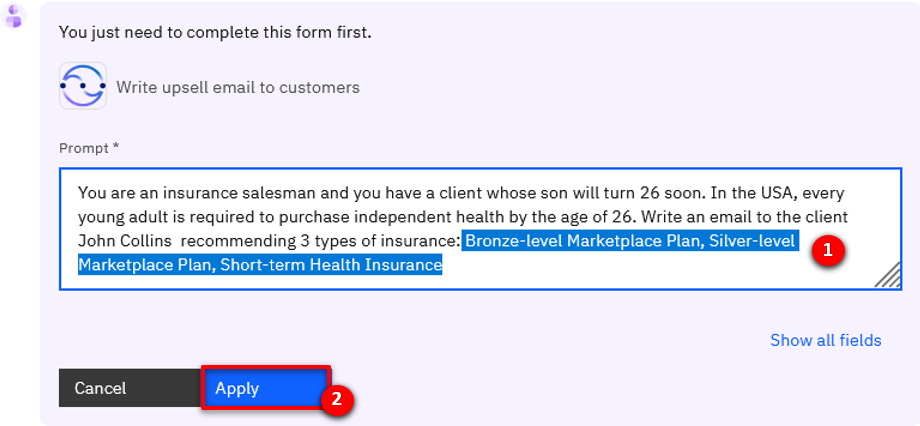 |

 

| **1.4** | **Use the Microsoft Outlook skill to send a personalized email** |
| :--- | :--- |
| **Narration** | Orchestrate launches its out-of-the-box Microsoft Outlook skill to send an email without the agent needing to use an email client. In addition to pre-populating the 'To' and 'Subject' fields, Orchestrate automatically inserts the AI-generated text into the 'body' field.|
| **Action** &nbsp; 1.4.1 | Review the email and point out the text generated by watsonx.ai that was automatically inserted into the **body** field.  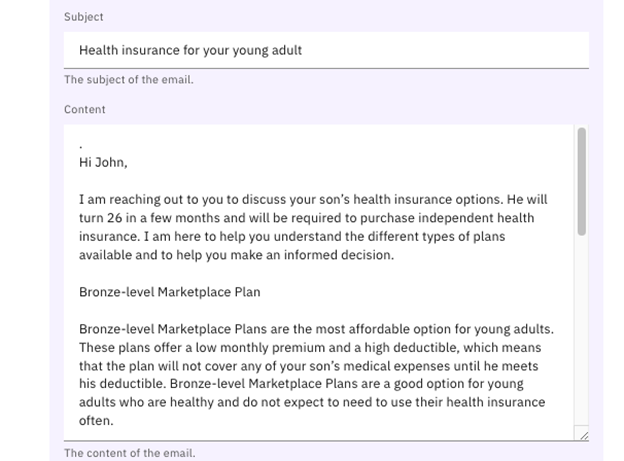|
| **Action** &nbsp; 1.4.2 | Change the email address in the **To** (1) field to your own email. Scroll down and click **Apply** (2) in the watsonx Orchestrate chat window.         Check your inbox to view the sent email. 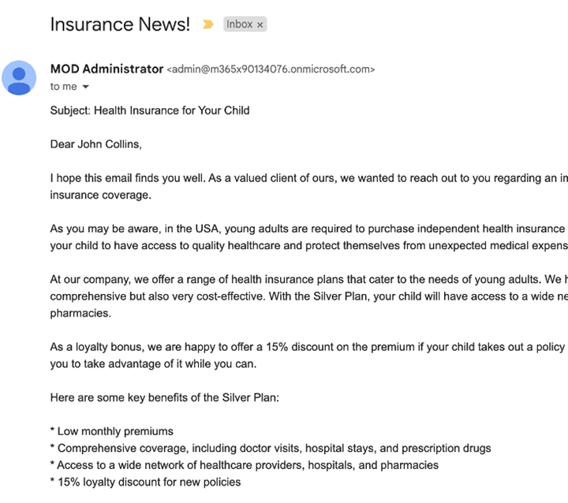 |
 
 

**[Go to top](#place1)**

  

2 - Combining skills into skill flows

 

| **2.1** | **Create a skill flow** |
| :--- | :--- |
| **Narration** | IBM watsonx Orchestrate provides access to a broad range of skills that help users perform their daily tasks. It comes with a collection of ready-to-use, out-of-the-box skills that range from working with productivity tools to providing deep analytical insights. Users can immediately access and use the built-in skills.    watsonx Orchestrate developers, called 'builders,' create the customized skills used by the insurance agents. Builders can create skill flows from a sequence of individual skills. When a skill flow is created, it becomes a new "composite" skill that can be used just like an individual skill.    Skill flows perform tasks composed of multiple steps. For example, the insurance agent used a skill flow that combined Salesforce, a product recommendation engine, and e-mail.    We’ll look at how builders create skill flows by sequencing the first two steps of the upsell task performed by the agent. We’ll combine the Salesforce and recommendation engine skills to build a new composite skill flow that searches Salesforce for target customers and then makes product recommendations for the selected customer. |
| **Action** &nbsp; 2.1.1 | Click the **menu slider** icon.   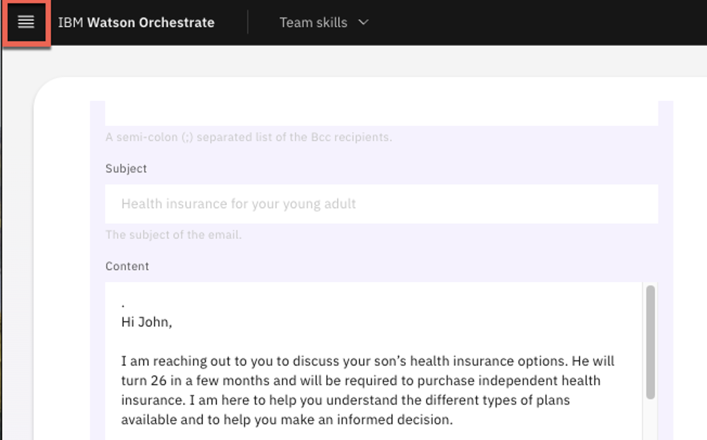 |
| **Action** &nbsp; 2.1.2 | Click **Skills** under the 'BUILD' section (these options are only shown to users with builder access).  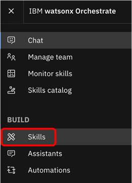 |
| **Action** &nbsp; 2.1.3 | Click the **Add skills** arrow (1). Click **Create a skill flow** (2).   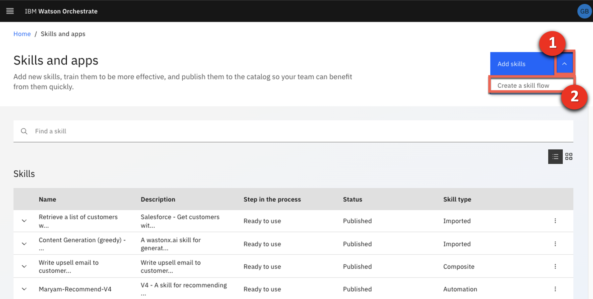 |
| **Narration** | To build skill flows, we can use any skill in the skill catalog. First, we’ll add the Salesforce skill that returns the list of clients who experienced recent life changes. |
| **Action** &nbsp; 2.1.4 | Click the **+** button.   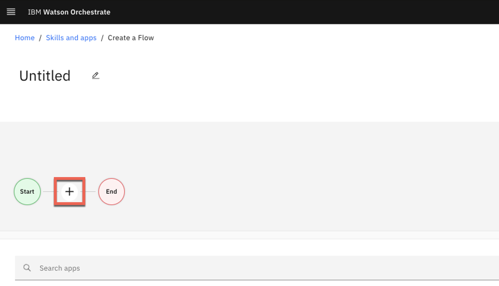 |
| **Narration** | The list of apps shows the 'Product Upsell' and 'Salesforce – Get customers with recent life changes' cards. <inline-notification text="These are shown at the top of the list as they are the connected personal skills that we prepared earlier."></inline-notification> |
| **Action** &nbsp; 2.1.5 | Click the **Salesforce – Get customers with recent life changes** card.   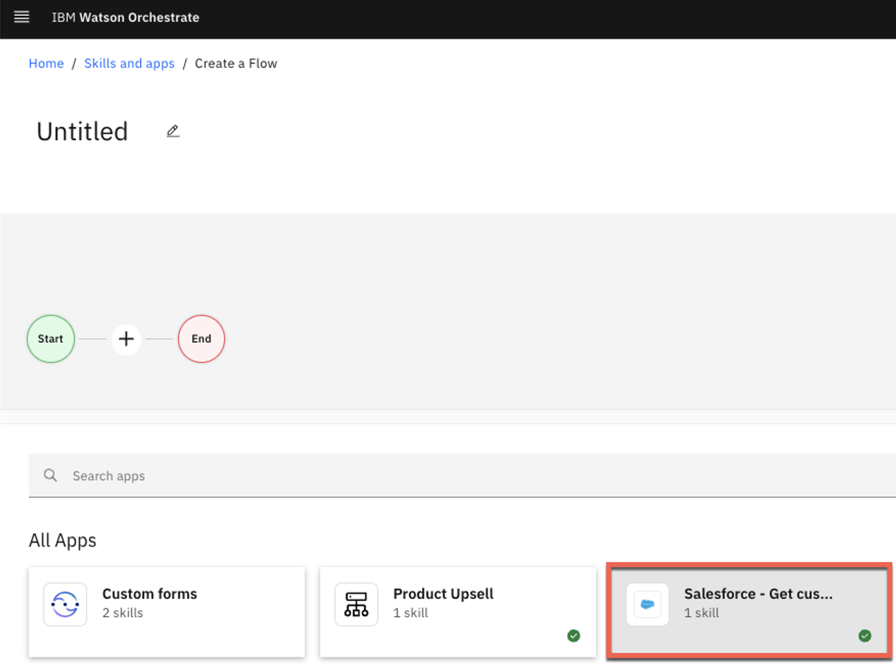 |
| **Action** &nbsp; 2.1.6 | Click **Add Skill +**.   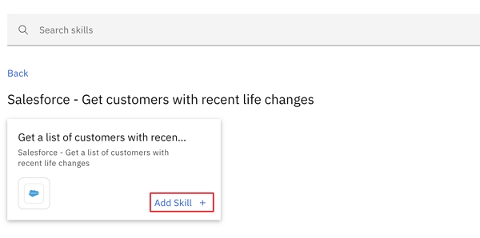 |
| **Narration** | The next step in the flow is to invoke the decision that determines the best product recommendation based on the customer situation. Let’s add the recommendation skill to the flow. |
| **Action** &nbsp; 2.1.7 | Click the **+** button.   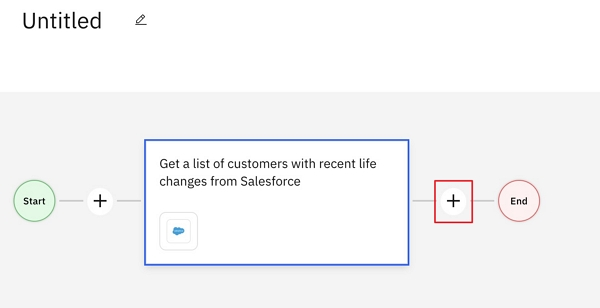 |
| **Action** &nbsp; 2.1.8 | Click the **Product Upsell** card.    |
| **Action** &nbsp; 2.1.9 | Click **Add Skill +**.    |
| **Narration** | Each skill can have one or more inputs and outputs. The skill flow editor allows builders to easily map the output retrieved from a previous skill in the flow to the input of a subsequent skill. For example, the attributes of the selected customer are available as inputs to the product recommendation decision engine. |
| **Action** &nbsp; 2.1.10 | Click the **Product Upsell** box within the flow. The property sheet for the skill will appear under the flow.   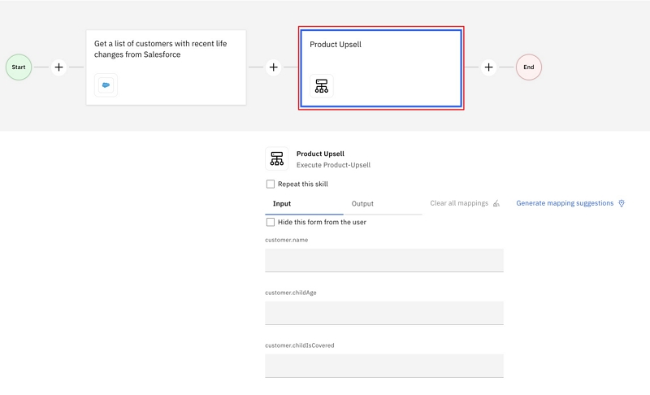 |
| **Narration** | The 'Input' and 'Output' tabs are used to assign the values. Output values from preceding skills are displayed in the 'Input' tab. |
| **Action** &nbsp; 2.1.11 | Click the **Input** tab (1). Click inside the **customer.name** field (2).   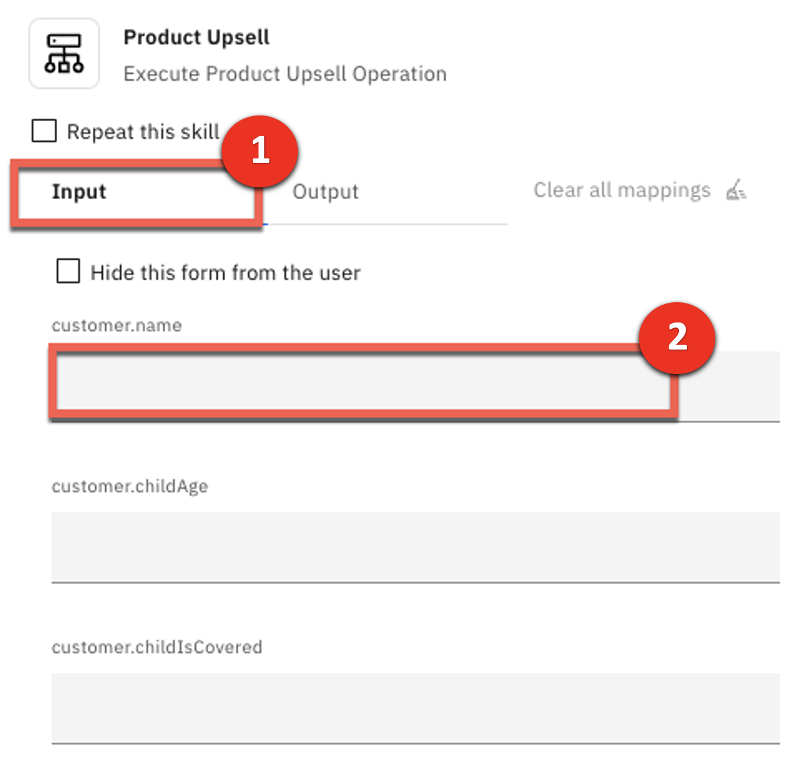 |
| **Action** &nbsp; 2.1.12 | Within the **Available Mappings** panel, click the skill that contains the value we need as an input.   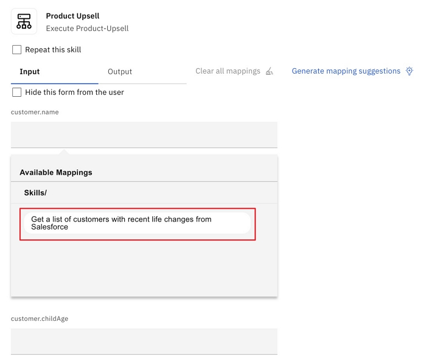 |
| **Action** &nbsp; 2.1.13 | Scroll through the available values and select **Name**.   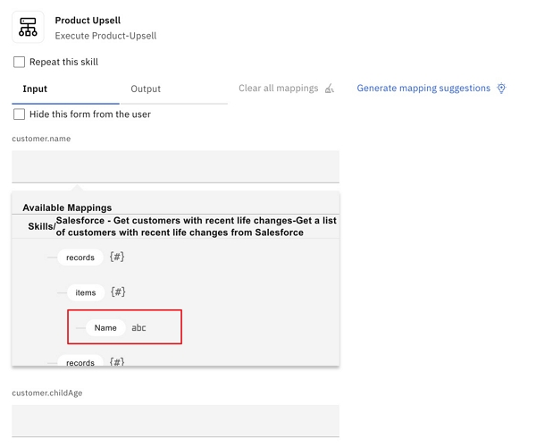 |
| **Action** &nbsp; 2.1.14 | The path to the value is now shown. Do not define **Operator**.   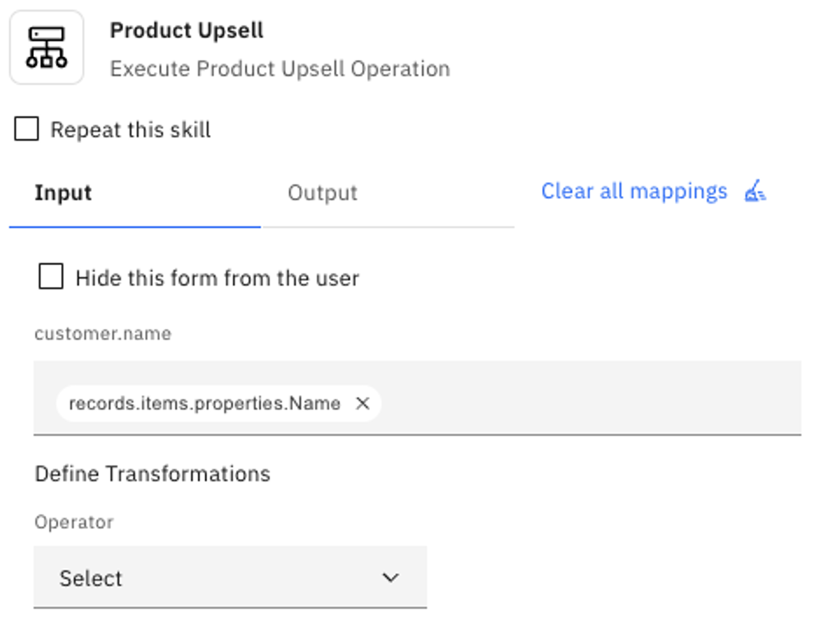 |
| **Action** &nbsp; 2.1.15 | Repeat this exercise to map the remaining two values.   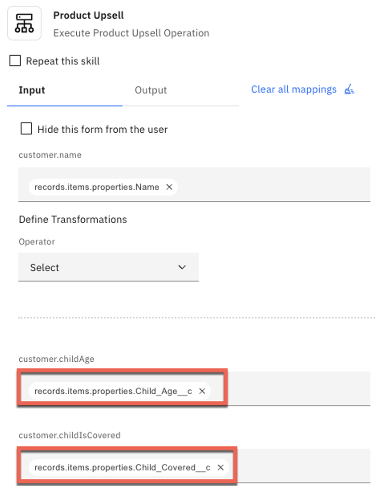 |
| **Narration** | We'll name our new composite flow and save it. |
| **Action** &nbsp; 2.1.16 | Click the **pencil** icon.   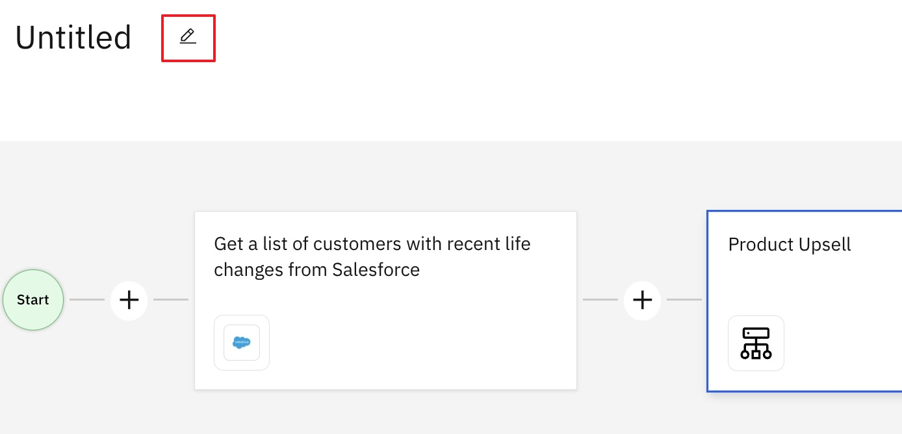 |
| **Action** &nbsp; 2.1.17 | In the **Edit Skill flow details** panel, provide a **Name** for your skill flow, such as '[your initials]-Upsell-Skillflow' (1). Click **Save** (2).   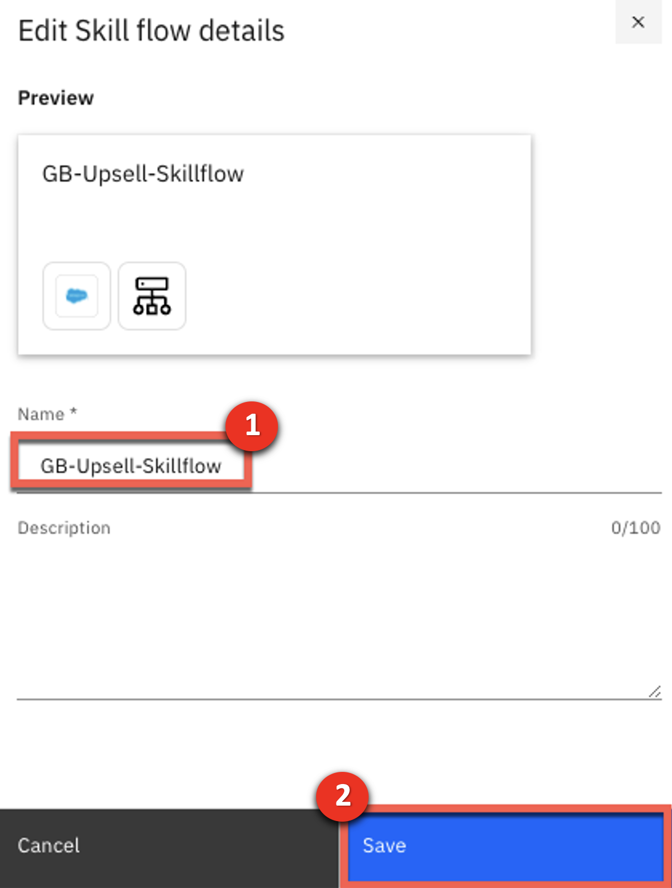 |
| **Action** &nbsp; 2.1.18 | Click the **Actions** arrow (1). Click **Save as draft** (2).   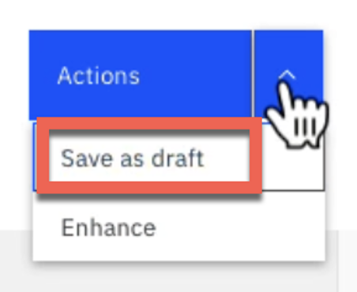 |

 

| **2.2** | **Enhance skills** |
| :--- | :--- |
| **Narration** | After building the skill flow, we’ll train the AI model used to trigger the skill from the chat interface. Once the skill is fully trained, we’ll publish it to the watsonx Orchestrate skill catalog. |
| **Action** &nbsp; 2.2.1 | In the top right corner of the screen, click the **Actions** arrow (1). Click **Enhance** (2).   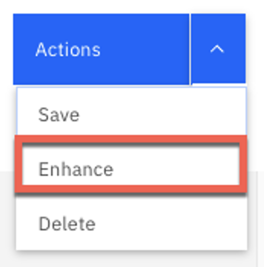 |
| **Narration** | Phrases are used to train the AI model. From the chat interface, watsonx Orchestrate can understand the user’s intents, and will ask for clarification and give users choices if it isn’t sure which skill to run. <inline-notification text="As this is a shared environment, it’s possible there are many duplicate phrases related to product upsell. Try to provide an original phrase, such as something that includes a name or unrelated term."></inline-notification> |
| **Action** &nbsp; 2.2.2 | Enter a phrase into the first **Phrases** placeholder, such as '**get gerrys upsell hints for customers**.'   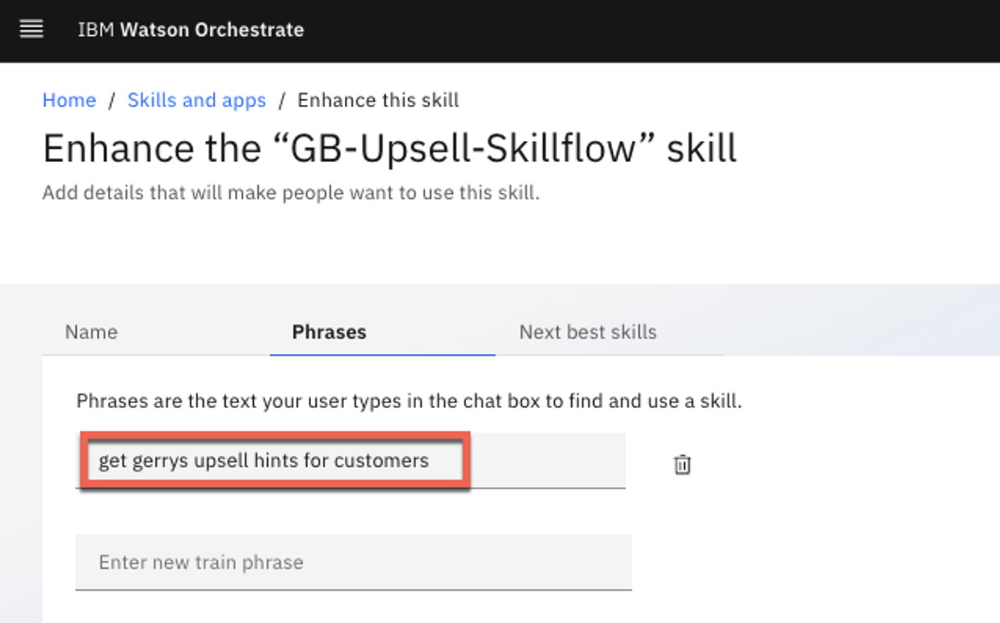 |
| **Narration** | Next, we’ll publish the new flow to the watsonx Orchestrate skill catalog, so the insurance agents can use it. |
| **Action** &nbsp; 2.2.3 | Click **Publish**.   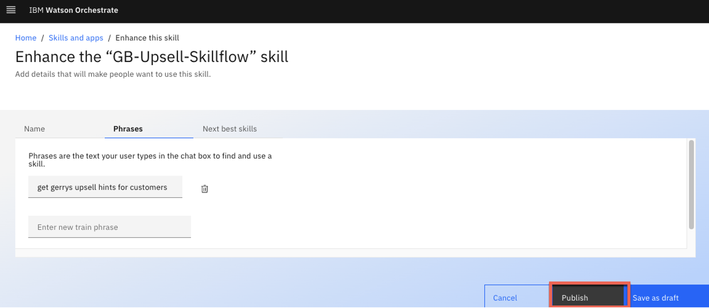 |

 

| **2.3** | **Run the skill flow** |
| :--- | :--- |
| **Narration** | We have finished creating and publishing the skill flow. Now, all the insurance agents in the company can add the skill as a personal skill. |
| **Action** &nbsp; 2.3.1 | Click the menu slider icon and select **Chat**.    |
| **Action** &nbsp; 2.3.2 | Click **Add skills from the catalog**.   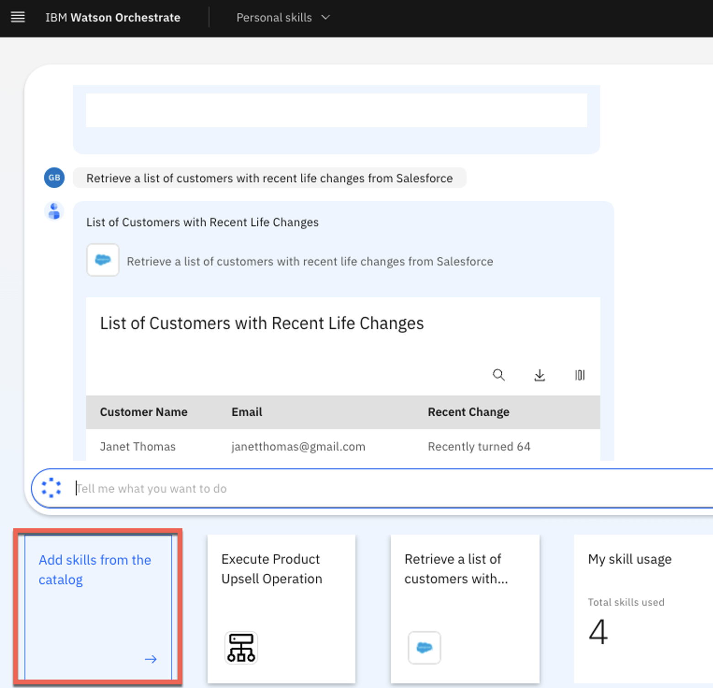 |
| **Action** &nbsp; 2.3.3 | Search the catalog for the word 'flows' and click the **Skill flows** card.  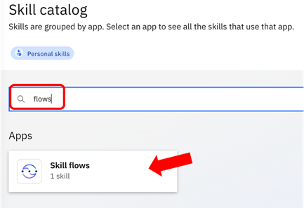 |
| **Action** &nbsp; 2.3.4 | In the Skill flows card of your upsell skill flow,, click **Add skill +**.   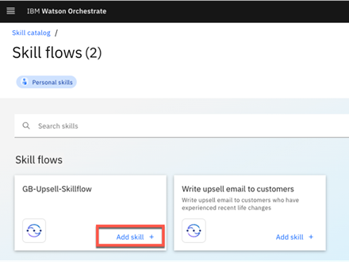 |
| **Narration** | We’re ready to run our new skill flow by asking watsonx Orchestrate to find upsell candidates and make product recommendations for the selected customer. |
| **Action** &nbsp; 2.3.5 | Click the menu slider to navigate back to your **Chat** view.    |
| **Action** &nbsp; 2.3.6 | Enter the phrase with your name in it to run your skill.   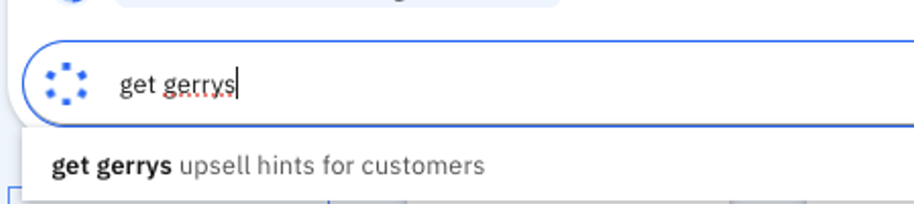 |
| **Narration** | The list of customers is returned, and we'll select one. |
| **Action** &nbsp; 2.3.7 | Select **John Collins** (1) and click **Apply** (2).   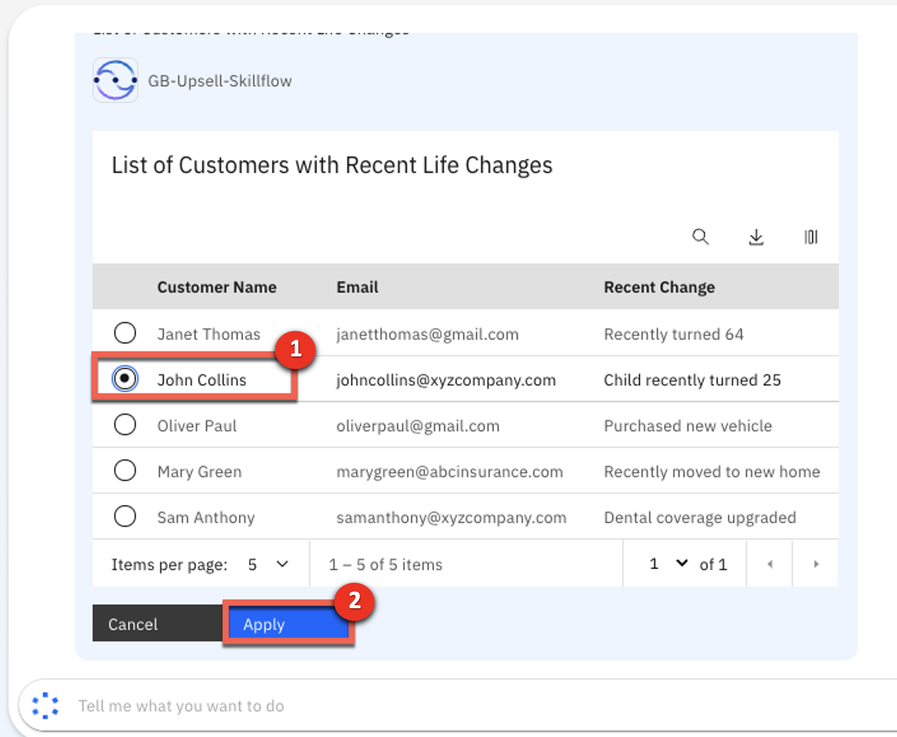 |
| **Action** &nbsp; 2.3.8 | The data for Johns Collins is mapped into the **customer.childAge** (1) and **customer.name** (2) fields for the product recommendation skill. Click **Apply** (3) to run the skill.   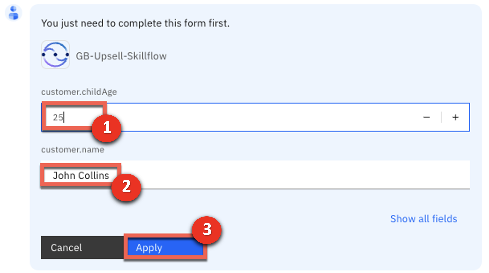 |
| **Narration** | Our builder created and published the new skill flow. The agent added the skill and ran it. We see that the new skill flow has run successfully and made a product upsell recommendation.   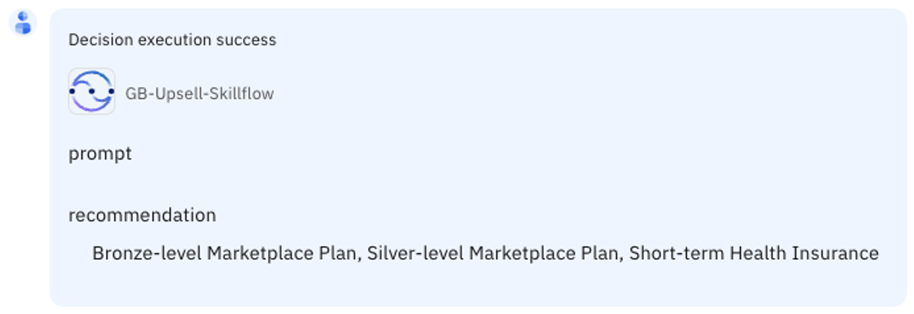 |

 

**[Go to top](#place1)**

  

3 - Building new skills

 

| **3.1** | **Import OpenAPI files** |
| :--- | :--- |
| **Narration** | watsonx Orchestrate comes with a catalog of out-of-the-box skills, such as the Microsoft Outlook skill used to send the customer e-mail. Additional skills can be added by watsonx Orchestrate 'builders’ who can create customized skills and make them available to insurance sellers.    Builders can create new skills using a few different sources:    1. *Composite Skill flows*: We can build composite skills from a sequence of individual skills, such as the skill flow we just created.   2. *Embedded Automations*: We can create skills using the built-in automation builder, such as the product recommendation skill used to determine the products to upsell.   3. *IBM Cloud Pak for Business Automation*: We can expose skills using pre-built integrations to automation services running in IBM Cloud Pak for Business Automation and IBM RPA. For example, Watsonx Orchestrate can invoke decisions, workflows and RPA bots running in those products.   4. *Open APIs*: Import skills from APIs exposed in OpenAPI files, such as the custom Salesforce skill used to retrieve a list of customers with recent life changes.    Let’s see how we created the custom Salesforce skills using an OpenAPI file.    (OpenAPI is a specification for documenting and standardizing the design and behavior of web APIs. An OpenAPI file provides the detailed outline of how a particular API works, including its operations, endpoints, data types, request and response formats and authentication methods.) |
| **Action** &nbsp; 3.1.1 | Click the menu slider and then click **Skills** (2).    |
| **Action** &nbsp; 3.1.2 | Click **Add skills**.   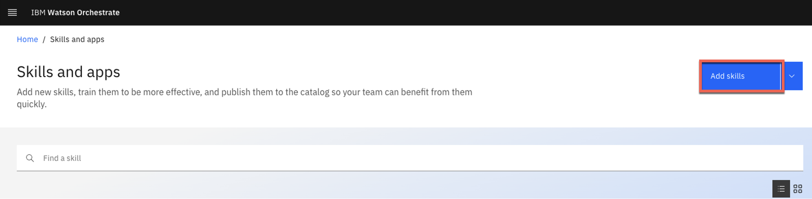 |
| **Narration** | watsonX Orchestrate is able to add new skills by importing an OpenAPI file and selecting the desired operation. First, we’ll upload the OpenAPI file. |
| **Action** &nbsp; 3.1.3 | Click **From files**.   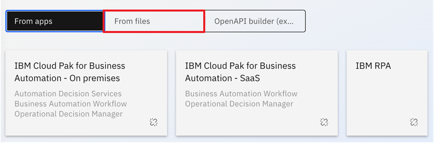 |
| **Action** &nbsp; 3.1.4 | Upload the **GetSalesforceCustomers.json** file you downloaded and updated during the demo preparation.   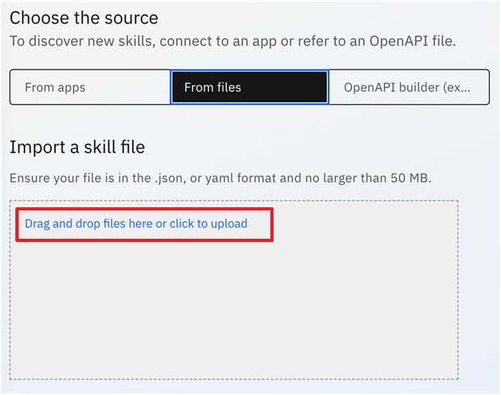 |
| **Narration** | The API specification is automatically imported from the file, and the status is displayed. |
| **Action** &nbsp; 3.1.5 | Highlight the status (1). Click **Next** (2).   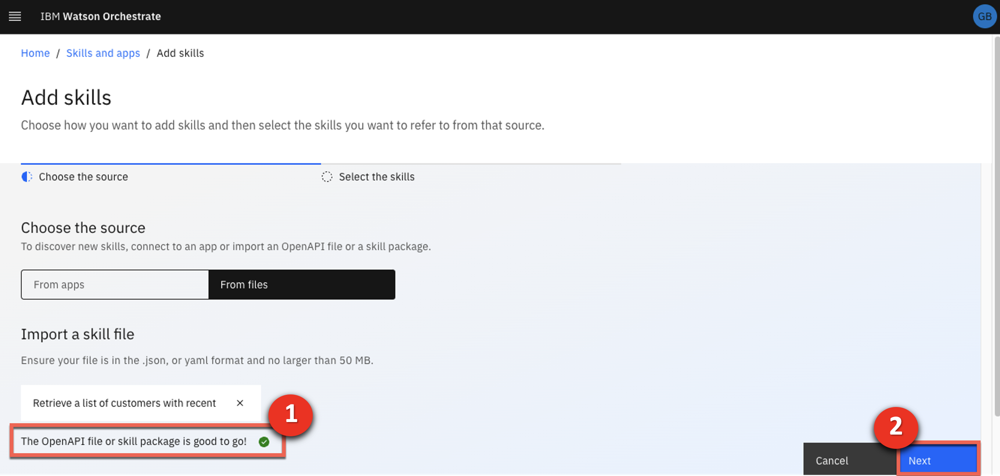 |
| **Narration** | Each API operation found in the OpenAPI file becomes available to be added as a new skill. In this case, only one operation is defined, so there is only one skill in the list and it is pre-selected. |
| **Action** &nbsp; 3.1.6 | Select the skill (1) and click **Add** (2). <inline-notification text="The unique value added to the OpenAPI file is now shown in the <strong>Description</strong>."></inline-notification> 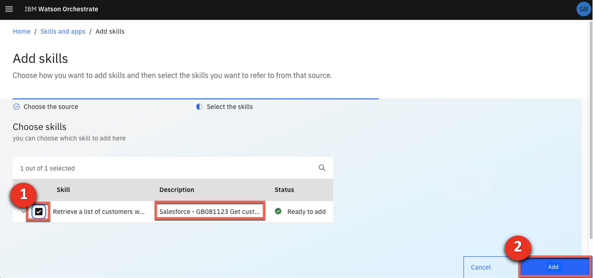 |
| **Action** &nbsp; 3.1.7 | In the search box, enter the unique ID you added to the OpenAPI file (1). Click the corresponding **ellipsis** icon and then click **Enhance this skill** (2). <inline-notification text="Unless a unique ID is used, it is highly likely that there will be many duplicates. Confirm the identity of your skill by expanding the details and verifying you are the author."></inline-notification> 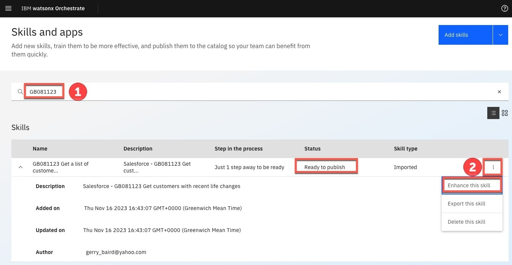 |
| **Action** &nbsp; 3.1.8 | Click the **Phrases** tab (1). Delete the second phrase and enter a unique phrase for the skill, such as the author's initials and date (2). Click **Publish** (3).   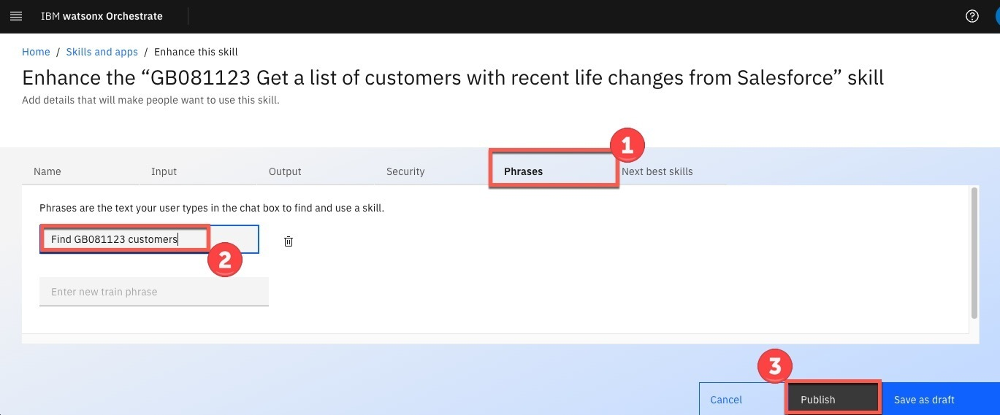 |
| **Action** &nbsp; 3.1.9 | Click **Home**.   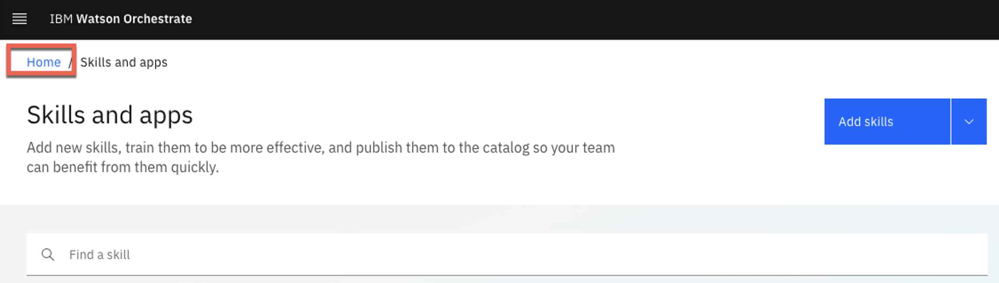 |
| **Action** &nbsp; 3.1.10 | Click **Add skills from the catalog**.   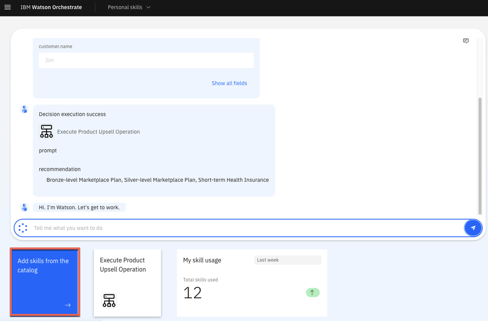 |
| **Action** &nbsp; 3.1.11 | Use your unique ID again to filter the list of skills (1). Click the card (2).    |
| **Action** &nbsp; 3.1.12 | Enter your unique ID again, if required (1). Click **Add skill +** (2). Click **Connect app** (3).   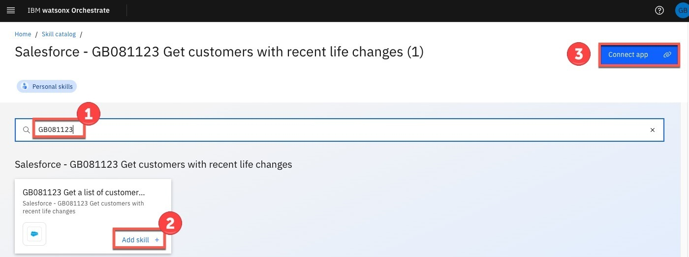 |
| **Action** &nbsp; 3.1.13 | Provide the **Client ID** and **Client Secret** (1). Click **Connect app** (2).   Use the following credentials:   • **Client ID**: 3MVG9HB6vm3GZZR_fBoKSxSomjQ8ZaShg9mWyjw2pJak55hcL8KGtUjjkooS7wpLD25QraIBxop4ThrTPK237   • **Client Secret**: 34CB8CCE1E4495C0CAE6A921A5FC7D17CC6CE614152175D20F5B00F8B250626C    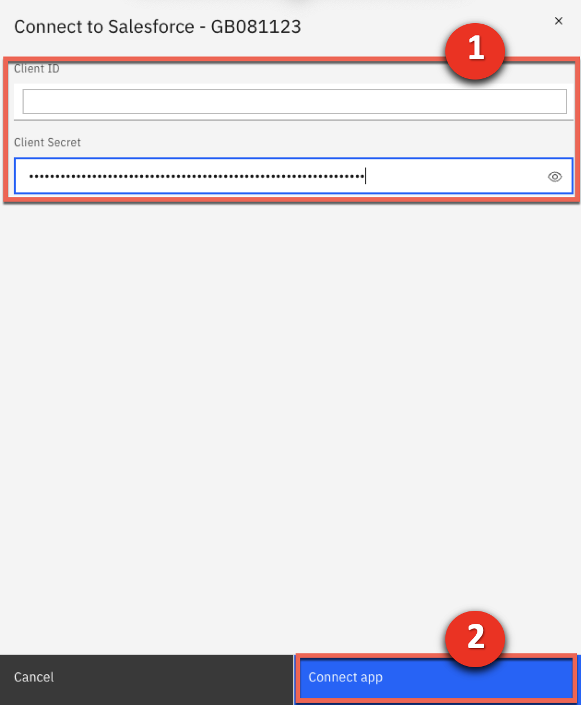 |
| **Narration** | Now that the skill is published and added to our personal skills, we can test it out. |
| **Action** &nbsp; 3.1.14 | Return to the chat screen and run your new personal skill by clicking on the tile.   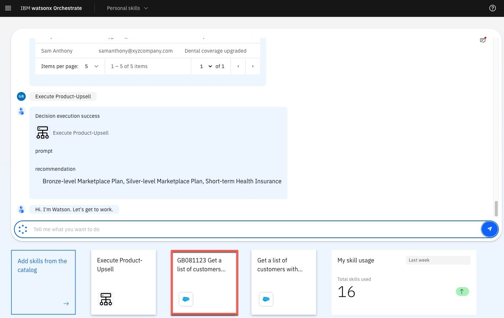 |
| **Narration** | We've successfully imported an OpenAPI custom skill file. When we run the new skill, we see the results of the Salesforce search displayed in a table. |
| **Action** &nbsp; 3.1.15 | Show the Salesforce results table in the chat window.    |

 

**[Go to top](#place1)**

  

Summary

  
Using an upsell / cross-sell example, we demonstrated how IBM watsonx Orchestrate provides a conversational interface for sales agents to perform their repetitive tasks.  

By providing a catalog of skills, Orchestrate eliminated the need to manually move data between different backend applications. watsonx Orchestrate streamlined the agent’s work within a single unified interface, boosting the agent’s productivity and enabling them to focus on higher value work.

We also showed how builders can easily import new custom skills and combine individual skills into composite skills, such as the upsell / cross-sell task performed by insurance agents. 

Thank you for attending today’s presentation.

**[Go to top](#place1)**

  

