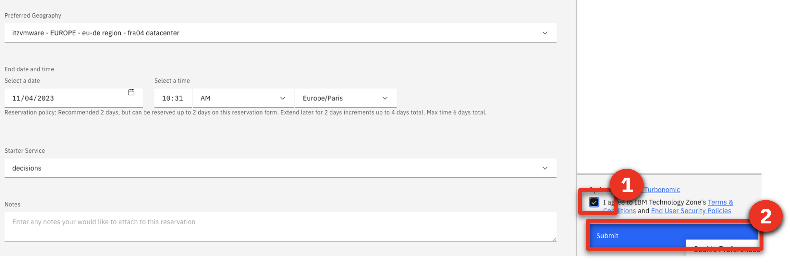
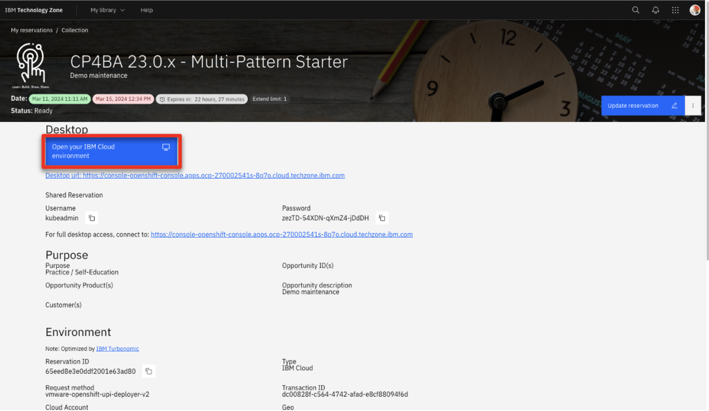
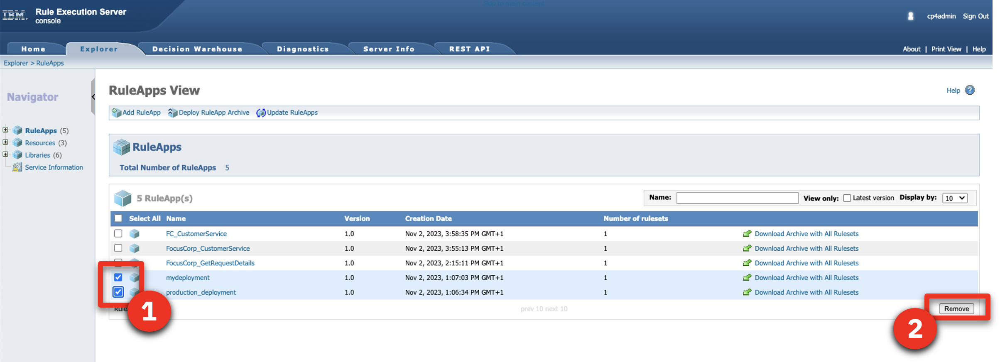
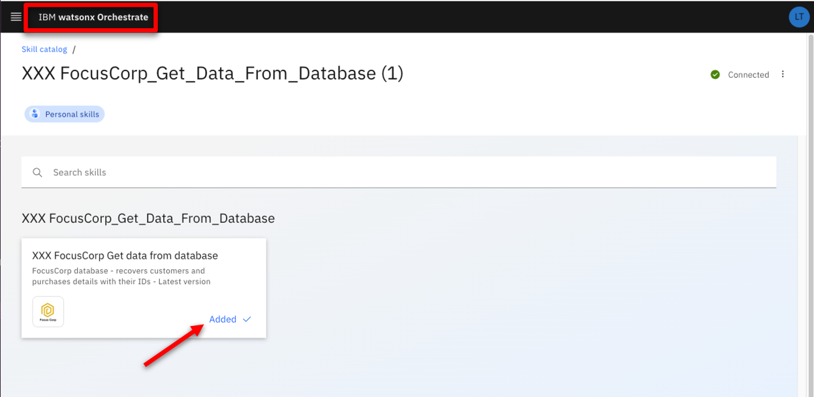
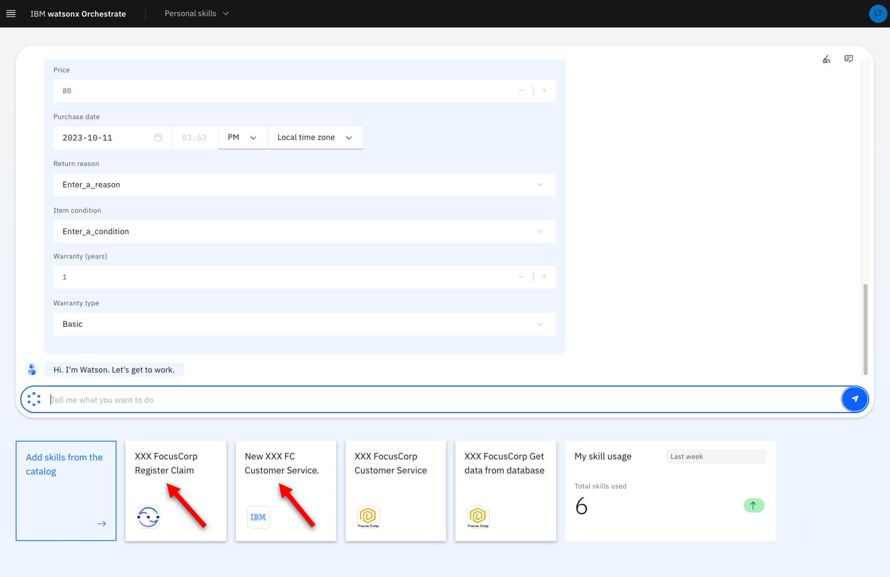

| **DEMO OVERVIEW** | | 
| :---         | :--- |
| **Scenario overview** | In this demo, we will see how watsonx Orchestrate can leverage Operational Decision Manager’s deployed services to create new skills. To illustrate this, we will use a company’s customer service application. |
| **Demo products** | IBM Operational Decision Manager (included in Cloud Pak for Business Automation V23.0.1), watsonx Orchestrate |
| **Demo capabilities** | Decision management; Digital assistant |
| **Sales guidance** | <a href="./files/wxO_ODM demo sales guidance .pdf" target="_blank" rel="noreferrer">wxO_ODM demo sales guidance .pdf</a> |
| **Demo intro slides** | <a href="./files/wxO_ODM Platinum Demo - Intro deck.pptx" target="_blank" rel="noreferrer">wxO_ODM Platinum Demo - Intro deck.pptx</a> |
| **Sales enablement video** | View the enablement video <a href="https://ibm.box.com/s/y2pd3hl8onuwgdnz8vcuvzxtcrs3ilpz" target="_blank" rel="noreferrer">here</a>. This video is for enablement purposes only (IBMers and Business Partners) and is not customer-ready. |
| **Demo script** | A complete demo script is on the second tab above. You can download a printer-ready PDF of the demo script <a href="./files/DEMO_Script.pdf" target="_blank" rel="noreferrer">here</a>.    This demo script has multiple tasks that each have multiple steps. In each step, you have the details about what you need to do (**Actions**), what you can say while delivering this demo step (**Narration**), and what diagrams and screenshots you will see.  This demo script is a suggestion, and you are welcome to customize based on your sales opportunity. Most importantly, practice this demo in advance. If the demo seems easy for you to execute, the customer will focus on the content. If it seems difficult for you to execute, the customer will focus on your delivery. |
| **Demo downloads** | Operational Decision Manager (Decision Center projects)   • <a href="./files/Customer Service.zip" target="_blank" rel="noreferrer">Customer Service.zip</a>   • <a href="./files/Get Request Details.zip" target="_blank" rel="noreferrer">Get Request Details.zip</a>    watsonx Orchestrate (For ODM on prem)   • <a href="./files/XXX%20FocusCorp%20Customer%20Service.json" target="_blank" rel="noreferrer">XXX FocusCorp Customer Service.json</a>   • <a href="./files/XXX%20FocusCorp%20Get%20data%20from%20database.json" target="_blank" rel="noreferrer">XXX FocusCorp Get data from database.json</a> OR  watsonx Orchestrate (For ODM on SaaS)   • <a href="./files/XXX%20FocusCorp%20Customer%20Service%20SaaS.json" target="_blank" rel="noreferrer">XXX FocusCorp Customer Service SaaS.json</a>   • <a href="./files/XXX%20FocusCorp%20Get%20data%20from%20database%20SaaS.json" target="_blank" rel="noreferrer">XXX FocusCorp Get data from database SaaS.json</a>    Optional (For ODM experts looking to customize the decision service)   • <a href="./files/RuleDesignerFiles.zip" target="_blank" rel="noreferrer">RuleDesignerFiles.zip</a> |
| **Required versions** | - watsonx Orchestrate SaaS (Standard or Enterprise edition) SaaS with the builder profile (mandatory) - IBM Operational Decision Manager 8.11.1.0  and 8.12 (on prem or SaaS) |
| **How to get support** | • Open a support case at <a href="https://techzone.ibm.com/help" target="_blank" rel="noreferrer">IBM Technology Zone Help</a> regarding issues with reserving and provisioning Tech Zone environments. • Contact <a href="https://ibm-cloud.slack.com/archives/C0216F39ACU" target="_blank" rel="noreferrer">#platinumdemos-automation-support</a> regarding issues with setting up and running this demo. |

<inline-notification text="This demo uses a shared watsonx Orchestrate environment. You will use your own 3-letter initials denoted by ‘<strong>XXX</strong>’ to differentiate any artifacts you create.  Note for ODM on SaaS users:</strong>  We are detailing the setup of IBM Operational Decision Manager (ODM) using a TechZone pre-configured VMWare image powered by PakInstaller. However, compatible ODM on SaaS configuration files are provided.    Ask your SaaS administrator for a basic authentication userID/Password to connect the watsonx Orchestrate to your ODM instance."></inline-notification>

 

### **STEP 1: PROVISION YOUR ENVIRONMENTS**

1 - Request a watsonx Orchestrate environment

This 300 demonstration requires an IBM watsonx Orchestrate (standard or enterprise) environment with the **'builder profile'** access rights. 
The procedure to request a watsonx Orchestrate environment access is documented on the <a href='https://techzone.ibm.com/collection/watsonx-orchestrate' target="_blank">watsonx Orchestrate environment access on TechZone</a>.

Make sure you are granted the **'builder profile'** role in your 300 environment request.

**[Go to top](#top)**

 

2 - Request a Cloud Pak for Business Automation environment

To run this demonstration, you will need an OpenShift environment with Cloud Pak
for Business Automation 23.0.1 installed. We will use IBM Operational Decision
Manager on prem version contained in this installation. Only the Decision
capabilities must be installed from your Cloud Pak for Business Automation.  <inline-notification text="Note: If you want to use your ODM hosted on a SaaS tenant, just contact your SaaS administrator to get a user and password to connect your RES in Basic Authentication. Go directly to Step 3: Download the installation files."></inline-notification>

1. Visit the <a href="https://techzone.ibm.com/collection/PakInstaller/journey-cloud-pak-for-business-automation" target="_blank" rel="noreferrer">Pak Installer</a> page.   

2. Click the **Cloud Pak for Business Automation 23.0.1 IF001 - VMWare Public (OCP 4.12) (Powered by Pak Installer)** tile.    

3. Select **Reserve now** tile.     

4. Select **Practice / Self-Education**     

5. Enter a **Purpose description**     

6. Select your **Preferred Geography**     

7. Select **decisions** as the **Starter service**     

8. Read and agree to **IBM Technology Zone's Terms and Conditions and End User Security Policies** (1). Click **Submit** (2).     

9. Check that the request was correctly submitted, and wait for the confirmation emails.     

 

**[Go to top](#top)**

  

 

### **STEP 2: VALIDATE YOUR ENVIRONMENT AND BOOKMARK YOUR IDS / URLS**

1 - Check your CP4BA install

After 4-5 hours, your Cloud Pak for Business Automation (CP4BA) should be ready. After requesting your CP4BA, you will receive a series of emails from IBM Technology Zone regarding the progress of your request.

1. Check for an email with the subject **Pak Installer – CloudPakInstalled** (1). Add your **Pak Installer Portal URL** (2) into your notebook.    

2. Wait for ODM to be installed.   <inline-notification text="At this stage, it will take around 3-4 hours to have ODM fully installed onto your environment."></inline-notification>

3. Click your **Pak Installer Portal URL**.    

4. Click the **Cloud Pak Console** tab.    

5. Check that the **Decision Console ODM** credentials and URLs are available.   <inline-notification text="If nothing is displayed in this section, you will have to wait a bit more for the installation to be completed."></inline-notification>  

6. Add the following information to your notebook: **Decisions Admin Username** and **Decisions Admin Password** (1), **Decision Center URL** (2), **Decision Server Console URL** (3), **Designer URL** (4).    

7. Add the CPD URL of your CP4BA install to your notebook.   <inline-notification text="Copy only the section highlighted in blue. It will be used to configure the discovery service in watsonx Orchestrate."></inline-notification>  

 

**[Go to top](#top)**

  

2 - Generate your API key

1. Log into the Designer interface using the **Designer URL** from your notebook using **Enterprise LDAP**.    

2. Use the **Admin Username (cp4admin)** credentials (1) from your notebook. Click **Log in** (2).    

3. Right-click on your **avatar** icon (1). Click **Profile and settings** (2).    

4. Click **API key**.    

5. Click **Generate new key**.    

6. Click **Generate**.    

7. Click the **show**   

8. Copy and paste the **API key** into your notebook (1). Click **Close** (2).    

 

**[Go to top](#top)**

  

3 - Generate your ZEN API key

1. Open a terminal window.    

2. Type the command:   `echo -n "cp4admin:<your API key>" | base64`    

3. Copy and paste your ZEN API key (in blue) in your notebook using the format '**ZenApiKey + [your generated ZEN API key]**'     

 

**[Go to top](#top)**

  

4 - Check your notebook

At this stage your notbook should contain the following information:   <inline-notification text="Please note the format of the ZEN API key (highlighted in orange), which you will have to use in the discovery service."></inline-notification> 

 

**[Go to top](#top)**

  

 

### **STEP 3: DOWNLOAD THE INSTALLATION FILES**

Get the required files

Four installation files are required for the setup of this demonstration.  
To set up IBM Operational Decision Manager (ODM):  
• <a href="./files/Customer Service.zip" target="_blank" rel="noreferrer">Customer Service.zip</a>  
• <a href="./files/Get Request Details.zip" target="_blank" rel="noreferrer">Get Request Details.zip</a>  
To set up watsonx Orchestrate (ODM on prem):  
• <a href="./files/XXX%20FocusCorp%20Customer%20Service.json" target="_blank" rel="noreferrer">XXX FocusCorp Customer Service.json</a>  
• <a href="./files/XXX%20FocusCorp%20Get%20data%20from%20database.json" target="_blank" rel="noreferrer">XXX FocusCorp Get data from database.json</a> 
OR 
To set up watsonx Orchestrate (ODM on SaaS):  
• <a href="./files/XXX%20FocusCorp%20Customer%20Service%20SaaS.json" target="_blank" rel="noreferrer">XXX FocusCorp Customer Service.json</a>  
• <a href="./files/XXX%20FocusCorp%20Get%20data%20from%20database%20SaaS.json" target="_blank" rel="noreferrer">XXX FocusCorp Get data from database.json</a>  

**Customer Service.zip** contains the business rule decision service driving the customer service decisions.  
**Get Request Details.zip** contains some rules that are used to simulate access to the FocusCorp database. These rules are providing the customer and purchase details based on a customer and purchase ID. This service is used to create the ‘FocusCorp get data from database’ skill.
The two JSON files are the skills configuration files that are used to make the skill creation faster in watsonx Orchestrate.  
Download the four files corresponding to your configuration on your computer to have them ready to setup ODM and watsonx Orchestrate.

 

**[Go to top](#top)**

  

 

### **STEP 4: CONFIGURE ODM**

1 - Import the ‘Get Request Details’ decision service

1. Log in to the **Decision Center** using the URL and credentials from your notebook.    

2. Click the **LIBRARY** tab.    

3. Click the **import** icon.    

4. Click **Choose**.    

5. Navigate to your local folder and select **Get Request Details.zip** (1). Click **Open** (2).    

6. Click **Import**.    

7. Click the **LIBRARY** tab.    

8. Repeat from **Step 3** and import the **Customer Service.zip** file.  

9. Click **Get Request Details**.    

10. Click **main**.    

11. Click the **Deployments** tab.    

12. Click the **Configurations** tab.    

13. Click the **+** icon.    

14. For the **Configuration name**, enter ‘**wxoDeploy**’ (1). For the **RuleApp name**, enter ‘**FocusCorp_GetRequestDetails**’ (2). Click the **Operations** tab (3).   <inline-notification text="Make sure to use the same name and letter case for the RuleApp name."></inline-notification>  

15. Select the **FocusCorp_Get_request_details** operation (1). Click the **Targets** tab (2).    

16. Check the **Decision Service Execution** target server (1). Click the **save** icon (2).    

17. Click **Create new version**.    

18. Hover your cursor over the **wxoDeploy** row and click the **deploy** icon.    

19. Click **Deploy**.    

20. Click **OK**.    

21. Wait for the service to be deployed.    

22. Click the **LIBRARY** tab.    <inline-notification text="The first decision service is now deployed on the rule execution server. Let’s deploy the ‘Customer Service’ one in the same way."></inline-notification>

 

**[Go to top](#top)**

  

2 - Import the ‘Customer Service’ decision service

Let's deploy the decision service driving the ‘Customer Service’ decision of the demo.

For this service, we are going to deploy two different instances with two different operations. One will be used by the finalized 'Customer Service' skill; the other one will be used to show how to create a skill step by step in watsonx Orchestrate. For this second one, you will have to update the RuleApp name with your own ‘XXX’ initials in order to not conflict with some skills that may have already been published by other users of your watsonx Orchestrate tenant.

1. Click the **Customer Service** decision service.    

2. Click the **main**.    

3. Click the **X** to remove the filter on the decision artifacts.    

4. Expand the **Customer Service** folder.    

5. Click **Operations**.    

6. Hover your cursor over the **FC_CustomerService** row and click the **edit** icon.     

7. Replace the '**XXX**' in the **Ruleset Name** with your own three-letter initials (1). Click the **save** icon (2).     

8. Click **Create New Version**.     

9. Click **Deployments**.     

10. Click **Configurations**.     

11. Click the **+** button.     

12. For the **Configuration name**, enter ‘**wxODeploy**’ (1). For the **RuleApp name**, enter ‘**FocusCorp_CustomerService**’ (2). Click the **Operations** tab (3).   <inline-notification text="Make sure to use the same name and letter case for the RuleApp name."></inline-notification>  

13. Select the **FocusCorp_CustomerService** operation (1). Click the **Targets** tab (2).     

14. Select the **Decision Service Execution** target server (1). Click the **save** icon (2).     <inline-notification text="ODM on SaaS users, you can choose the Dev or Prod server. Just make sure to bookmark the corresponding server URL to connect the discovery service later in this documentation."></inline-notification> 

15. Click **Create New Version**.    

16. Repeat from **Step 11** using the following information:    • **Configuration name**: wxoDeployDemo   • **RuleApp name**: FC_CustomerService   • Select the **FC_CustomerService** operation  

17. Hover your cursor over the **wxODeploy** row and click the **deploy** icon.    

18. Click **Deploy**.    

19. Click **OK**.    

20. After the deployment is completed, click **Configurations**.    

21. Repeat from **Step 17** and deploy the **wxODeployDemo** configuration.    
We are done with the Decision Center configuration, let’s now make sure the two decision services are correctly deployed on the Rule Execution Server. 

 

**[Go to top](#top)**

  

3 - Check the deployments on the Decision Server

Let’s now make sure the two decision services are correctly deployed on the Rule Execution Server.

1. Open the **Decision Server Console** using the URL from your notebook.  
2. Click the **Explorer** tab.    

3. [Optional] Select the two RuleApps that are not part of the demo (1). Click **Remove** (2).   <inline-notification text="We are removing these two RuleApps to better display the deployed services in the watsonx Orchestrate discovery service."></inline-notification>  

4. Click **Confirm**.    

5. Click **FC_CustomerService**.    

6. Make sure the ruleset name has your updated initials (it is '**XXX**' in the screenshot by default).    

 

**[Go to top](#top)**

  

 

### **STEP 5: CONFIGURE WATSONX ORCHESTRATE**

1 - Update the JSON skill files

To quicken the demo setup, we are providing two skill configuration files. In order to avoid conflicts with other watsonx Orchestrate users, we are going to customize these skills with your own three-letter initials.

We are also going to update the server URL with the URL of your own ODM Rule Execution Server. 
<inline-notification text="In the following steps, ODM on SaaS users will edit/use the SaaS versions of the two JSON files."></inline-notification>

1. Open the **XXX FocusCorp Customer Service.json** file with a compatible text editor of your choice.    

2. Replace the **server URL** with the **CMD URL** from your notebook.     <inline-notification text="Replace only the section highlighted in blue. If you have deployed your decision service on SaaS,  the URL will look like <strong>https://odm-run-demo-emea-10.automationcloud.ibm.com/</strong>DecisionService/rest. The section in bold corresponds to the Decision Server URL your ODM service is deployed on (Dev or Prod). "></inline-notification> 

3. Replace the two occurrences of ‘**XXX**’ occurrences with your own three-letter initials.    

4. Save the file under a new name containing your own initials.  

5. Repeat from **Step 1** to update the second JSON file (**XXX Focus Corp Get data from database.json**).  

 

**[Go to top](#top)**

  

2 - Import the two skills

1. Log in to your watsonx Orchestrate instance using your IBM ID credentials.    

2. Click the **menu slider** icon.    

3. Click **Skills**.    

4. Enter your '**XXX**' initials to see the skills that may have been deployed with these same initials.   <inline-notification text="Use other initials if the demo skills have already been deployed with the initials of your choice."></inline-notification>  

5. Click **Add skills**.    

6. Click **From files**.    

7. Click **Drag and drop files here or click to upload**.    

8. Select the **XXX FocusCorp Get data from database.json** file you previously customized (1). Click **Open** (2).    

9. Click **Next**.    

10. Select the **XXX FocusCorp Get data from database** skill (1). Click **Add** (2).    

11. Enter your '**XXX**' initials to search for your skill.    

12. Click the **ellipsis** icon (1). Click **Enhance this skill** (2).    

13. Click **Publish**.    

14. Enter your '**XXX**' initials and check that your skill is correctly published.    

15. Repeat from **Step 5** and import the **XXX FocusCorp Customer Service.json** file.  

16. Click **IBM watsonx Orchestrate**.    

 

**[Go to top](#top)**

  

3 - Add skills to your personal skills

1. Click **Add skills from the catalog**.    

2. Enter your '**XXX**' initials to search for the imported skills in the catalog.    

3. Click the **XXX FocusCorp_Get_Data_From_database** skill.    

4. Click **Connect app**.    <inline-notification text="For ODM on SaaS users, use the Basic Authentication userID/password provided by your SaaS administrator in the following steps."></inline-notification>

5. Enter your **ZEN API key** from your notebook (1). Click **Connect app** (2)    

6. Click **Add skill +**.    

7. Check that your skill is added. Click **IBM watsonx Orchestrate**.    

8. Repeat from **Step 1** and add the **XXX FocusCorp Customer Service** skill.  

9. Click the **XXX Focus Corp Get data from database** skill to test it.    

10. Enter ‘**johnsmith@acme.com**’ as the **Customer email** (1). Enter ‘**001**’ as  **Product identification number** (2). Click **Apply** (3).    

11. Check that the service returns some values.    

You are now ready to demo!

 

**[Go to top](#top)**

  

 

### **ADVANCED DEMO SCENARIO**

 Update business rules [Optional] 

 
<inline-notification text="You must be comfortable with ODM to proceed with this scenario."></inline-notification>

The provided skills (jason files) are configured to use the latest deployed ruleapp. You can use that following additional actions to illustrate this capability:
1. Update a business rule in the Decision Center with any policy update of your choice. 
2. Deploy a new version of the RuleApp in the Rule Execution Server using your exiting deployment configuration. 
3. Re-run the exact same skill flow and show that the new rules have been applied.

 

### **AFTER EACH DEMO**

Remove the two skills created during the demo

After each demo, you must remove the **New XXX FC FocusCorp Customer Service** skill you imported using the discovery service, as well as the skill flow created during the demo.    

1. Click the **menu slider** icon.    

2. Click **Skills**.    

3. Enter your '**XXX**' initials to access your skills.    

4. Look for the skill with the **Skill flow** skill type. Click its corresponding **ellipsis** icon (1). Click **Delete this skill** (2).    

5. Click **Delete**.    

6. Repeat from **Step 4** and delete the **New XXX FC Customer Service** skill.    

7. Click **IBM watsonx Orchestrate**.    

8. You are now ready to demo again.    
<inline-notification text="Only the 2 FocusCorp skills imported from the Jason files and recognizable with their FocusCorp icon should remain in your skill set."></inline-notification>
 

**[Go to top](#top)**

  

 

### **UNINSTALL THE DEMO**

Remove the four skills created during the demo

1. Repeat the **AFTER EACH DEMO** steps and remove the four '**XXX**' skills (XXX being your own initials).   <inline-notification text="The kill flow must be removed first."></inline-notification>  

2. Enter your '**XXX**' initials and make sure no skills remain.    

 

**[Go to top](#top)**

  

