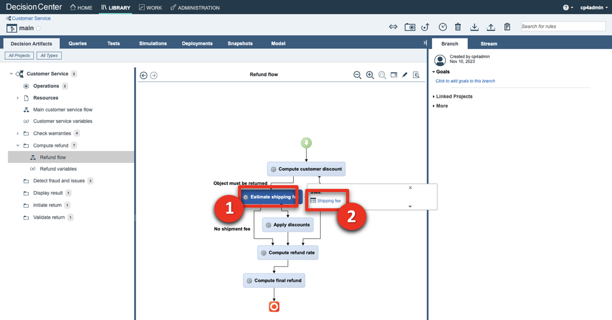
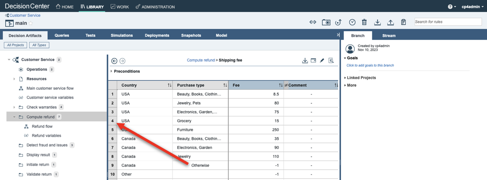
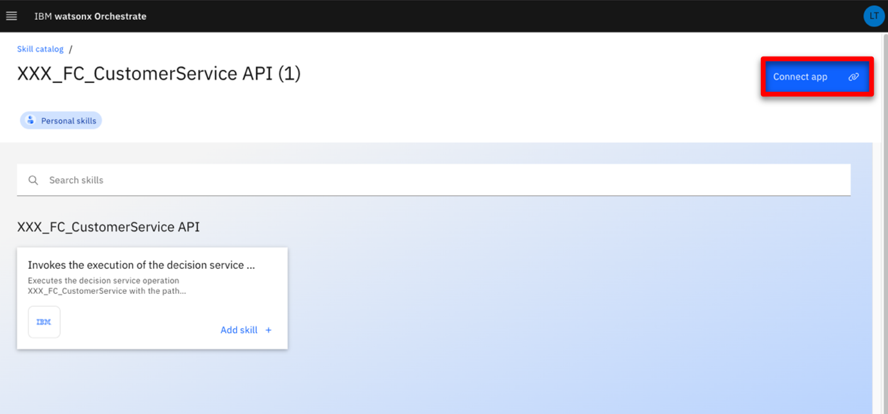
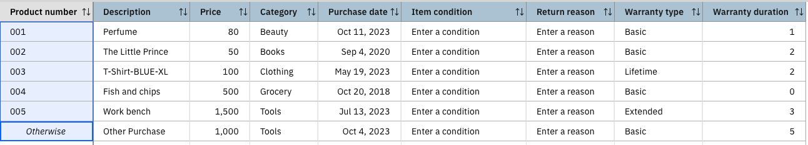

Introduction

Today we’ll see how IBM watsonx Orchestrate can be used to enhance call center agent productivity, increase compliance with an organization's business procedures, and reduce risk of inconsistency in the decision making process.

Using a customer service scenario, we’ll see how to use watsonx Orchestrate to easily create a 'return validation' skill from an existing IBM Operational Decision Manager (ODM) application. Then, we’ll see how the built-in skill flow capability can be used to sequence several skills into a single activity.

We’re using a customer service example, but the same pattern can be used to leverage any existing deployed decision services across your enterprise.

Let’s get started!

(Printer-ready PDF version of the demo script  <a href="./files/DEMO_Script.pdf" target="_blank" rel="noreferrer">here</a>)

 

1 - Reviewing the Operational Decision Manager decision

 

| **1.1** | **Introduce the customer service decision** |
| :--- | :--- |
| **Narration** | FocusCorp uses Operational Decision Manager (ODM) as a backend application to automatically validate and approve return requests from customers.   The company now wants to enable all call center agents to directly access the decision output so they can determine immediately whether a return is approved while on the phone with a customer.  Before seeing how to create such a skill in watsonx Orchestrate, let’s look at the existing application in ODM. |
| **Action** &nbsp; 1.1.1 | Show the ODM Business Console screen that was opened during the demo preparation. Select **Enterprise LDAP** (1), enter the Username **cp4admin** (2), enter the **password** (3) you copied in your notebook, and click **Log in** (4). <inline-notification text="The Decision Center console will start from the last page you were in when you left during your last connection."></inline-notification>  |
| **Action** &nbsp; 1.1.2 | Click the **LIBRARY** tab.    |
| **Narration** | The return policy is managed in ODM by FocusCorp's retail business team, using a dedicated business console called Decision Center. Let’s see how the return policy is implemented in ODM. |
| **Action** &nbsp; 1.1.3 | Click the **Customer Service** decision service.    |
| **Action** &nbsp; 1.1.4 | Click the **main** branch.    |
| **Action** &nbsp; 1.1.5 | Click the **Decision Artifacts** tab, if you are not already on that tab.    |
| **Action** &nbsp; 1.1.6 | Click the **X** to remove any decision artifact filters (if any).    |
| **Action** &nbsp; 1.1.7 | Click **Main customer service flow**.    |

 

| **1.2** | **Provide an overview of the decision service** |
| :--- | :--- |
| **Narration** | The return validation policy is composed of rule artifacts including ruleflows, decision tables and business rules.    The main ruleflow is the backbone of the decision service. It synchronizes a variety of rules that cover fraud detection, warranty validation, return policy and refund conditions. |
| **Action** &nbsp; 1.2.1 | Click the **Compute refund** box (1) and then the **Refund flow** link (2).    |
| **Narration** | Let’s look at one of the decision artifacts. The ‘Shipping fee’ decision table defines the fixed return fee depending on the location of the customer and the type of item being returned. |
| **Action** &nbsp; 1.2.2 | Click the **Estimate shipping fee** box (1) and then the **Shipping fee** link (2) to open the decision table.    |
| **Narration** | Each row of the table corresponds to a specific business rule that can also be seen in natural language. In this rule, the return fee for grocery items in the United States is $15. A message is also added to the response to document the decision. |
| **Action** &nbsp; 1.2.3 | Hover your cursor over the header of row 4 to display the 'grocery' business rule.        |
| **Action** &nbsp; 1.2.4 | Click **Main customer service flow**.    |
| **Narration** | This decision service is deployed in a production environment and is invoked by FocusCorp's enterprise applications. Let’s look at the deployment environment. |

 

| **1.3** | **Introduce the production Rule Execution Server** |
| :--- | :--- |
| **Narration** | The ODM Rule Execution Server is a console to monitor rule applications deployed on a given server. From this console, the rule administrator can test a rule application, trace its usage, run diagnostics, and access execution traces when required. |
| **Action** &nbsp; 1.3.1 | Show the ODM **Rule Execution Server** screen that was opened during the demo preparation.    |
| **Action** &nbsp; 1.3.2 | Click the **Explorer** tab.    |
| **Narration** | Two RuleApps are deployed in this production environment. The 'Customer Service' RuleApp manages the return policy we just looked at in the Decision Center. |
| **Action** &nbsp; 1.3.3 | Click the **FocusCorp_CustomerService** RuleApp.    |
| **Action** &nbsp; 1.3.4 | Click the **FocusCorp_Customer_Service** Ruleset.    |
| **Narration** | The customer service application has one ruleset with two input parameters -- the customer and the purchase to be returned. Both the decision service and the ruleset it contains are versioned. At execution time, a user can decide to use a specific version, or the latest deployed version of the RuleApp. |
| **Action** &nbsp; 1.3.5 | Point out and explain the **FocusCorp_Customer_Service** ruleset. The output parameter (1), the return decision (2) and the versioning(3).    |
| **Narration** | Let’s now see how to leverage these deployed decisions using watsonx Orchestrate to make these return decisions visible to call center agents. |

**[Go to top](#place1)**

  

2 - Creating a new skill in watsonx Orchestrate

 

| **2.1** | **Connect the discovery service to the ODM Rule Execution Server** |
| :--- | :--- |
| **Narration** | Let’s now log in to watsonx Orchestrate with the the ‘Builder’ profile. This profile enables us to create, enrich and publish skills. |
| **Action** &nbsp; 2.1.1 | Log in to your watsonx Orchestrate instance.    |
| **Action** &nbsp; 2.1.2 | Click the **hamburger** icon.    |
| **Action** &nbsp; 2.1.3 | Click **Skills**.    |
| **Narration** | watsonx Orchestrate offers a wide variety of skills that can be added for a single individual (personal skill) or the whole team. Let’s create a new personal skill. |
| **Action** &nbsp; 2.1.4 | Click **Add skills**.    |
| **Narration** | There are various ways to create a skill in watsonx Orchestrate. One of them is to use a discovery service to create new skills from IBM Cloud Pak for Business Automation that are deployed on SaaS or on premises, or from RPA SaaS. The automation service we want to leverage is deployed on a containerized version of ODM on premises.  |
| **Action** &nbsp; 2.1.5 | Click the **IBM Cloud Pak for Business Automation - On premises** tile.     <inline-notification text="If you are using a SaaS environment, click the <strong>IBM Cloud Pak for Business Automation – SaaS</strong> tile and use the basic authentication credentials provided by your SaaS admin."></inline-notification>|
| **Narration** | To access the automation environment, an API key has been generated by the Cloud Pak for Business Automation administrator. With this API key and the cluster URL, we can set up the discovery service and let it access all the automation services deployed in this environment.  |
| **Action** &nbsp; 2.1.6 | Enter your **Username** (1), **API key** (2) and **Connection URL** (3) you stored in your notebook in the demo preparation. Click **Connect** (4).     | 

<inline-notification text="If you are using the SaaS discovery service, the connection URL will be depending on the environment (Dev or Prod) the decision service is deployed on. To find the right connection URL, open your Decision Server console and copy its corresponding  URL (only the part in bold) from your browser navigation bar (ie: <strong>https://odm-dev-demo-emea-10.automationcloud.ibm.com/</strong>res/protected/home.jsf)."> 
 </inline-notification> 
 

| **2.2** | **Create the customer service skill from the ODM RuleApp** |
| :--- | :--- |
| **Narration** | The discovery service lets us see all the deployed business automation services we can leverage to create a new skill. |
| **Action** &nbsp; 2.2.1 | Expand the **Automations** folder.    |
| **Narration** | ‘FC_CustomerService’ is one of the deployed ODM applications we can leverage. The new skill we are about to create will execute the business rules deployed on the rule execution server that we saw earlier. |
| **Action** &nbsp; 2.2.2 | Select **FC_CustomerService**.    |
| **Narration** | Now we'll create a new skill in watsonX Orchestrate. Let’s search for our recently added skill. |
| **Action** &nbsp; 2.2.3 | Select the '**Invokes the execution..**' skill (1) and click **Save as draft** (2).    |
| **Narration** | Next, we’ll configure the skill to define how it asks for the input and displays the output. We’ll also train the natural language processing (NLP) engine on the phrases that can be used to invoke the skill. |
| **Action** &nbsp; 2.2.4 | Search for ‘**FC**’ to access the recently imported skill.    |
| **Narration** | The discovery service has created a version of the skill that is not yet published. As we can see, it is now ready to be published in the skills catalog. |
| **Action** &nbsp; 2.2.5 | Expand the **Invokes the execution of the decision service operation XXX_FC_CustomerService** skill (XXX are your initials used during demo prep). <inline-notification text="The <strong>Step in the process</strong> for this skill should read '<strong>Just 1 step away to be ready</strong>'. The <strong>Status</strong> for this skill should read '<strong>Ready to publish</strong>'."></inline-notification>  |
| **Action** &nbsp; 2.2.6 | Make sure you are on the right skill by checking you are the author of the skill.    |
| **Narration** | We can now define the way users will interact with our skill. This is required before publishing the skill. |
| **Action** &nbsp; 2.2.7 | Click the corresponding **ellipsis** icon.    |
| **Action** &nbsp; 2.2.8 | Click **Enhance this skill**.    |

 

| **2.3** | **Publish the customer service skill to your personal skills** |
| :--- | :--- |
| **Narration** | The first thing we'll customize is the title of the skill. On the right we see how the skill will be displayed to users. As this demo environment is shared across various users, we'll add initials to easily find the skill in the catalog. |
| **Action** &nbsp; 2.3.1 | Enter an easy-to-find skill name (e.g., '**New XXX FocusCorp customer service.**' – XXX being your own initials)    |
| **Narration** | We can customize how the inputs will be displayed and edit a specific label for each entry. We can also specify what attributes will be required to invoke the skill. |
| **Action** &nbsp; 2.3.2 | Click the **Input** tab.    |
| **Action** &nbsp; 2.3.3 | Scroll down to the **customer.name** field.    |
| **Action** &nbsp; 2.3.4 | Enter ‘**Customer name**’ in the **customer.name** field.    |
| **Narration** | The same procedure is applied for the remaining fields. The output parameters are also customized in the same way. |
| **Action** &nbsp; 2.3.5   | Click the **Output** tab.    |
| **Narration** |  In this scenario, we only need to specify the column headers of the table that contains the decision fields returned by ODM. |
| **Action** &nbsp; 2.3.6   | Click **Edit response**.    |
| **Action** &nbsp; 2.3.7   | Type ‘**Return decision**’ in the **decision.returnStatus** header field.    |
| **Narration** |  The same procedure is applied for the remaining output fields. We have already prepared a fully configured skill that we'll see in a couple of minutes. Next, we are specifying the phrases orchestrate will use to train the NLP engine. |
| **Action** &nbsp; 2.3.8 | Click the **Phrases** tab.    |
| **Action** &nbsp; 2.3.9 | Type ‘**register a claim**’ as a new phrase. Press the enter/return key on your keyboard to save the new phrase.    |
| **Narration** |  Our skill is now published in the watsonx Orchestrate catalog. Users are now able to add it to their personal skill sets.|
| **Action** &nbsp; 2.3.10 | Click **Publish**.      |

 

| **2.4** | **Add the customer service skill to your personal skills** |
| :--- | :--- |
| **Narration** | We can now add this new skill into our personal catalog. |
| **Action** &nbsp; 2.4.1 | Click **IBM watsonx Orchestrate**.    |
| **Action** &nbsp; 2.4.2 | Click **Add skills from the catalog**.    |
| **Action** &nbsp; 2.4.3 | Type your ‘**XXX**’ in the search field ('XXX' being your own initials).    |
| **Action** &nbsp; 2.4.4 | Click the ‘**XXX_FC_CustomerService API**’ skill ('XXX' being your own initials).    |
| **Narration** | Next, we'll connect the skill to the Rule Execution Server. We'll use the ZEN API key that was provided by our ODM administrator to connect to the deployed rule service. |
| **Action** &nbsp; 2.4.5 | Click **Connect app**.    |
| **Action** &nbsp; 2.4.6 | Enter the **ZEN API key** (1) you copied in your notebook. Click **Connect app** (2).    |
| **Narration** | The skill is connected, and we can now add it into our personal catalog. |
| **Action** &nbsp; 2.4.7 | Click **Add skill +**.    |
| **Action** &nbsp; 2.4.8 | Check that your skill is added.    |
| **Action** &nbsp; 2.4.9 | Click **IBM watsonx Orchestrate**.    |

 

| **2.5** | **Show the customer service skill** |
| :--- | :--- |
| **Narration** | The new skill is now listed in our personal skills list. In one click, we can invoke it. |
| **Action** &nbsp; 2.5.1 | Click the **New XXX FocusCorp customer service** tile ('XXX' being your own initials).    |
| **Narration** | The decision service requires multiple pieces of data to process the return. Instead of requesting the agent to input this data manually, we'll query the FocusCorp database to retrieve the data automatically using another skill. |
| **Action** &nbsp; 2.5.2 | Scroll through the set of required inputs.    |
| **Action** &nbsp; 2.5.3 | Click the **XXX FocusCorp Get data from database** skill ('XXX' being your own initials).    |
| **Narration** | Let’s use a customer email and product identification number, just like a call center agent would do. |
| **Action** &nbsp; 2.5.4 | Enter ‘**johnsmith@acme.com**’ as the **Customer email** (1). Enter ‘**001**’ as the **Product identification number** (2). Click **Apply** (3).    |
| **Narration** | The database skill has returned the customer and item details from the FocusCorp database. We can now use the database skill to feed the decision skill. To do so, we will create a skill flow. |
| **Action** &nbsp; 2.5.5 | Scroll through the result to show the data recovered from the back-end system.    |

**[Go to top](#place1)**

  

3 - Sequencing skills into a skill flow

 

| **3.1** | **Create the customer service skill flow** |
| :--- | :--- |
| **Narration** | Let’s now work on this skill flow. As an automation builder, we can sequence multiple skills. |
| **Action** &nbsp; 3.1.1 | Click the **hamburger** icon.    |
| **Action** &nbsp; 3.1.2 | Click **Skills**.    |
| **Action** &nbsp; 3.1.3 | Expand the **Add skills** menu (1). Click **Create a skill flow** (2).    |
| **Narration** | The first step is to give a name and description to the skill flow so that users can easily recognize it in the catalog. |
| **Action** &nbsp; 3.1.4 | Click the **pencil** icon to name the skill flow.    |
| **Narration** | The description will help users understand the actions performed by the skill flow. |
| **Action** &nbsp; 3.1.5 | Enter a skill name that contains your 'XXX' initials (e.g., '**XXX FocusCorp Register claim**') (1). In the **Description** field, enter ‘**Get the customer and purchase details from the database - Validates return conditions and refunds**’ (2). Click **Save** (3).    |
| **Narration** | Next, we must add the two skills we need for this flow. The first one will collect the data from the database. The second one, which we created from ODM, will analyze the data and return a decision. |
| **Action** &nbsp; 3.1.6 | Click the **+** button.    |
| **Narration** | Let’s search for the skills we have added in our personal skills. |
| **Action** &nbsp; 3.1.7 | Search for '**XXX**' to find all your skills from the catalog ('XXX' being your own initials).    |
| **Action** &nbsp; 3.1.8 | Click the **XXX FocusCorp_Get_Data_from_database** skill ('XXX' being your own initials).    |
| **Narration** | We can add the database skill to the flow.|
| **Action** &nbsp; 3.1.9 | Click **Add skill +**.    |
| **Action** &nbsp; 3.1.10 | Click **+** button.    |
| **Narration** |Next, let’s search for the decision skill. |
| **Action** &nbsp; 3.1.11 | Search for '**XXX**' to find all your skills from the catalog ('XXX' being your own initials).    |
| **Narration** | To save time, we will use a pre-configured version of the decision skill.|
| **Action** &nbsp; 3.1.12 | Click the **XXX FocusCorp_Customer_Service** skill ('XXX' being your own initials).     |
| **Action** &nbsp; 3.1.13 | Click **Add skill +**.    |
| **Action** &nbsp; 3.1.14 | Click the second skill in the flow.    |
| **Narration** | The two skills are now sequenced in the flow. Next, we must map the output parameters of the database skill to the input fields of the decision skill. This operation can be automated using watsonx Orchestrate’s intelligent mapping capability. Orchestrate is able to suggest a mapping based on attributes, names and types. |
| **Action** &nbsp; 3.1.15 | Click **Generate mapping suggestions**.    |
| **Narration** | We can see all the attributes are correctly mapped between the two skills in just a single click. No additional action is required. We can now save the skill to add it to the catalog, as well as publish it to users. |
| **Action** &nbsp; 3.1.16 | Point out the mapped values.    |
| **Action** &nbsp; 3.1.17 | Expand the **Actions** menu (1). Click **Save as draft** (2).    |
| **Narration** | Let’s now enhance the skill flow by adding some phrases that will be used to invoke the skill in the chat interface of watsonx Orchestrate. |
| **Action** &nbsp; 3.1.18 | Expand the **Actions** menu (1). Click **Enhance** (2).    |
| **Action** &nbsp; 3.1.19 | Click **Phrases**.    |
| **Narration** | Let's add ‘return a product’ to the training set. Many more phrases can be added to improve the NLP training. |
| **Action** &nbsp; 3.1.20 | Type '**return a product**’.    |
| **Narration** | Our skill flow is ready to be published. Just by entering ‘return a product’ in the chat interface, watsonx Orchestrate will understand that this skill should be used. |
| **Action** &nbsp; 3.1.21 | Click **Publish**.    |
| **Action** &nbsp; 3.1.22 | Click **IBM watsonx Orchestrate**.    |

**[Go to top](#place1)**

  

4 - Using the skill flow in the call center

 

| **4.1** | **Add the customer service skill flow** |
| :--- | :--- |
| **Narration** | Since we are using a shared environment for this demonstration, we'll need to add the skill flow to our personal skillset. In a real life situation, the skill would be added to the team skillset so that any call center agent could easily access it. |
| **Action** &nbsp; 4.1.1 | Click **Add skills from the catalog**.    |
| **Action** &nbsp; 4.1.2 | Type your '**XXX**' initials to find all your skills from the catalog.    |
| **Action** &nbsp; 4.1.3 | Click the **Skill flows** tile.    |
| **Action** &nbsp; 4.1.4 | Search for ‘**XXX**’ (‘XXX’ being your own initials).    |
| **Action** &nbsp; 4.1.5 | Click **Add skill +**.    |
| **Action** &nbsp; 4.1.6 | Check that your skill is added. Click **IBM watsonx Orchestrate**.    |

 

| **4.2** | **Use the customer service skill flow** |
| :--- | :--- |
| **Narration** | We're now ready to use the skill flow.  Let's now assume the role of a customer service agent who receives a call from a customer. We'll ask for their customer email and the product ID of the item to be returned. |
| **Action** &nbsp; 4.2.1 | Type ‘**return a product**’ and press the enter/return key on your keyboard.    |
| **Action** &nbsp; 4.2.2 | Enter ‘**alexgreen@acme.com**’ as the **Customer email** (1). Enter ‘**001**’ as the **Product indentification number** (2). Click **Apply** (3).    |
| **Narration** | The customer tells us they are returning the product because it arrived late. |
| **Action** &nbsp; 4.2.3 | For the **Return reason** field, select **Arrived_late** (1). For the **Item condition** field, select **Opened** (2). Click **Show all fields** (3).    |
| **Narration** | All the other required fields have been automatically pre-filled, saving us a lot of time. |
| **Action** &nbsp; 4.2.4 | Point out the other pre-filled fields.    |
| **Action** &nbsp; 4.2.5 | Scroll down and click **Show fewer fields**.    |
| **Action** &nbsp; 4.2.6 | Click **Apply**.    |
| **Narration** | In one click, the ODM decision service returns a decision and additional information, such as the refund amount or any required shipping fees. All these results have been dynamically calculated by the rules we saw at the beginning of this scenario.<inline-notification text="You can execute the demonstration with different combination of users (e.g.: other emails below) and items (see highlighted product numbers below) to show the different decision outcomes."></inline-notification>   |
| **Action** &nbsp; 4.2.7 | Point out the decision results.    |

 

**[Go to top](#place1)**

  

Summary

In this demo, we saw how a company uses IBM watsonx Orchestrate to leverage and expose existing ODM Decision Services in new ways. 

We used the Discovery Service to create a new skill that invokes rule-based decisions manged by ODM. We then created a skill flow that orchestrates a sequence of skills, mapping their respective inputs and outputs automatically. Finally, we used watsonx Orchestrate NLP to invoke this skill flow using a chat interface.

Thank you for attending today’s presentation.

**[Go to top](#place1)**

  

