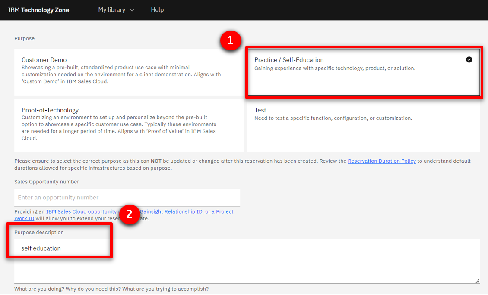
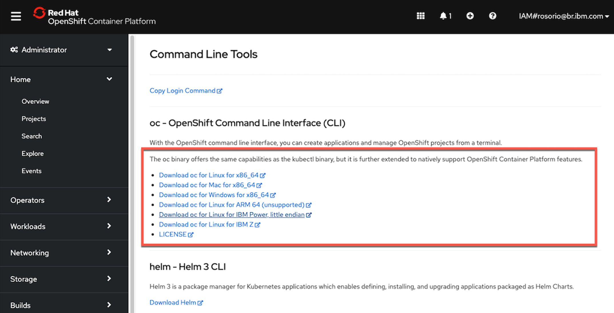

<span id="place1"></span>

<span id="top"></span>

| **DEMO OVERVIEW** | | 
| :---         | :--- |
| **Scenario overview** | {{ page.overview }} |
| **Demo products** | {{ page.product }} |
| **Demo capabilities** | {{ page.capabilities }} |
| **Demo intro slides** | Download the Introduction and Overview slides <a href="{{ page.boxIntroPresentationUrl }}" target="_blank" rel="noreferrer">here</a>. This is a short deck of customer-facing slides that sets the context for the demo. |
| **Demo script** | A complete demo script is on the second tab above. You can download a printer-ready PDF of the demo script <a href="{{ page.boxPdfScript }}" target="_blank" rel="noreferrer">here</a>.<br/><br/> This demo script has multiple tasks that each have multiple steps. In each step, you have the details about what you need to do (**Actions**), what you can say while delivering this demo step (**Narration**), and what diagrams and screenshots you will see.<br/><br/>This demo script is a suggestion, and you are welcome to customize based in your sales opportunity. Most importantly, practice this demo in advance. If the demo seems easy for you to execute, the customer will focus on the content. If it seems difficult for you to execute, the customer will focus on your delivery. |


| **Customer-ready <br/>demo video** | View the demo video <a href="{{ page.customerVideo }}" target="_blank" rel="noreferrer">here</a>. This is a short, but detailed, hands-on walkthrough of the scenario. The video is customer-ready.<br/><br/>Potential uses of this video are:<br/><br/>1. Familiarize yourself with the details of this scenario <br/>2. Gain customer agreement that they would like to have a tech-seller do a deep-dive demo of this scenario <br/>3. Use as a prospecting tool to generate customer interest in applying these capabilities |

| **Required versions** | Cloud Pak for Integration 2023.4.1 |
| **How to get support** | • Open a support case at <a href="https://techzone.ibm.com/help" target="_blank" rel="noreferrer">IBM Technology Zone Help</a> regarding issues with reserving and provisioning Tech Zone environments.<br/>• Contact <a href="https://ibm-cloud.slack.com/archives/C0216F39ACU" target="_blank" rel="noreferrer">#platinumdemos-automation-support</a> regarding issues with setting up and running this demo. |

{{ page.topcategory }}

<details markdown="1">

<summary>1 - Provision a Red Hat OpenShift cluster</summary>

To provision your own Red Hat OpenShift cluster for the Cloud Pak for Integration, follow these steps: <br/>

1. To deploy a Red Hat OpenShift cluster, go <a href="https://techzone.ibm.com/my/reservations/create/63a3a25a3a4689001740dbb3" target="_blank" rel="noreferrer">here</a>. Select if you prefer to make a reservation now or schedule for later. 
<br/>
<br/>

2. If you do not have a sales opportunity, select the purpose **Practice / Self-Education** (1) for a 2-day reservation (which can be extended without any approvals to 6 days) and fill in the **Purpose description** (2).
<br/>
<br/>

3. Select the **Preferred Geography**.
<br/>
<br/>

4. Several additional fields will appear. Select **4.14** (1) as the OpenShift version, **ODF - 2TB** (2) for the storage, **16 vCPU x 64 GB - 100 GB ephemeral storage** (3) as the worker node flavor, accept the terms and conditions (4) and click **Submit**.
<br/>
<br/>

5. You will receive a few emails as the provisioning process continues. You should expect the final email to be sent after an hour. The final email should look similar to the following.
<br/>
<br/>

**[Go to top](#top)**

<br/><br/>

</details>

<span id="AccessOpenShift"></span>

<details markdown="1">

<summary>2 - Access your OpenShift cluster and install the command line</summary>


In this section, you access your OpenShift cluster and install the OpenShift command line tool. 

1. Open the **Reservation ID** link that was included in the "Reservation Ready on IBM Technology Zone" email.
<br/>
<br/>

2. Copy the kubeadmin **Password** (1) and open the OpenShift console by clicking on **Open your IBM Cloud environment** (2).
<br/>
<br/>

3. Use **kubeadmin** (1) as the user, paste the **Password** (2) and click **Login** (3).
<br/>
<br/>

4. On the web console page, click **?** (1), and select **Command line tools** (2).
<br/>
<br/>

5. Follow the links to install the OpenShift Command Line Interface (CLI) for your Operating System.
<br/>
<br/>

6. To configure the command line on your machine, click on the down arrow to the right of kubeadmin (1) and select **Copy login command**.
<br/>
</br>

7. Click on **Display token**.

8. Copy the **Login with this token** and run in the command line.
<br/>
</br>

You have successfully configured the Openshift command line on your machine.

<br/>

**[Go to top](#top)**

<br/><br/>

</details>

<span id="cloneGitHub"></span>

<details markdown="1">

<summary>3 - Clone the demo assets from a GitHub repository</summary>

To copy the repository you will need to have the Git CLI on your machine. If you don’t have it, follow the installation steps described in this <a href="https://github.com/git-guides/install-git" target="_blank" rel="noreferrer">page</a>, based on your operating system.


1. To download the scripts to install the demo, create a new directory, change to this newly created directory, and run the following command:

   ```git clone {{ page.gitHubUrl }}```

   <br/>

2. Change to the new {{ page.gitHubDir }} directory:
   
   ```cd {{ page.gitHubDir }}```

   <br/>

**[Go to top](#top)**

<br/><br/>

</details>

<span id="installDemo"></span>

<details markdown="1">

<summary>4 - Install the demo</summary>

1. To deploy the demo run:

   ```./deploy.sh```

   This will automatically deploy the resources into the CP4I namespace.


2. The deployment will take approximately 30-45 minutes to install. Wait for the deployment to complete. The URL and credentials will be shown once the installation is complete. 
   

Your have installed the Cloud Pak for Integration ready to be configured.

**[Go to top](#top)**
</details>

<span id="installprereqs"></span>

<details markdown="1">

<summary>5 - Prerequisites and preparing your Cloud Pak for Integration environment</summary>

**Connect Cloud Pak for Integration to your endpoints**<br/>

Now, let's configure our services endpoints in Cloud Pak for Integration.<br/>

1.	Return to the command line and access the Platform Navigator using the provided URL. Copy and paste  the **Username** (1) and **Password** (2) from the command line output, and click **Sign In** (3).<br/><br/><br/>

2. You will be asked to provide a new password as you are using a temporary password. Provide a new password and click **Submit**. <br/><br/>

2. In the menu on the top left, open the **Design** folder (1) and select **Integrations** (2). <br/><br/>

3. Click on the **ace-designer-demo** entry. <br/><br/>

4. Click the **Catalog** icon to see a list of the available connectors. <br/><br/>

5. To configure the MQ connection, search for **'IBM MQ'** (1) and click **Connect** (2). <br/><br/>

6. Enter **'basicmq'** for the **Queue manager name** (1), **'basicmq-ibm-mq'** for the **Queue manager hostname** (2), and **'1414'** for the **Listener port number** (3). <br/><br/>

7. Enter **'SYSTEM.DEF.SVRCONN'** for the **Channel name** (1), and click **Connect** (2). <br/><br/>

8. Click **Continue**. <br/><br/>

9. Scroll to the top of the page, and click the **+** button to the right of the search bar. <br/><br/>

10. Access the API definition for the external account service <a href="https://raw.githubusercontent.com/IBM/platinum-demo-code-cp4icp4ba/main/cp4i/appConnect/CustomerAccountOpenAPIJSONServer.yaml" target="_blank" rel="noreferrer">here</a>. Download the file using **File** --> **Save Page as**.<br/><br/>

11. Assure **Import a connector file or API document** (1) is selected and select **Next** (2).
<br/><br/>

12. Select **OpenAPI** (1) for the Document type, use the downloaded **CustomerAccountOpenAPIJSONServer.yaml** file (2), and click **Next** (3). <br/><br/>

12. Click **Import API**. <br/><br/>

13. Search for **Customer Account** (1), and click **Connect** (2). <br/><br/>

14. Scroll down and click **Connect**.<br/><br/>

**Import flows to App Connect Designer**<br/>

1. Download the following two files: <br/> • <a href="https://raw.githubusercontent.com/IBM/platinum-demo-code-cp4icp4ba/main/cp4i/appConnect/MQExternalProvider.yaml" target="_blank" rel="noreferrer">MQ flow to simulate the acquired bank</a> <br/> • <a href="https://raw.githubusercontent.com/IBM/platinum-demo-code-cp4icp4ba/main/cp4i/appConnect/Accounts.yaml" target="_blank" rel="noreferrer">Accounts API flow that workflow will use</a><br/>

2. Import the **MQExternalProvider.yaml** file by clicking the **Dashboard** icon (1), then **New** (2), and then **Import flow…** (3). <br/><br/>

3. Use the downloaded **MQExternalProvider.yaml** file (1), and click **Import** (2). <br/><br/>

4. Start the imported flow by selecting **Start flow** (1). <br/><br/>

5. Repeat steps 2 - 4 for the **Accounts.yaml** file. This time, the flow is started by switching the toggle from **Stopped** to **Started**. <br/><br/>

<br/>
<br/>

**Test the flow**<br/>

1. Select the **Test** tab (1), **Get /Accounts/{customerId}** operation (2), and then the **Try it** tab (3). <br/><br/>

2. Scroll down and enter '**1234567890**' in the **customerId** field (1), and click **Send** (2). <br/><br/>

3. The first test will fail due to a known timeout issue with the error shown in the screenshot below. Click **Send** a second time to receive the correct response. <br/><br/>

4. You will see the following correct response. <br/><br/>

5. Three environmentally specific pieces of information are required to integrate the API into the workflow: the API URL, client ID and hostname. <br/><br/> Scroll to the top of the screen and save the **API URL** (1) and **client ID** (2).<br/><br/>The hostname is contained within the API URL. It is the portion between "https://" and the next "/". <br/><br/> The hostname will look like this: ademo-gw-gateway-cp4i.itzroks-120000k3ak-vzlud5-4b4a324f027aea19c5cbc0c3275c4656-0000.eu-de.containers.appdomain.cloud<br/><br/>Save the hostname, API URL and client ID.<br/><br/>

**[Go to top](#top)**

</details>

<br/>
<br/>

## **INSTALL THE DEMO: Cloud Pak for Business Automation (Windows VM)**

<details markdown="1">

<summary>1 - Provision a Technology Zone demo environment</summary>

1.  Reserve a Technology Zone demo environment <a href="https://techzone.ibm.com/my/reservations/create/64ff5a5bc02ef60017329109" target="_blank" rel="noreferrer">here</a>.

2. Wait until your reservation status is **Ready** on the IBM Technology Zone’s **My Library → My Reservations** page. (You can either keep refreshing the My Reservation page or wait for a confirmation email.)<br/><br/>When your reservation is **Ready**, click the reservation tile to view the reservation details.<br/><br/>

3. On the reservation details page, copy or bookmark the **Published services** links for **BAW Workflow Center** and **BAW Process Portal**.<br/><br/>When your reservation is **Ready**, click the reservation tile to view the reservation details.<br/><br/>

**[Go to top](#top)**

<br/><br/>

</details>

<span id="ImportCertificate"></span>

<details markdown="1">

<summary>2 - Import the signer certificate for Cloud Pak for Integration</summary>

1. Open the BAW **VM Remote Console.** Use the links on the reservation page. Open the link on the left. Then click to open the console in **Full screen**.<br/><br/>

2. Click the red **Ctrl+Alt+Del** button. <br/><br/> <br/>

3. Click **Yes** on the **Networks** dialog box.

   <inline-notification text="The first time you access the VM, you will be presented with the network option below. It is imperative to select YES. (Otherwise, the VM will not be properly configured for this demo.)"></inline-notification>
   


4. On the Windows desktop, double-click the **WebSphere Console** shortcut to open the WebSphere Console.<br/> <br/>

5. Click **Advanced…**, then **Accept the Risk and Continue** to continue past the security warning.<br/><br/>

6. Enter '**admin**' as the **User ID** and '**admin**' as the **Password**. <br/> <br/>

7. Open **Security** (1) and click **SSL certificate and key management** (2). <br/> 

8. Click **Key stores and certificates**. <br/> <br/>

9. Click **CellDefaultTrustStore**. <br/> 

10. Click **Signer certificates**. <br/> <br/>

11. Click **Retrieve from port**. <br/> <br/>

12. For **Host**, enter your Cloud Pak for Integration ROKS hostname. For **Port**, enter '**443**'. For **Alias**, enter '**integration-1**'. Click **Retrieve signer information**. <br/><br/>

13. Click **Apply**.<br/> <br/>

14. Click **Save**. <br/><br/>

15. The new certificate is now added. <br/><br/>

You can now close the BAW VM console window.

**[Go to top](#top)**

<br/><br/>

</details>

<span id="ImportProcessFlow"></span>

<details markdown="1">

<summary>3 - Import the process app and update the 'AccountsServer' hostname in the process app settings</summary>


Before completing this section, download the Select the **<a href="https://raw.githubusercontent.com/ibm/platinum-demos/master/docs/300-enhancing-ba-with-integration/New_Account_Opening.twx" target="_blank" rel="noreferrer">New Account Opening.twx</a>** file.<br/><br/>

1. Using a browser on your local computer, open **BAW Workflow Center** using the Published Services link from the top of the Technology Zone reservation page.<br/>

2. Log in to **Workflow Center** using '**admin**' as both the **User name** and **Password**. <br/> <br/>

3. Click **Process Apps**. <br/><br/>

4. Click **Import**. <br/> <br/>

5. Click **Browse**. <br/> <br/>

6. Select the **New_Account_Opening.twx** file (1). Click **Open** (2). <br/> <br/>

7. Click **OK**. <br/> <br/>

8. Wait for the import to complete. Click **New Account Opening**. <br/> <br/>

9. Click the **Servers** tab. <br/> <br/>

10. In **Process App Settings**, **AccountsServer** must be updated with the hostname of your Cloud Pak for Integration ROKS environment. Set **Hostname** to the hostname of your Cloud Pak for Integration ROKS environment. <br/> <br/>

<br/>

**[Go to top](#top)**

</details>
<br/>
<br/>

## **PREPARE TO GIVE THE DEMO**

<details markdown="1">

<summary>1 - Log into Cloud Pak for Integration</summary>

1.	Open **Cloud Pak for Integration** using your username (1), credentials (2) and click **Login** (3).<br/><br/>

2. In the menu on the top left, open the **Design** folder (1) and select **Integrations** (2). <br/><br/>

3. Click on the **ace-designer-demo** entry. <br/><br/>

<br/>

**[Go to top](#top)**

<br/><br/>

</details>

<span id="ProcessDesigner"></span>

<details markdown="1">

<summary>2 - Open the account opening process in Process Designer</summary>

1. Using Firefox on your local computer, open **BAW Workflow Center** using the Published Services link from the top of the Technology Zone reservation page.
   <inline-notification text="Using separate browsers for Process Designer vs. Process Portal prevents the logins from colliding with each other."> </inline-notification>

2. Log in to **Workflow Center** using '**admin**' as both the **User name** and **Password**. <br/> <br/>

3. Click **Process Apps**. <br/> <br/>

4. Click **New Account Opening**. <br/> <br/>

5. Click **Processes** (1) and then **New Account (Current Workflow)** (2). <br/> <br/>

6. The **New Account (Current Workflow)** process definition is now open. <br/> <br/>

<br/>

**[Go to top](#top)**

<br/><br/>

</details>

<span id="ProcessPortal"></span>

<details markdown="1">

<summary>3 - Log into Process Portal</summary>

1. Using Chrome on your local computer, open **BAW Process Portal** using the Published Services link from the top of the Technology Zone reservation page.
   <inline-notification text="Using separate browsers for Process Designer vs. Process Portal prevents the logins from colliding with each other."> </inline-notification>

2. Log in with **'assistant'** as the **Username** and **'passw0rd'** as the **Password**. <br/> <br/>

3. **Process Portal** is now open. <br/> <br/>


**[Go to top](#top)**

<br/><br/>

</details>

<span id="APIKeyHandy"></span>

<details markdown="1">

<summary>4 - Have the API key handy</summary>

The very last step of the Cloud Pak for Integration installation (above) required you to save the API key (**client ID**).

In the demo script, you will be required to enter the Cloud Pak for Integration API key into the process application. Make sure the API key is easily accessible.

<inline-notification text="For easy access, store the API key in the Windows clipboard."> </inline-notification>


**[Go to top](#top)**

<br/><br/>

</details>

<span id="YAMLFileHandy"></span>

<details markdown="1">

<summary>5 - Have the YAML file handy</summary>

In the demo script, you will be required to use the OpenAPI 3.0 YAML file to discover the API. Download the YAML file **<a href="./Accounts-openapi.yaml.zip" target="_blank" rel="noreferrer">here</a>**.

**[Go to top](#top)**

</details>

***

Click [here](demo-script) to go to the **Demo script** on the next tab.