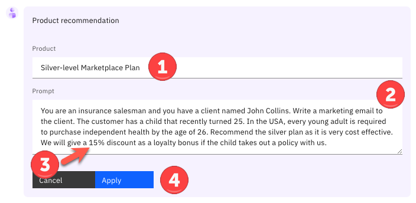

Introduction

Today I want to show you how watsonx Orchestrate uses conversational AI to help your sales professionals be more productive and close more business. 

Typically insurance sales agents spend their time across many tasks while constantly context switching between multiple applications to do their jobs. A large part of any successful insurance seller's time should be spent servicing existing clients, but an important part of being a great sales agent is finding new business and building pipeline.

Prior to watsonx Orchestrate, agents in this insurance office dedicated a few hours per week to sending prospecting emails for upsell and cross-sell opportunities, as well as building pipeline. To do this, a typical insurance seller would: 
1.	Search Salesforce for customers that meet certain cross-sell criteria.
2.	Determine the best cross-sell products to offer each customer.
3.	Send a personalized email to each customer.

Unfortunately, agents in this office are facing a number of challenges that prevent them from performing at their best:
- Searching their Salesforce system effectively for sales opportunities is time consuming and requires a lot of skill... skills that not everyone on the team possesses, especially new hires who need to be trained.
- Matching customer circumstances to the most optimal and competitive products is time consuming and requires expert product knowledge. The information about products, customers, and policies is spread over multiple systems and spreadsheets.
- Multiple systems and applications are used to perform customer outreach (Salesforce, Outlook, etc). It takes time to switch between these applications to find the required information. Data is copied and pasted between applications and inevitably errors are made.
- There isn't time to create a personalized email for each customer so instead, sellers use templates, but they know that the emails that are produced this way are often ignored by their customers.   

Let's look at how this prospecting work can be done more effectively with watsonx Orchestrate.
- We’ll use a chat interface to extract data from SalesForce that leverages a pre-configured search to find customers with recent life events.
- We’ll match these customers to the most suitable and competitive products using an AI-infused automation that represents the digitized business knowledge of a product expert. 
- Instead of using an email template, we’ll feed the customer information and the products details into a generative AI model. This model will draft a prospecting email that a human-in-the-loop can review and edit with any specific information for this customer.
- Finally, we’ll automate the creation and dispatch of the email, but we won’t have to open Outlook and copy over email addresses, email text or product info.    

Let's get started.

 

1 - Retrieving a customer list from Salesforce

 

| **1.1** | **Invoke a Salesforce skill using natural language** |
| :--- | :--- |
| **Narration** | A common task for an insurance agent is to periodically search their Salesforce system for customers with recent life events that are good candidates to receive upsell/cross-sell offers. For example, the birth of a child or death of a parent often brings focus to life insurance coverage, and so on. Traditionally, this task involves creating custom Salesforce reports and downloading them for manual and offline review by a sales agent.   How does this play out with an insurance company using watsonx Orchestrate? An agent invokes a Salesforce search using a simple natural language phrase like: "Write an upsell email to my customers", IBM watsonx Orchestrate uses AI to understand this agent's intent and performs the correct action, even when the request phrase is ambiguous.|
| **Action** &nbsp; 1.1.1 | Perform the following steps:   1. Enter the command **Write an upsell email to my customers**  2. Click the **Send arrow**.   **Note:** if you get **No skill matches your request** try rephrasing your question. Also, ensure you have selected **Team skills** from the menu bar at the top of the screen. 
| **Narration** | IBM watsonx Orchestrate runs the Salesforce task by connecting to a back-end API that retrieves a list of customers with recent life events. The retrieved customer data is neatly displayed in a table within watsonx Orchestrate's chat interface.  The agent reviews the list of customers and pursues a cross-sell opportunity with John Collins, who has a child that recently turned twenty-five. For this product, turning twenty-five is a milestone requiring children to acquire independent health insurance coverage. (Other states and countries set different age limits for various family milestones).|
| **Action** &nbsp; 1.1.2 | Perform the following steps:   1.Select the radio button associated with **John Collins** (1) from the table   2. Click the **Apply** button in the chat window (you may have to scroll down to see the button).    |

 

**[Go to top](#place1)**

  

2 - Automating the product recommendation

 

| **2.1** | **Identify products for cross-sell / upsell** |
| :--- | :--- |
| **Narration** | Next, the agent needs to determine which products to recommend for John based on his circumstances and recent life event.   The customer details from Salesforce are automatically submitted into watsonx Orchestrate's built-in decision engine and the upsell recommendations are displayed. Behind the scenes, the decision engine applied business logic that took into account many different attributes specific to this customer (**John Collins**), such as his child’s age, pre-existing conditions, and current coverage. Then the AI product recommendation criteria determined the best products to suggest.  In this case, the decision engine recommended the **Silver-level Marketplace Plan**, and based on this, it has also created a prompt that will be submitted into the generative AI model to create the email. The product choice is highlighted to the agent for improved clarity, and as you can see, the agent has some control over the prompt and may adjust it if required. | 
| **Action** &nbsp; 2.1.1 | Perform the following steps:   1. Highlight the product recommendation 2. Review the prompt created by the decision skill for the selected customer, based on their circumstances. 3. Optionally, adjust the discount in the prompt by changing **15%**, to **20%**, as indicated by the arrow 4. Click **Apply**  |

 

**[Go to top](#place1)**

  

3 - Generating and sending a personalized email

 

| **3.1** | **Use generative AI to write a personalized email for the client** |
| :--- | :--- |
| **Narration** | Personalized emails increase the likelihood of conversion. IBM watsonx Orchestrate uses one of IBM's Large Language Models (LLM's), built on the watsonx.ai platform. This model generates a personalized email for the selected customer. Perfecting the AI prompt to generate a properly formatted email is typically a time-consuming activity. To make this faster and repeatable for insurance sellers, watsonx Orchestrate used its embedded decision skill to create the prompt, but the agent still has control over all the parameters used to generate the email.  The agent may have adjusted the prompt in the previous step, but now we are ready to submit all of the parameters into the LLM. These parameters control the length of the generated email, the model used, and some further tuning parameters. |
| **Action** &nbsp; 3.1.1 | Perform the following steps to submit the request to the LLM:  1. Optionally, click on **Show all fields** to reveal all the LLM parameters (changing these parameters is not recommended). 2. Click **Apply** and the prompt will be submitted into the generative AI model. (Note: email generation will take approx 30 seconds to complete).   |

 

| **3.2** | **Use watsonx Orchestrate's built-in Microsoft Outlook skill to send a personalized email to the client** |
| :--- | :--- |
| **Narration** | IBM watsonx Orchestrate launches its out-of-the-box Outlook skill and pre-fills an email with the contact details for **John Collins** and the generated email content containing the proposal. The insurance seller can now review the generated content for accuracy and add any further information to ensure the proposal is relevant to the customer.   The IBM provided generative AI models are specifically trained on curated data to produce output suitable for business purposes, but it is still important for an agent to review it. This 'human in the loop" approach is vital, clients want to save time by leveraging AI to generate the bulk of the content, but they still want their agents to have overall control.   Since we're using a built-in skill to handle the Outlook email the agent doesn't need to open their Outlook client, the **To** and **Subject** fields have been pre-populated and the AI-generated text has been inserted into the **content** field.|
| **Action** &nbsp; 3.2.1 | Review the generated email (edit if necessary) and discuss the text generated by watsonx.ai that was automatically inserted into the **Content** field.    **Note:** An LLM can be non-deterministic, for the same input prompt it can generate different output, especially if other parameters have been changed. The models are constantly retraining and evolving, so your output may differ from this image. The model used in the demo has not been fine tuned with insurance industry knowledge. Clients deploying these models can fine tune them with product knowledge and provide examples of the content to be generated.|
| **Action** &nbsp; 3.2.2 | Perform the following steps:  1. Change the email address in the **To** field to your own email. 2. Scroll down and click **Apply** at the bottom of the watsonx Orchestrate chat window.   IBM watsonx Orchestrate will tell you that the email was sent.  |

 
 

**[Go to top](#place1)**

  

Summary

  
Using an upsell/cross-sell example, this lab showed how watsonx Orchestrate provides a conversational interface for insurance sales agents to perform their repetitive tasks and reduce the time it takes to complete common business tasks, such as searching through customer relationship management (CRM) reports for sales opportunities.

Product expertise was used to create an automation that provides optimal product recommendations based on client circumstances, and combined these recommendations with client details into a prompt that was submitted into a generative AI model. The result was a client proposal derived from expert product knowledge and accurate client data prepared for the agent for review. 

By providing a catalog of skills, watsonx Orchestrate eliminated the need for this insurance agent to manually move data and context switch between different back-end applications. Watsonx Orchestrate streamlined this agent's work by sequencing a series of skills within a single unified interface, boosting their productivity, reducing errors, and enabling them to focus on higher value work.

**[Go to top](#place1)**

  

