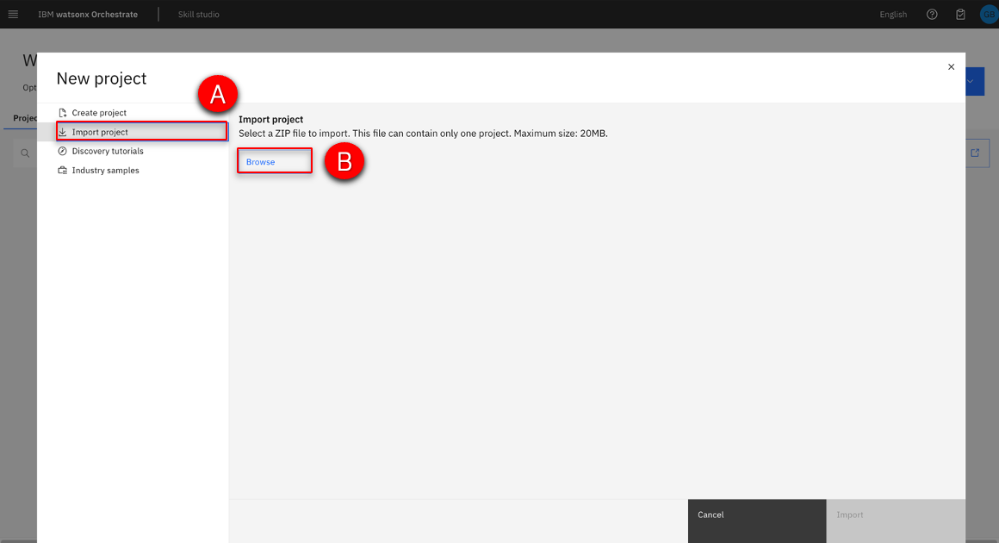
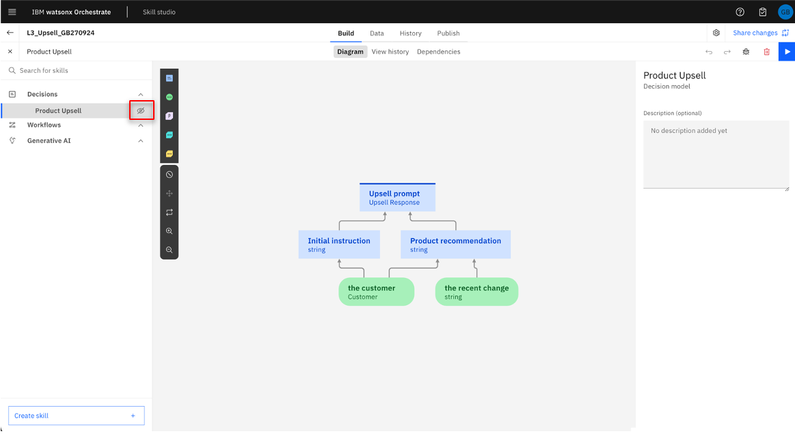
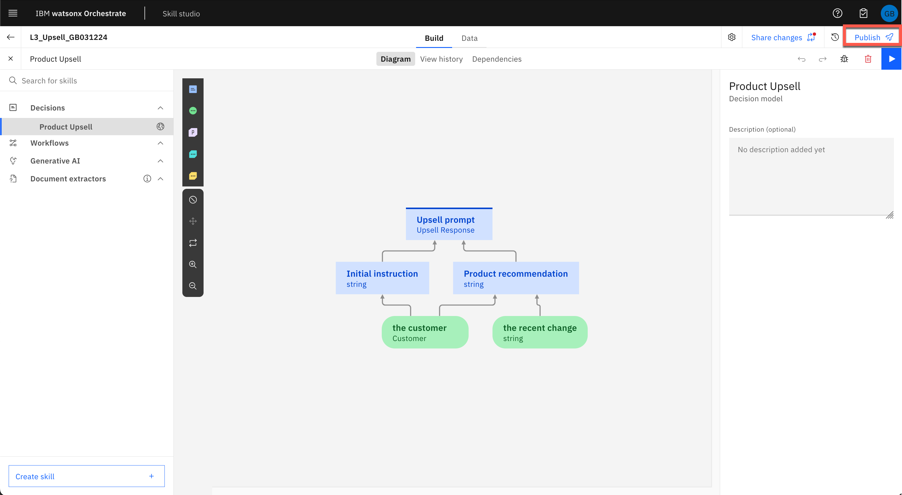
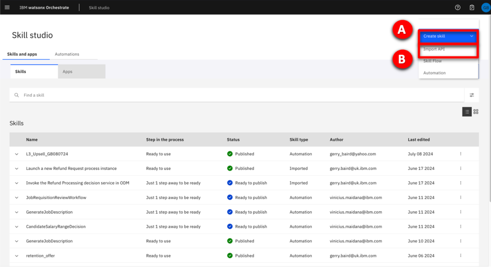

| **DEMO OVERVIEW** | | 
| :---         | :--- |
| **Scenario overview** | This demo shows how watsonx Orchestrate implements complex operations by combining individual skills together by using a skill flow.    In this demo, you will create customized skills in watsonx Orchestrate and assemble them together to create a skill-flow that implements an upsell/cross-sell process to assist insurance sellers with their email marketing. |
| **Demo products** | watsonx Orchestrate |
| **Demo capabilities** | Automation builder, embedded decision engine; OpenAPI based skills.|
| **Demo script** | A complete demo script is on the second tab above.    This demo script has multiple tasks that each have multiple steps. In each step, you have the details about what you need to do (**Actions**), what you can say while delivering this demo step (**Narration**), and what screenshots you will see.  This demo script is a suggestion, and you are welcome to customize based in your sales opportunity. Most importantly, practice this demo in advance. If the demo seems easy for you to execute, the customer will focus on the content. If it seems difficult for you to execute, the customer will focus on your delivery. |
| **Applicable learning plans and badges** | This demo is used in the following learning plans:  • watsonx Orchestrate Level 3 for Technical Sales <a href="https://yourlearning.ibm.com/activity/PLAN-B4BFAE1FED99" target="_blank" rel="noreferrer">IBM</a>    Use this demo as credit towards the watsonx Orchestrate Technical Sales Intermediate badge. |
| **How to get support** | • IBMers can use the <a href="https://ibm.enterprise.slack.com/archives/C06HT5PHLN9" target="_blank" rel="noreferrer">#ba-techlcd-support</a> Slack channel.  • If you are a BP and require assistance, please open a support case at <a href="https://techzone.ibm.com/help" target="_blank" rel="noreferrer">IBM Technology Zone Help</a>. |

### **DEMO INSTALLATION AND SETUP**

1 –  Access the demo environment (IBMers)

This demo can be performed on any tenant where the user has the builder role. For new watsonx Orchestrate users, request access by submitting a request <a href="https://forms.monday.com/forms/dc4f2e5c205f756bee82204f8b57705d?r=use1" target="_blank" rel="noreferrer">here</a>. You will receive an email once you have been onboarded onto a suitable tenant, but please allow 48 hours for your request to be processed.

Based on your role and requirements, you will be onboarded onto a sales demonstration tenant or an enablement tenant. Enablement tenants provide short-term access (two week maximum) for enablement purposes.

Once you have received your onboarding email, use your IBM ID to log into your assigned tenant here.

Users with access to multiple tenants (demo environments) should ensure they select a tenant where they have the Builder role. Please use the <a href="https://ibm.enterprise.slack.com/archives/C06HT5PHLN9" target="_blank" rel="noreferrer">#ba-techlcd-support</a>  Slack channel if you require assistance.

**[Go to top](#top)**

 

2 – Access the demo environment (Business Partners)

If you do not have access to a tenant, you can request access by submitting a request <a href="https://forms.monday.com/forms/dc4f2e5c205f756bee82204f8b57705d?r=use1" target="_blank" rel="noreferrer">here</a>. You will receive an email once you have been onboarded onto a suitable tenant, but please allow 48 hours for your request to be processed.

Once you have received your onboarding email, use your IBM ID to log into your assigned tenant <a href="https://dl.watson-orchestrate.ibm.com/home" target="_blank" rel="noreferrer">here</a>.

**[Go to top](#top)**

 

3 – Prepare the demo files

### 3.1 – macOS: prepare the decision model archive file
This demo uses a decision model and skills based on OpenAPI specifications. As the demo is performed on a shared tenant, you must import your own copied of the decision model and API’s that are required to complete it.

<inline-notification text="You <u>must</u> RENAME the file you download, so it’s imperative to go through all of these steps."></inline-notification>

1.	Download the decision model file:  <a href="./files/L3_Upsell_Master.zip" target="_blank" rel="noreferrer">L3_Upsell_Master.zip</a>. 
2.	Open a **Terminal** window at the download location.
3.	Enter the following command to unzip the decision model, this creates a directory called **L3_Upsell_Master**: <code> unzip L3_Upsell_Master.zip </code>
4. Rename the top-level directory adding your initials combined with today’s date to ensure that your project name is unique as shown in this example: <code>mv L3_Upsell L3_Upsell_XXddmmyy</code>  <inline-notification text="The top-level directory name will determine the name of your decision project once it is imported."></inline-notification>
5.	Compress your renamed folder using the following command as an example.  <code>zip -r L3_Upsell_XXddmmyy.zip L3_Upsell_XXddmmyy  </code>

### 3.2 – Windows: prepare the decision model archive file
<inline-notification text="You <u>must</u> RENAME the file you download, so it’s imperative to go through all of these steps."></inline-notification>

Windows does not include a built-in utility for working with zip files. The examples below use 7-Zip, which is a free, open-source utility. Download and install 7-Zip, then add the executable (7z.exe) to your path so it can be used from a command prompt.  

1.	Download the decision model file: <a href="./files/L3_Upsell_Master.zip" target="_blank" rel="noreferrer">L3_Upsell_Master.zip</a>.
2.	Open a Command Prompt at the download location.
3.	Enter the following command to unzip the decision model, this creates a directory called L3_Upsell_Master <code> 7z x L3_Upsell_Master.zip </code>
4.	Rename the top-level directory adding your initials combined with today’s date to ensure that your project name is unique as shown in this example:  <code>ren L3_Upsell L3_Upsell_XXddmmyy</code> <inline-notification text="The top level directory name will determine the name of your decision project once it is imported."></inline-notification>
5.	Compress your renamed folder using the following command as an example: <code>7z a -r L3_Upsell_XXddmmyy.zip L3_Upsell_XXddmmyy</code>

### 3.3 – Prepare OpenAPI files
The OpenAPI file must be updated before it can be used to import a new skill because watsonx Orchestrate uses attributes from the OpenAPI file as the unique ID for the skill. Since other users have already imported the skill from the OpenAPI file, changes must be made to ensure uniqueness and prevent errors.

Use a code editor (Microsoft VSCode is recommended) to edit the OpenAPI file by performing the following steps:

1. Download the OpenAPI file:  <a href="./files/L3_OpenAPI.yml" target="_blank" rel="noreferrer">L3_OpenAPI.yml</a> and open it in your editor.
2. In a multi-user environment, unique values for the API attributes must be provided. There are five attributes in two groups that must be updated: **title** and **description** in the **info** section **(A)** and **description, summary** and **operationId** in the **paths** section **(B)**.   
3. Modify the title and description on **lines 3 and 4 (A)** by appending your initials and date as shown in the image below. In this example **“GB010524”** was used, but create your own reference based on your initial and today’s date. Take note of whatever reference you add, you will need it to use it to filter catalog search results later in the demonstration.   
4. Modify the **summary, description** and **operationId** fields on lines **14, 15 and 16 (B)**.  For the **summary** and **description** fields, append your initials and date as shown. The **operationId** field <u>cannot</u> contain a space, so instead add a period (.) followed by your initials and date.    
5. Save the updated file.

**[Go to top](#top)**
 

4 – Import the decision model

1.	From the watsonx Orchestrate home page click Automations. 
2. Click Create automation.
3. Perform the following steps: A. Select **Import automation**, B. Click **Browse**.    
4. Use the file browser to select the zip file **L3_Upsell_XXddmmyy.zip** that you created earlier and click **Open**. <inline-notification text="Ensure you select the updated zip file, the directory will contain the original zip file and the expanded directory."></inline-notification>  
5. Click **Import** to open the decision model.   
6. Select the **Operations** tab from the top.   
7. Click **Create operation**.  
8. Enter a unique **Operation name** into the panel that opens on the right. <inline-notification text="Use an operation name with the same name as your project name to ensure that it is unique. Your project name will already include your initials and today’s date."></inline-notification>   
9. Click the **Component** drop down and select **Product Upsell (A)**, then click **Save (B)**. 
10. Click **Share changes**. 
11. Click **Share**.   
12. Optionally, enter a comment (for example **“Added operation.”**) then click **Share**. <inline-notification text="In a multi-user environment, this comment would be used to summarize the changes made so that other users can load your changes into their session."></inline-notification>    
13. Click the navigation link in the top-left corner to return to your decision model. <inline-notification text="Your link will show the name that you chose for your project, for example <strong>L3_Upsell_XXddmmyy.</strong>"></inline-notification>   
14. Select on the **History** tab from the top.    
15. Click on the **Version** link that corresponds to the most recent update in the **View history** table.    
16. When the **Create a version** window opens, enter **“1.0.0”** in the **Name** field **(A)**, then click **Create (B)**.    
17. Select the **Publish** tab.    
18. Expand the **twisty (A)** in the publish section to show the details of **Version 1.0.0**, then click **Publish (B)**.    
19. When the **Publish automation** window opens, click **Publish**.    
20. Click the **hamburger navigation** menu icon **(A)**, then select **Skills and Apps (B)** from the left menu.    
21. If the **Learn to add and enhance skills** window opens, you can simply close it by clicking **Skip tour**.     
22. Select the **Skills tab (A)**, enter the unique name given to your decision model in the **search field (B)**, then press **Enter**.    
23. Locate the skill created by publishing your decision model and click the **ellipsis** (three vertical dots) **(A)** that correspond to the model, then select **Enhance this skill (B)**.    
24. When the **Enhance this skill window opens**, click **Publish**.   
25. A message should appear on the top right-hand side of the screen that says **Published successful**.  Click the **navigation hamburger** menu icon **(A)**, and then select **Skills catalog (B)** from the left menu.   
26. Enter the unique name given to your decision model in the **Search field (A)** (the field with the magnifying glass), press **Enter** key, then click on the **App tile (B)**. <inline-notification text="This contains the name of your decision project in the format <strong>L3_Upsell_XXddmmyy.</strong>"></inline-notification>    
27. When your skill appears, click **Add skill** on the tile that corresponds to your decision model.    
28. Click the **navigation hamburger** menu icon **(A)** and select **Chat (B)** from the left menu.    
29. Click on the tile corresponding to your recently added skill that contains your decision model name. For example, **L3_Upsell_GB050324**.     <inline-notification text="The skill starts and invokes the decision model."></inline-notification> 
30. Enter a name for the customer into the **name** field; for example, **“James” (A)**, then click **Apply (B)** to submit the form for processing. <inline-notification text="If a name is not provided an error will be shown."></inline-notification>    
31. The decision model returns the default prompt. Preparation for this decision model is now complete.    
32. Clear the output from the chat window by clicking the **broom** icon.     
33. Select the **checkbox (A)** then click **Clear history (B)**.   

**[Go to top](#top)**

 

5 – Create the OpenAPI CRM skill

Using the OpenAPI file that you previously updated, create the CRM skill required for this demo.

1. Click the **navigation hamburger** menu icon **(A)**, then select **Skills and apps (B)** in the **Build** section from the left menu.   
2. Select the **Skills tab (A)**, then click **Add skills (B)**.   
3. Select the **From file tab (A)** and in the **Import a skill** file section, click on **Drag and drop files here or click to upload** link **(B)**.   
4. Select your modified OpenAPI file and click **Next**.   
5. In the **Choose skills section**, select the checkbox for the skill **(A)**, then on the bottom-right corner of the screen, click **Add (B)**.  <inline-notification text=" A message should appear on the top right-hand side of the screen indicating that the skill was successfully added."></inline-notification>   
6. Select the **Skills** tab.   
7. Perform the following steps:  A. Enter the unique reference given to your skill when you were updating the file into the filter panel, then press **Enter**.  B. Locate the skill **Get Customers with recent life events** and click the ellipsis (three vertical dots) in the right-hand column.  C. Click **Enhance this skill**.   
8. At the bottom right-hand side of the screen, click **Publish**.   
9. Click the **navigation hamburger** menu icon **(A)**, then select **Skills catalog (B)** from the left menu.   
10. Enter the unique reference that you used when updating the file into the **search filed (A)**, and press **Enter**. When the results are filtered, click on the **CRM** tile that contains your unique identifier **(B)**.  
11. In the top-right corner of the screen, click **Connect app**.   
12. Enter credentials (any combination of **username (A)** and **password (B)** will work) and click **Connect app (C)**.  <inline-notification text=" A message will appear in the top-right hand corner of the screen to confirm that you are connected."></inline-notification>   
13. Click **Add skill+** on the **Get Customers with recent life events …** skill tile **(A)**. A message will appear to confirm the skill has been added.   
14. Click the **hamburger navigation** menu icon **(A)**, then select **Chat (B)** from the left menu.   
15. Confirm that two tiles **(A & B)** are present below the watsonx Orchestrate chat window. The **Get Customers with recent life events** skill represents the OpenAPI skill, and **L3_Upsell** represents the decision model you previously imported.   

**[Go to top](#top)**

 

6 – Add Generate Email skill

From the skills catalog, add the built in ‘Generate an email’ skill, required for this demo.

1. Click the **navigation hamburger** menu icon **(A)**, then select **Skills catalog (B)** from the left menu.    
2. Type **“watsonx”** into the **Search field (A)** (the field with the magnifying glass), press **Enter** key, then click on the **App tile (B)**.   
3. In the top-right corner of the screen, click **Connect app**.   
4. Enter a **Bearer Token (A)** (any value will work), then click **Connect app (B)**.   
5. Click **Add skill +** on the **Generate an email** tile **(A)**. A message will appear to confirm the skill has been added.   
 
**[Go to top](#top)**

 

 

7 – After your demo

The watsonx Orchestrate environment that is used for this demo is shared by many users. After completing your demo, please take a few minutes to remove any skills or automations you created during the demo. Full instructions to remove your skills are given at the end of these demo instructions.

**[Go to top](#top)**

 

Click [here](demo-script) to go to the **Demo script** on the next tab.
